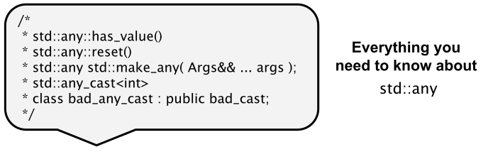

# Klasse `std::any`

[Zurück](../../Readme.md)

---

[Quellcode](Any.cpp)

---

*Allgemeines*:

Siehe das Beispiel im korrespondierenden Quellcode.

---

## Literaturhinweise:

Ein interessanter Vergleich der beiden Klassen `std::any` und `std::variant` findet sich in *stackoverflow*:

["C++ `std::variant` versus `std::any`"](https://stackoverflow.com/questions/56303939/c-stdvariant-vs-stdany/)

---

[Zurück](../../Readme.md)

---
