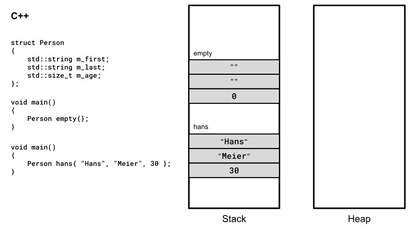
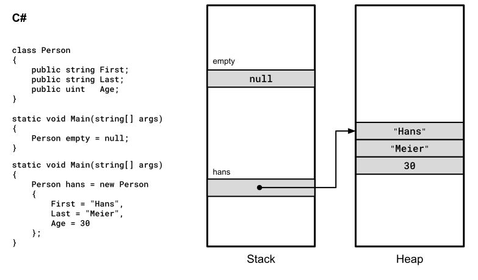
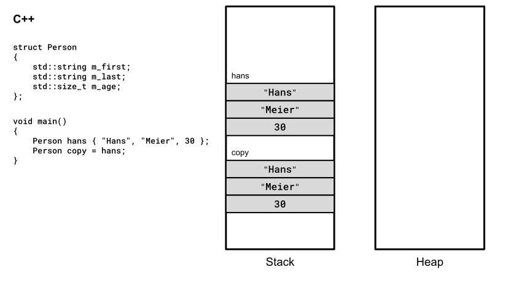
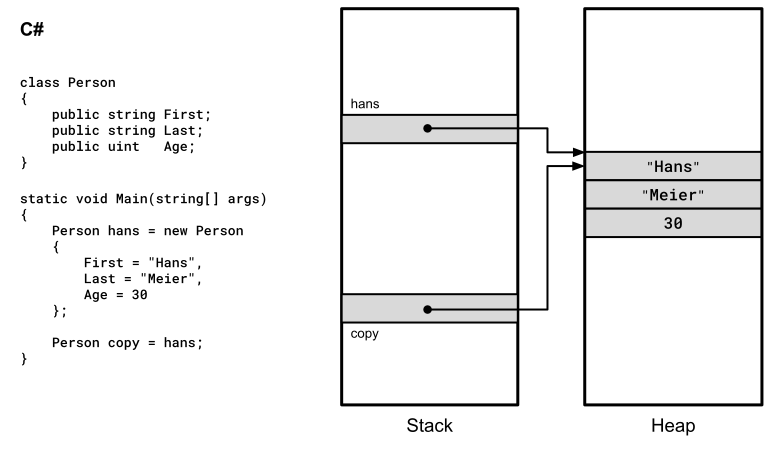
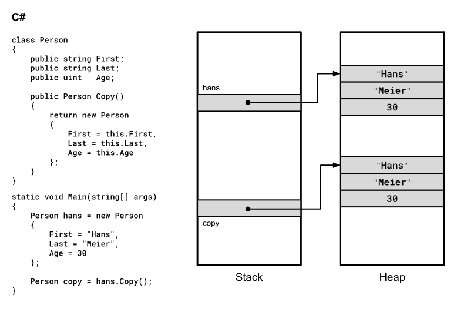
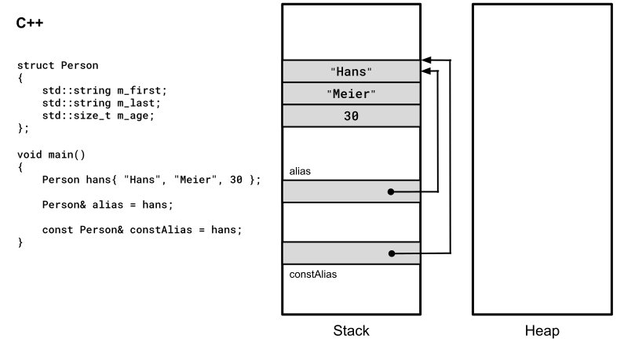
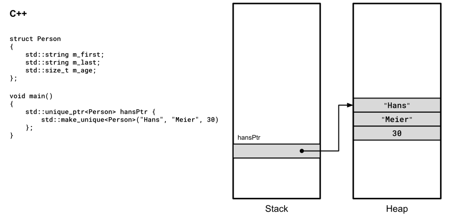

# Wertsemantik versus Referenzsemantik in Bildern

[Zurück](Architecture.md)

---

## Allgemeines

  * Wertsemantik in C++
    * Objekte erzeugen
    * Objekte kopieren
  * Referenzsemantik in C++
    * Mit Referenzen
    * Mit Adressen (Pointer)

---

## Objekte erzeugen

### Wertsemantik in C++

Objekte können in C++ global oder lokal angelegt werden:



*Abbildung* 1: Wertsemantik in C++.


### Referenzsemantik in C#

Objekte in C# liegen generall am Heap:



*Abbildung* 2: Referenzsemantik in C#.

---

## Objekte kopieren

### Kopieren eines Objekts bei Wertsemantik

Beim Kopieren eines C++&ndash;Objekts entsteht eine echte Kopie.
Je nach Struktur des Objekts kann hierzu ein Kopierkonstruktor notwendig sein,
ein entsprechender Aufruf erfolgt implizit:



*Abbildung* 3: Kopieren eines Objekts bei Wertsemantik in C++.


### Kopieren eines Objekts bei Referenzsemantik

Beim Kopieren eines C#&ndash;Objekts wird die Referenz kopiert &ndash; das Objekt selbst bleibt davon unberührt:



*Abbildung* 4: Kopieren eines Objekts bei Referenzsemantik in C#.


### Erstellen einer echten Kopie bei Referenzsemantik

Um in C# eine echte (tiefe) Kopie eines Objekts zu erstellen, muss dies mit einem expliziten Methodenaufruf erfolgen.



*Abbildung* 5: Erstellen einer echten Kopie bei Referenzsemantik in C#.


---

## Referenzsemantik in C++

### Referenzsemantik mit Referenzen

In C++ kann man zu existierenden Objekten eine Referenz definieren.
Die Referenz ist ein Alias &ndash; hinter dem Alias verbirgt sich eine Adresse und damit keine Kopie:



*Abbildung* 6: Referenzsemantik mit Referenzen.


### Referenzsemantik mit Zeigern

Objekte in C++ können dynamisch sein:
Dazu sind in &bdquo;*Classic C++*&rdquo; die Operatoren `new` und `delete` zu verwenden,
in *Modern C++* die Smart Pointer Klassen `std::unique_ptr`, `std::shared_ptr` oder `std::weak_ptr`:



*Abbildung* 7: Referenzsemantik mit Zeigern.

Theoretisch ließen sich Objekte am Heap auch über Referenzen ansprechen, dies ist aber mehr als unüblich
und führt auf Grund der Lebensdauereinschränkungen von dynamischen Objekten vermutlich eher zu Fehlern:

```cpp
01: std::unique_ptr<Person> hansPtr{
02:     std::make_unique<Person>("Hans", "Meier", 30)
03: };
04: 
05: Person& personRef = *hansPtr;
06: 
07: hansPtr->m_age++;
08: 
09: personRef.m_age++;
```

Die allgemeine Regel für Zeiger (Pointer) und Referenzen in C++ lautet:

  * Referenzen: Sie werden für lokale und globale Objekte verwendet.<br />
    Zum Beispiel bei der Parameterübergabe, um bei diesem Vorgang Kopien zu vermeiden.
    Globale Objekte existieren für die gesamte Laufzeit des Programms, lokale Objekte hingegen eignen sich nur für die Betrachtung von Zwischenergebnissen,
    da diese nach dem Verlassen des Unterprogramms (Methode, freie Funktion, Block) wieder zerstört werden.
  * Zeiger: Sie werden für dynamische Objekte verwendet.<br />Ihr Speicherbedarf wird bei Bedarf reserviert und danach wieder freigegeben. 
    Dies ist der Hauptunterschied zu globalen oder lokalen Objekten.

---

[Zurück](Architecture.md)

---
