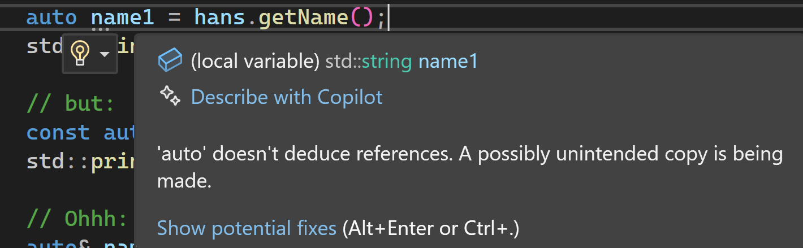
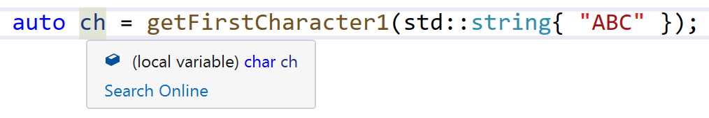
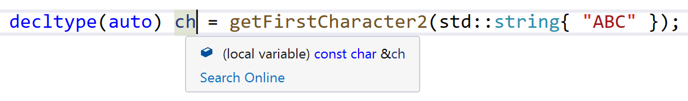

# `auto`

[Zurück](../../Readme.md)

---

[Quellcode](Auto.cpp)

---

## Inhalt

  * [Einleitung](#link1)
  * [Vereinbarung von Variablen / *Automatic Type Deduction*](#link2)
  * [Neuartige Möglichkeit in der Definition von Funktionen / *Function Return Type Deduction*](#link3)
  * [Funktionsdefinition mit *Trailing Return Type*](#link4)
  * [Verlust von `const` und `&` (Referenz) bei `auto`](#link5)
  * [decltype(auto)](#link6)
  * [`auto` versus `decltype`](#link7)
  * [`auto` versus `decltype(auto)`](#link8)
  * [Typableitung bei Template Parametern (*Template Parameter Type Deduction*)](#link9)
  * [Möglichkeiten des Gebrauchs von `auto` im Vergleich](#link10)
  * [Literaturhinweise](#link11)

---

## Einleitung <a name="link1"></a>

Das Schlüsselwort `auto` besitzt mehrere, völlig unterschiedliche Einsatzmöglichkeiten:

  * Vereinbarung von Variablen / *Automatic Type Deduction*
  * Neuartige Möglichkeit in der Definition von Funktionen / *Function Return Type Deduction*
  * Funktionsdefinition mit *Trailing Return Type*
  * Verlust von `const` und `&` (Referenz) bei `auto`
  * `decltype(auto)`
  * `auto` versus `decltype`
  * `auto` versus `decltype(auto)`
  * Typableitung bei Template Parametern / *Template Parameter Type Deduction*
  * Möglichkeiten des Gebrauchs von `auto` im Vergleich

*Hinweis*: Das Schlüsselwort `auto` fällt in der C++&ndash;Sprachbeschreibung in die Kategorie der 
so genannten *Type Inference*. Hierzu zählen die beiden Schlüsselwörter `auto` und `decltype`.

---

## Vereinbarung von Variablen / *Automatic Type Deduction* <a name="link2"></a>

Mit `auto` lassen sich Variablen definieren. Der Typ der Variablen leitet sich in diesem Fall
aus dem Vorbelegungswert der Variablen ab:

```cpp
auto n = 123;    // n is type of int
```

*Bemerkung*: Im letzten Beispiel hat man durch die Verwendung von `auto` nicht viel gewonnen.
Etwas anders ist die Situation im nächsten Beispiel:

```cpp
auto result = getFunction(); 
```

Hier gewinnt man zwei Vorteile:

  * Ist der Rückgabetyp von `getFunction` länglich zum Hinschreiben, dann spart man mit `auto` Tipparbeit
    (z.B. eben `auto` an Stelle von `std::map<int, std::string>`).
  * Ändert sich der Rückgabetyp von `getFunction`, so muss man den Quellcode an all den Stellen,
    an denen ein Aufruf von `getFunction` in Verbindung mit `auto` steht, nicht nachgezogen werden.

## Neuartige Möglichkeit in der Definition von Funktionen / *Function Return Type Deduction* <a name="link3"></a>

Ab C++ 14 ist es möglich, dass der Rückgabetyp einer Funktion vom Compiler automatisch bestimmt wird.
Zu diesem Zweck

  * verwendet man das Schlüsselwort `auto` als Rückgabetyp in der Funktionsdefinition.
  * muss der Compiler auf Grund einer oder auch mehrerer `return`-Anweisungen eindeutig in der Lage sein,
    den Rückgabetyp ermitteln zu können.

*Beispiel*:

```cpp
auto sum(float f1, float f2)
{
    return f1 + f2;
}
```

*Anwendung*:

```cpp
auto result = sum(1.0, 2.0);  // float
```

Häufig kann man die Beobachtung machen, dass der Umstieg auf *Function Return Type Deduction*
(auch: *Automatic Return Type Deduction*) zu leichter lesbarem Quellcode führt:

*Beispiel*:

<pre>
class Contact
{
    std::string m_name;
    size_t m_number;

public:
    <b>auto</b> getName() const { return m_name; }
    <b>auto</b> getMobileNumber () const { return m_number; }
};
</pre>

**Beachte**:

*Automatic Return Type Deduction* zieht einen interessanten Anwendungsfall nach sich:
Es ist möglich, den Rückgabetyp einer Funktion **lokal** in dieser zu definieren und
den Aufruf dieser Funktion mit *Automatic Return Type Deduction* durchzuführen.
Auch zu dieser skuril anmutenden Vorgehensweise ein Beispiel:

```cpp
auto make_planet()
{
    struct Planet { std::string name; int moons; bool rings; };

    return Planet{ "Saturn", 82, true };
}
```

Damit kann die Funktion `make_planet` wie folgt aufgerufen werden:

```cpp
// using automatic return type deduction
auto planet = make_planet();

std::cout 
    << planet.name << ' '
    << planet.moons << ' '
    << planet.rings << std::endl;

// using automatic return type deduction & structured binding
auto [name, num_moons, has_rings] = make_planet();

std::cout
    << name << ' '
    << num_moons << ' '
    << has_rings << std::endl;
```

Im letzten Code-Fragment finden Sie noch eine Kombination der *Automatic Return Type Deduction* und dem
*Structured Binding* vor!


## Funktionsdefinition mit *Trailing Return Type* <a name="link4"></a>

Unter dem Begriff &bdquo;*Trailing Return Type*&rdquo; versteht man die Möglichkeit,
den Rückgabetyp hinter der Parameterliste statt wie ursprünglich vor dem Funktionsnamen zu platzieren.
Die neue und alte Syntax sind zueinander kompatibel und können im Code durchaus gemeinsam verwendet werden.

*Beispiel*:

```cpp
// old, "classical" syntax
std::string toString(int value);

// new syntax with trailing return type
auto toString(int value) -> std::string;
```

Eine Funktionsdefinition mit *Trailing Return Type* bietet sich dann an,
wenn es bei Funktionen in der Schreibweise *Function Return Type Deduction*
mit mehreren `return`-Anweisungen zu Mehrdeutigkeiten kommt:

*Beispiel*:

```cpp
// Error:
// "'double': all return expressions must deduce to the same type:
// previously it was 'char'"
auto foo(bool flag, char ch, double d)
{
    if (flag) {
        return ch;
    }
    else {
        return d;
    }
}
```

Eine übersetzungsfähige Version sieht so aus:

```cpp
auto foo(bool flag, char ch, double d) -> double
{
    if (flag) {
        return ch;
    }
    else {
        return d;
    }
}
```

## Verlust von `const` und `&` (Referenz) bei `auto` <a name="link5"></a>

Die automatische Typableitung mit `auto` hat einen Nebeneffekt:
Die zwei möglichen Qualifizierer `const` und `&` (Referenz)
gehen bei der Typableitung verloren.
Wir demonstrieren dies an einem Beispiel:

```cpp
const std::string message{ "This is an important message :)" };

const std::string& getMessage()
{
    return message;
}
```

Wenn wir die Funktion `getMessage` aufrufen und ihr Resultat in einer mit `auto`  deklarierten Variablen abspeichern,
verlieren wir sowohl `const` als auch die Referenz:

```cpp
auto msg = getMessage();   // msg has type 'std::string'
```

Die Variable `msg` hat den Typ `std::string` &ndash; und damit nicht den Typ `const std::string&`!

*Hinweis*:
Der Visual C++ Compiler weist in einem Tooltip darauf hin (*Abbildung* 1):



*Abbildung* 1: Warning *auto* doesn't deduce references.

Man kann dies natürlich dadurch verhindern, dass man die Variable vom Typ `auto&` oder `const auto&` deklariert!

*Hinweis*:
Es würde eine *zweite* Möglichkeit geben, den Verlust von `const` bzw. von `&` auszugleichen.
Hierzu darf man nicht `auto` einsetzen, sondern muss mit `decltype` arbeiten:

```cpp
decltype(getMessage()) msg3 = getMessage();  // msg3 has type `const std::string&`

std::cout << "Message: " << msg3 << std::endl;
```

Ein letzter Schönheitsfehler verbleibt: Es kommt quasi zu einer Dopplung des Ausdrucks, in unserem Beispiel `getMessage()`.
Auch das beheben wir noch, siehe hierzu die Kombination
von `auto` und `decltype`:

```cpp
decltype(auto)
```


## `decltype(auto)` <a name="link6"></a>

`decltype(auto)` wird genauso benutzt wie `auto`, nur sind die Regeln zum Ableiten des Typ (*Type Deduction*)
unterschiedlich:

  * Bei `auto` gehen mögliche Qualifizierer wie `const`, `volatile` und `&` (Referenz) verloren.
  * Bei `decltype(auto)` gehen diese Qualifizierer **nicht** verloren.

Wir betrachten dazu ein Beispiel:

```cpp
decltype(auto) getFirstCharacter(const std::string& s)
{
    return s[0];
}
```

Wenn wir diese Funktion zweimal aufrufen,
erkennen wir den Unterschied:

```cpp
auto ch1 = getFirstCharacter(std::string{ "ABC" });

decltype(auto) ch2 = getFirstCharacter(std::string{ "ABC" });
```

Variable `ch1` ist vom Typ `char`, Variable `ch2` hingegen vom Typ `const char&`,
siehe hierzu auch *Abbildung* 2 und *Abbildung* 3:



*Abbildung* 2: Variablendeklaration mit `auto`.



*Abbildung* 3: Variablendeklaration mit `decltype(auto)`.


## `auto` versus `decltype` <a name="link7"></a>

`auto` leitet den Typ einer Variablen ab, wenn sie mit Hilfe ihres Initialisierers deklariert wird.

```cpp
auto i = 1; // int
```

`decltype` leitet den Typ des Ausdrucks ab, der für die Variablendeklaration oder das Einfügen in ein Template verwendet werden kann.


```cpp
int f() {
    return 0;
}

decltype(f()) i;            // i is integer

vector<decltype(f())> v;    // vector<int>, cannot be done with auto
```

## `auto` versus `decltype(auto)` <a name="link8"></a>

In den in diesem Abschnitt gezeigten Beispielen haben wir gesehen,
dass `auto` allein nicht in einen konstanten oder Referenztyp konvertiert werden kann.
Dazu müssen wir `auto&` oder `const auto` verwenden.
Sie geben dem Programmierer damit mehr Kontrolle über den deklarierten Typ.

```cpp
int& f(int& i){
    return ++i;
}

int x = 10;

auto i = f(x);      // i gets a copy of f(10)

auto& j = f(x);     // j is a reference to x
```

Aber manchmal möchten wir, wie bei einem Wrapper,
dass der Compiler den Typ genau so herleitet, wie er ist:

```cpp
decltype(auto) getFirstCharacter(const std::string& s)
{
    return s[0];
}
```

## Typableitung bei Template Parametern (*Template Parameter Type Deduction*) <a name="link9"></a>

Der Typ von Template Parametern wird vom Übersetzer an Hand der Argumente aufgelöst,
mit denen ein Funktionstemplate aufgerufen wird. Template Parameter, die sich aus den Argumenten nicht erschließen lassen,
müssen folglich explizit angegeben werden.

Wir betrachten ein Funktionstemplate mit drei Template Parametern:

```cpp
template <typename TReturn, typename T1, typename T2>
TReturn add(const T1& t1, const T2& t2)
{
    return t1 + t2;
}
```

Ein Aufruf mit allen drei Template Parametern sieht so aus:

```cpp
auto result = add<long, int , int>(10, 20);
```

Da sich, um bei diesem Beispiel zu bleiben, die Template Parameter für `T1` und `T2` aus den
Werten 10 und 20 ableiten lassen können,
kann man auch verkürzt schreiben:

```cpp
auto result = add<long>(10, 20);
```

Es ist logischerweise nur noch der Typ für den Rückgabetyp aufzuführen, da dieser von `T1` und `T2` abweichen kann.
Dies wiederum kann nur funktionieren, wenn diejenigen Template Parameter, die der Compiler automatisch ermitteln soll,
sich am Ende der Template Parameter Liste befinden.
Also eine Funktionstemplate Definition in der Gestalt

```cpp
template <typename T1, typename T2, typename TReturn>
TReturn add2(const T1& t1, const T2& t2)
{
    return t1 + t2;
}
```

besitzt diese Eigenschaft nicht.

*Hinweis*: Ist man auf der Suche nach einer Funktionstemplate Definition, die bei Bedarf ohne jegliche
Spezifikationen von Datentypen beim Aufruf auskommt, so könnte man mit Default Werten für die Template Parameter arbeiten:

```cpp
template <typename TReturn = long, typename T1, typename T2>
TReturn add(const T1& t1, const T2& t2)
{
    return t1 + t2;
}
```

Jetzt ist ein Aufruf der Gestalt

```cpp
auto result = add(10, 20);
```

übersetzungsfähig.

## Möglichkeiten des Gebrauchs von `auto` im Vergleich <a name="link10"></a>

Wir wollen einen kurzen und prägnanten Vergleich in der Möglichkeit des Gebrauchs von `auto` geben:

#### `auto`

Steht für eine Kopie eines Elements.

#### `auto&`

Steht für eine Referenz eines Elements mit der Intention, dieses zu ändern.

#### `const auto&`

Steht für eine Referenz eines Elements mit der Intention, dieses **nicht** zu ändern.

#### `auto&&`

Steht für eine *Universal Referenz* eines Elements im Kontext von generischem Code (Template, generisches Lambda).
`auto&&` bezeichnet man auch als *Vorwärtsreferenz*, dies bedeutet:

  * Wenn `auto&&` mit einem *LValue* initialisiert wird, verhält sich die Referenz wie eine *LValue* Referenz.
  * Wenn `auto&&` mit einem *RValue* initialisiert wird, verhält sich die Referenz wie eine *RValue* Referenz.

#### `decltype(auto)`

`decltype(auto)` verhält sich im Prinzip wie `auto`, nur werden `const`, `volatile` und `&` beibehalten.

Zusammenfassend kann man sagen:

  * Verwende `auto`, wenn man zum Beispiel in einer *range-based loop* mit einer Kopie arbeiten möchte.
  * Verwende `auto&`, wenn man zum Beispiel in einer *range-based loop* die Elemente verändern möchte.
  * Verwende `auto&&`, wenn man zum Beispiel in einer *range-based loop* im Kontext von generischem Code die Elemente verändern möchte.
  * Verwende `const auto&`, wenn man zum Beispiel in einer *range-based loop* auf die Elemente nur mit lesendem Zugriff zugreifen möchte (auch im Kontext von generischen Code).

---

## Literaturhinweise <a name="link11"></a>

Die Anregungen zu diesem Code-Snippet finden sich unter anderem in

[Modern C++ Features](https://arne-mertz.de/2017/01/decltype-declval/)<br>(abgerufen am 06.11.2021)

oder in

[Auto Type Deduction in Range-Based For Loops](https://blog.petrzemek.net/2016/08/17/auto-type-deduction-in-range-based-for-loops/)<br>(abgerufen am 06.11.2021).

---

[Zurück](../../Readme.md)

---
