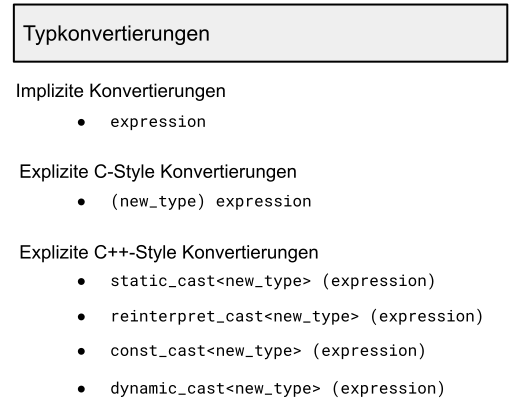

# Typumwandlungen

[Zurück](../../Readme.md)

---

[Quellcode](Casts.cpp)

---

## Inhalt

  * [Einleitung](#link1)
  * [Implizite Konvertierungen](#link2)
  * [Explizite Konvertierungen: C-Style Cast](#link3)
  * [Explizite C++ Konvertierungen](#link4)
  * [Die `static_cast`-Operation](#link5)
  * [Die `reinterpret_cast`-Operation](#link6)
  * [Die `const_cast`-Operation](#link7)
  * [*C-Style-Casts* und *New-Style-Casts*](#link8)
  * [Die `dynamic_cast`-Operation](#link9)
  * [`static_cast`- oder `dynamic_cast`-Operation](#link10)
  * [Literatur](#link11)

---

## Einleitung <a name="link1"></a>

Die Programmiersprache C++ kennt eine ganze Reihe verschiedener Typkonvertierungsmöglichkeiten.
Einen Überblick über die expliziten Typkonvertierungen finden Sie in *Abbildung* 1 vor:



*Abbildung* 1: Überblick über die unterschiedlichen Typkonvertierungsmöglichkeiten in C/C++

---

## Implizite Konvertierungen <a name="link2"></a>

Eine implizite Konvertierung wird vom Compiler automatisch durchgeführt, wenn ein Ausdruck in einen seiner kompatiblen Typen konvertiert werden muss.

Beispielsweise können Konvertierungen zwischen primitiven Datentypen implizit erfolgen.

```cpp
01: long a = 5;      // int implicitly converted to long 
02: double b = 123l; // long implicitly converted to double
```

*Maschinencode*:

```asm
                long a = 5;      // int implicitly converted to long 
00007FF67026C74A  mov         dword ptr [rbp+44h],5  
                double b = 123l; // long implicitly converted to double
00007FF67026C751  movsd       xmm0,mmword ptr [__real@405ec00000000000 (07FF670503070h)]  
00007FF67026C759  movsd       mmword ptr [rbp+68h],xmm0
```

Implizite primitive Konvertierungen können auch zur Laufzeit durchgeführt werden:

```cpp
01: int a = 123;    
02: long b = 123l; 
03: 
04: long n = a;      // int implicitly converted to long 
05: double m = b;    // long implicitly converted to double
```

*Maschinencode*:

```asm
                int a = 5;    
00007FF67026C75E  mov         dword ptr [rbp+84h],5  
                long b = 123l; 
00007FF67026C768  mov         dword ptr [rbp+0A4h],7Bh  

                // implicit conversions, done by the machine code
                long n = a;      // int implicitly converted to long 
00007FF67026C772  mov         eax,dword ptr [rbp+84h]  
00007FF67026C778  mov         dword ptr [rbp+0C4h],eax  
                double m = b; // long implicitly converted to double
00007FF67026C77E  cvtsi2sd    xmm0,dword ptr [rbp+0A4h]  
00007FF67026C786  movsd       mmword ptr [rbp+0E8h],xmm0
```

Hier erkennen wir, dass beispielsweise bei der Konvertierung von ganzzahligen Werten nach Gleitpunktwerten
Konvertierungsroutinen zur Laufzeit ausgeführt werden müssen. Dies kostet Performanz!

Diese impliziten primitiven Konvertierungen lassen sich weiter in zwei Arten unterteilen:
*Promotion* und *Demotion* (in etwa &bdquo;*Heraufstufung*&rdquo; und &bdquo;*Herabstufung*&rdquo;).

Eine *Promotion* erfolgt, wenn ein Ausdruck implizit in einen größeren Typ konvertiert wird,
und eine *Demotion* erfolgt, wenn ein Ausdruck in einen kleineren Typ konvertiert wird.

```cpp
01: // Promotion
02: long   a = 123;   // int promoted to long
03: double b = 123l;  // long promoted to double
```

Da eine *Demotion* zu Informationsverlust führen kann, erzeugen diese Konvertierungen
bei den meisten Compilern eine Warnung:

```cpp
01: // Demotion
02: int  a = 10.0;   // warning: possible loss of data
03: bool b = 123;    // warning: possible loss of data
```

*Output-Window*:

```
warning C4244: 'initializing': conversion from 'double' to 'int', possible loss of data
warning C4305: 'initializing': truncation from 'int' to 'bool'
```

Wenn der potenzielle Informationsverlust beabsichtigt ist,
kann man die Warnung durch eine &bdquo;*explizite*&rdquo; Konvertierung unterdrücken.

Dies führt uns zum nächsten Abschnitt:

## Explizite Konvertierungen: C-Style Cast <a name="link3"></a>

Die erste explizite Konvertierung (im engl. &bdquo;*Type Cast*&rdquo;)
ist aus C übernommen und wird allgemein als *C-Style-Cast* bezeichnet.

Der gewünschte Datentyp wird einfach in Klammern links neben dem zu konvertierenden Ausdruck platziert:

```cpp
01: // C-style cast
02: int  a = (int) 123.456;  // double demoted to int
03: bool b = (bool) 123;     // int demoted to bool
```

Der *C-Style-Cast* eignet sich für die meisten Konvertierungen zwischen primitiven Datentypen.

Bei Konvertierungen zwischen Klassen und Zeigern kann er jedoch zu mächtig sein.

Um eine bessere Kontrolle über die verschiedenen möglichen Konvertierungsarten zu erhalten,
wurden in C++ vier neue Cast-Operationen eingeführt, die sogenannten *Named Casts* oder *New-Style-Casts*.

## Explizite C++ Konvertierungen <a name="link4"></a>

Die Namen der vier *New-Style-Casts* lauten 

```cpp
static_cast<new_type> (expression) 
reinterpret_cast<new_type> (expression) 
const_cast<new_type> (expression) 
dynamic_cast<new_type> (expression)
```

Wie zu sehen ist, folgt auf den Namen des Casts der neue Typ in spitzen Klammern
und anschließend der zu konvertierende Ausdruck in Klammern.

Diese Casts ermöglichen eine präzisere Kontrolle über die Konvertierung,
was wiederum dem Compiler das Erkennen von Konvertierungsfehlern erleichtert.

*Bemerkung*:<br />
Der *C-Style-Cast* umfasst in seiner Definition den `static_cast`, den `reinterpret_cast`
und den `const_cast`.
Bei falscher Anwendung führt dieser Cast daher häufiger zu subtilen Konvertierungsfehlern.

### Die `static_cast`-Operation <a name="link5"></a>

Die `static_cast`-Operation führt Konvertierungen zwischen kompatiblen Typen durch.

Er ähnelt dem *C-Style-Cast*, ist aber restriktiver.

Beispielsweise erlaubt der *C-Style-Cast*, dass ein Integer-Zeiger auf eine `char`-Variable zeigt:

```cpp
// C-Style-Cast
char c = 10;       // 1 byte
int* p = (int*)&c; // 4 bytes, compiles, works ?!?
```

Da dies zu einem 4-Byte-Zeiger führt, der auf 1 Byte allokierten Speicher verweist,
führt das Schreiben in diesen Zeiger entweder zu einem Laufzeitfehler oder überschreibt angrenzenden Speicher:

```cpp
*p = 5;            // run-time error: stack corruption
```

Im Gegensatz zum Cast im *C-Style* ermöglicht der statische Cast dem Compiler zu überprüfen,
ob die *Pointer*- und *Pointee*-Datentypen kompatibel sind,
wodurch der Programmierer diese falsche Zeigerzuweisung während der Kompilierung erkennen kann:

```cpp
01: // static_cast
02: char c = 10;                    // 1 byte
03: int* p = static_cast<int*>(&c); // 4 bytes
```

Der Compiler reagiert mit der Fehlermeldung <i>Invalid type conversion: 'static_cast': cannot convert from 'char *' to 'int *'</i>.

### Die `reinterpret_cast`-Operation <a name="link6"></a>

Um eine Zeigerkonvertierung zu erzwingen, verwendet man stattdessen die `reinterpret_cast`-Operation.
Diese arbeitet im Hintergrund auf dieselbe Weise wie der *C-Style-Cast*:

```cpp
01: // reinterpret_cast
02: char c = 10;                           // 1 byte
03: int* p = reinterpret_cast<int*>(&c);   // 4 bytes // compiles
```

Die `reinterpret_cast`-Operation verarbeitet Konvertierungen zwischen bestimmten, nicht verwandten Typen, beispielsweise von einem Zeigertyp in einen anderen, inkompatiblen Zeigertyp.

Er führt lediglich eine binäre Kopie der Daten durch, ohne das zugrunde liegende Bitmuster zu verändern oder zu interpretieren.

Beachten Sie, dass das Ergebnis einer solchen Low-Level-Operation systemspezifisch und daher nicht portierbar ist.

Diese Cast-Operation  sollte mit Vorsicht verwendet werden, wenn sie sich nicht vollständig vermeiden lässt.


Ein zweites Beispiel:

```cpp
01: struct MyStruct
02: {
03:     char x1;
04:     char x2;
05:     char x3;
06:     char x4;
07: };
08: 
09: {
10:     struct MyStruct s{ 'A' , 'B' , 'C' , '\0' };
11: 
12:     // reinterpret struct as char* pointer :-) 
13:     char* ptr = reinterpret_cast<char*>(&s);
14: 
15:     std::println("{}", ptr);
16: }
```

*Ausgabe*:

```
ABC
```


### Die `const_cast`-Operation <a name="link7"></a>

Der dritte C++-Cast ist die `const_cast`-Operation.
Sie wird hauptsächlich verwendet, um den `const`-Modifikator einer Variablen hinzuzufügen oder zu entfernen.

```cpp
01: const int constVar = 123;
02: int* nonConstIp = const_cast<int*>(&constVar); // removes const
```

Obwohl die `const_cast`-Operation die Änderung des Wertes einer Konstanten ermöglicht,
handelt es sich dabei immer noch um ungültigen Code, der einen Laufzeitfehler verursachen kann.

Dies könnte beispielsweise der Fall sein, wenn sich die Konstante in einem Bereich des *Read-Only*-Speichers befindet:

```cpp
*nonConstIp = 10; // potential run-time error
```

Die `const_cast`-Operation wird häufig dann verwendet,
wenn eine Funktion ein nicht konstantes Zeigerargument annimmt, obwohl sie den Zeiger nicht ändert:

```cpp
01: void print(int* ptr)
02: {
03:     std::println("{}", *ptr);
04: }
```

Der Funktion kann dann mit Hilfe einer  `const_cast`-Operation eine konstante Variable übergeben werden:

```cpp
01: const int constVar = 123;
02: 
03: // print(&constVar);                  // error: cannot convert argument 1 from 'const int*' to 'int*'
04: 
05: print(const_cast<int*>(&constVar));   // compiles, runs
```

---

### *C-Style-Casts* und *New-Style-Casts* <a name="link8"></a>

Beachten Sie, dass der *C-Style-Cast* den `const`-Modifikator ebenfalls entfernen kann.
Da diese Konvertierung jedoch im Hintergrund erfolgt, sind *New-Style-Casts* vorzuziehen.

Ein weiterer Grund für die Verwendung von *New-Style-Casts* ist,
dass sie im Quellcode leichter zu finden sind als ein *C-Style-Cast*.

Das ist wichtig, da Typkonvertierungsfehler schwer zu entdecken sein können.

Ein dritter Grund für die Verwendung von *C-Style-Casts* ist deren unkomfortable Schreibweise.

Da explizite Konvertierungen in vielen Fällen vermieden werden können, wurde dies bewusst so gewählt,
dass Entwickler nach einer anderen Lösung suchen.

---

### Die `dynamic_cast`-Operation <a name="link9"></a>

Im folgenden Beispiel wird ein `Derived`-Zeiger mithilfe einer dynamischen Konvertierung in einen `Base`-Zeiger umgewandelt.

Diese &bdquo;*derived-to-base*&rdquo; Konvertierung ist erfolgreich, da das `Derived`-Objekt ein vollständiges `Base`-Objekt enthält:

```cpp
01: class Base
02: {
03: public: 
04:     virtual void test() { std::println("Base"); }
05: };
06:             
07: class Derived : public Base
08: {
09: public:
10:     void test() override { std::println("Derived"); }
11: };
12: 
13: {
14:     Derived* child = new Derived();
15:     Base* base = dynamic_cast<Base*>(child); // ok
16:     base->test();
17: }
```

*Ausgabe*:

```
Derived
```

Das nächste Beispiel versucht, einen `Base`-Zeiger in einen `Derived`-Zeiger umzuwandeln.
Da das `Base`-Objekt kein vollständiges `Derived`-Objekt enthält, schlägt diese Zeigerkonvertierung fehl.

Um dies anzuzeigen, gibt der dynamische Cast einen Nullzeiger zurück.
So lässt sich bequem zur Laufzeit überprüfen, ob eine Konvertierung erfolgreich war:


```cpp
01: Base* base = new Base();
02: Derived* child = dynamic_cast<Derived*>(base);
03: 
04: if (child == 0) {
05:     std::println("Null pointer returned!");
06: }
```

*Ausgabe*:

```
Null pointer returned!
```

Wird anstelle eines Zeigers eine Referenz konvertiert, schlägt die dynamische Umwandlung mit einer `std::bad_cast`-Exception fehl.
Dies muss mithilfe einer `try`-`catch`-Anweisung behandelt werden:

```cpp
01: Base base;
02: 
03: try {
04:     Derived& child = dynamic_cast<Derived&>(base);
05: }
06: catch (std::bad_cast& e)
07: {
08:     std::println("{}", e.what());
09: }
```

*Ausgabe*:

```
Bad dynamic_cast!
```

### `static_cast`- oder `dynamic_cast`-Operation <a name="link10"></a>

Der Vorteil eines dynamischen Casts besteht darin, dass der Programmierer während der Laufzeit prüfen kann,
ob eine Konvertierung erfolgreich war.

Der Nachteil ist der damit verbundene Performance-Overhead.

Aus diesem Grund wäre im ersten Beispiel ein statischer Cast vorzuziehen gewesen,
da eine &bdquo;*derived-to-base*&rdquo; Konvertierung nie fehlschlagen kann:

```cpp
01: // less performance overhead : using a static_cast
02: Derived* child = new Derived();
03: Base* base = static_cast<Base*>(child); // ok
04: base->test();
```

*Ausgabe*:

```
Derived
```

Wäre die Konvertierung von der Basis- zur abgeleiteten Klasse mit einem statischen anstatt einem dynamischen Cast durchgeführt worden,
wäre die Konvertierung nicht fehlgeschlagen.

```cpp
01: Base* base = new Base();  // toggle between Base and Derived
02: Derived* child = static_cast<Derived*>(base);
03: 
04: if (child == 0) {
05:     std::println("Null pointer returned!");
06: }
07: else {
08:     std::println("static_cast successful!");   // Oooops
09: }
```

*Ausgabe*:

```
static_cast successful!
```

Die Konvertierung hat einen Zeiger zurückgegeben, der auf ein unvollständiges Objekt verweist!
Die Dereferenzierung eines solchen Zeigers kann zu Laufzeitfehlern führen.

---

## Literatur <a name="link11"></a>

Eine sehr gute Beschreibung aller möglichen Tpykonvertierungsmöglichkeiten findet sich hier:

[Tutorial Type Conversions](https://web.archive.org/web/20160316114647/http://pvtuts.com/cpp/cpp-type-conversions)<br />
(abgerufen am 23.3.2025).

Haben Sie sich schon einmal gefragt, warum C-Style-Casts und `reinterpret_cast`-Casts als schädlich gelten?
In diesem Artikel wird genauer betrachtet, was bei ihnen schiefläuft:

[C++ Background: Static, reinterpret and C-Style casts](https://anteru.net/blog/2007/c-background-static-reinterpret-and-c-style-casts/)<br />
(abgerufen am 23.3.2025).

---

[Zurück](../../Readme.md)

---
