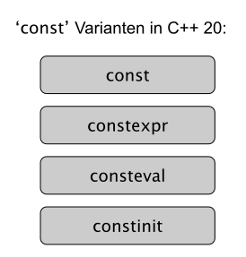

# Verschiedene Varianten mit `const`

[Zurück](../../Readme.md)

---

[Quellcode](Const.cpp)

---

## Allgemeines

Mit C++20 haben wir vier Schlüsselwörter, die alle mit `const` beginnen:

*Abbildung* 1: Verschiedene Varianten mit `const`.

## `const` 

  * `const` deklariert ein Objekt als konstant. Das heißt,
dass sich der Wert dieses Objekts nach der Initialisierung nicht mehr ändert.
Der Compiler kann diese Tatsache für Optimierungen nutzen.

  * Es verhindert außerdem, dass der Programmierer Code schreibt, der Objekte ändert,
die nach der Initialisierung nicht mehr geändert werden sollten.

  * `const` impliziert keine Auswertung zur &bdquo;Übersetzungszeit&rdquo;.
Der Compiler kann den Code optimieren und dies tun,
aber im Allgemeinen werden `const`-Objekte zur Laufzeit initialisiert:

## `constexpr` 

  * `constexpr` teilt dem Compiler mit, dass dieser Ausdruck zu einem berechenbaren konstanten Wert zur *Übersetzungszeit* führt,
sodass er an Stellen wie Array-Längen und Zuweisungen zu konstanten Variablen etc. verwendet werden kann.

  * `constexpr` erlaubt es explizit zur Übersetzungszeit zu programmieren und dies in der vertrauten C++&ndash;Syntax.

  * Mit dem Schlüsselwort `constexpr` lässt sich ein Ausdruck definieren,
der zur Übersetzungszeit evaluiert werden kann.

  * `constexpr` lässt sich für Variablen, Funktionen, aber auch für benutzerdefinierte Typen (Klassen, Strukturen) verwenden.

  * Ein zur Übersetzungszeit evaluierter Ausdruck besitzt viele Vorteile.
So sind `constexpr` Variablen und auch Instanzen von benutzerdefinierten Typen automatisch thread-sicher
und können im ROM gespeichert werden.

  * `constexpr` Funktionen werden zur Übersetzungszeit ausgeführt,
so dass deren Ergebnisse direkt zur Laufzeit zur Verfügung stehen

## `consteval` 

  * `consteval` kann nur auf Funktionen angewendet werden und erzwingt,
dass alle Aufrufe zur Übersetzungszeit erfolgen.

  * Mit `consteval` werden sogenannte *Immediate-Functions* erzeugt.
Jeder Aufruf einer solchen Funktion erzeugt eine Übersetzungszeit-Konstante.
Oder einfacher ausgedrückt:
Eine `consteval`&ndash;Funktion / *Immediate-Function* wird zur Übersetzungszeit ausgeführt.

  * *Immediate-Functions* können als Alternative zu Makros angesehen werden.

  * Man kann Variablen als `constexpr` deklarieren,
es gibt jedoch keine Möglichkeit zum Deklarieren von `consteval`-Variablen.

## `constinit` 

  * Das Schlüsselwort `constinit` garantiert,
dass eine Variable während der Übersetzungszeit initialisiert wird,
wodurch die Leistung verbessert wird,
da keine dynamische Initialisierung erforderlich ist.

  * `constinit` erzwingt die Initialisierung statischer oder threadlokaler Variablen
zur Übersetzungszeit mit einem konstanten Wert.

  * Mit `constinit` ist man in der Lage, das so genannte &bdquo;*Static Order Initialization Fiasco*&rdquo;
zu begrenzen,
indem vorkompilierte Werte in einer genau definierten Reihenfolge verwendet werden
im Gegensatz zu einer dynamischen Initialisierung, die vom Linker abhängig ist.

  * Im Gegensatz zu `const` oder `constexpr` bedeutet `constinit` nicht, dass das Objekt unveränderlich ist.

  * Im Gegenteil: `constinit` kann nicht in konstanten Ausdrücken verwendet werden!

---

[Zurück](../../Readme.md)

---
