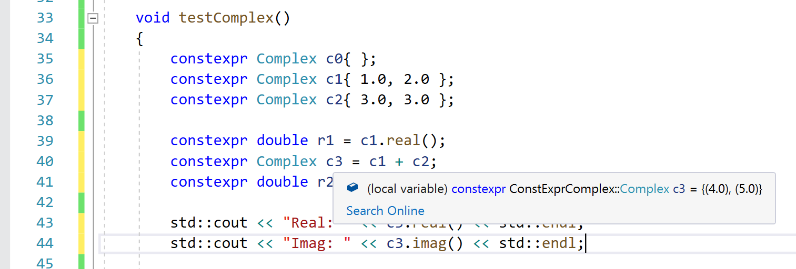
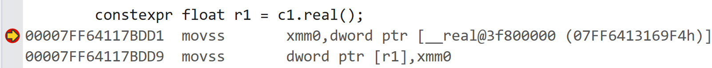
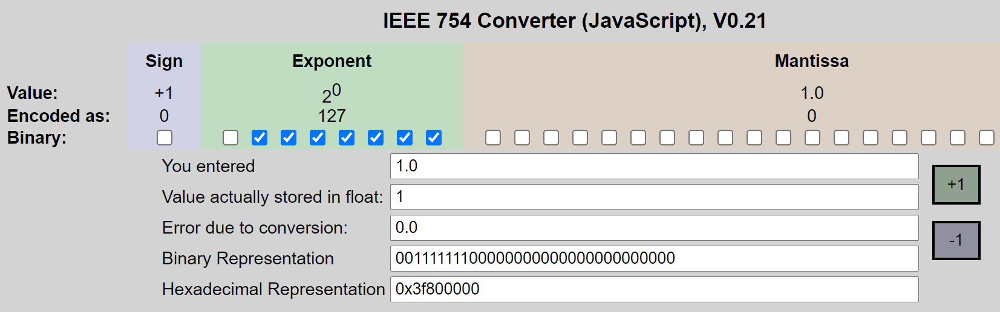
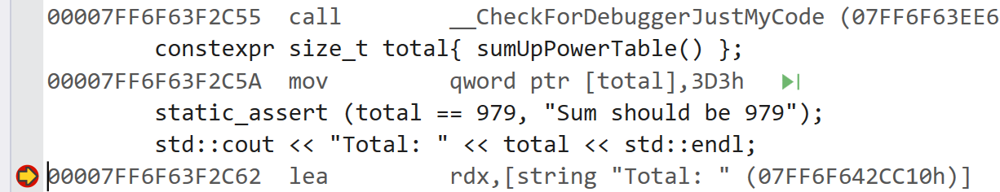
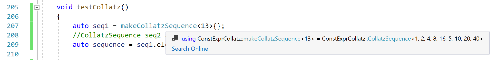

# `constexpr` - Programmierung zur Übersetzungszeit mit `constexpr`

[Zurück](../../Readme.md)

---

[Quellcode 1](ConstExpr.cpp)

[Quellcode 2](ConstExprExtended.cpp)

---

## Allgemeines:

Die Berechnung von Ausdrücken zur Übersetzungszeit wurde mit C++&ndash;17 auf ein neues Niveau angehoben.
Längst haben wir es nicht mehr mit nur konstanten Literalen oder einfachen Ausdrücken,
bestehend aus einer Summation oder Multiplikation, zu tun.
In C++&ndash;17 können zur Übersetzungszeit Variablen, Funktionen und auch ganze Klassen bzw. deren Objekte mit entsprechenden Konstruktoren
zur Übersetzungszeit ausgeführt bzw. erzeugt werden.

Von Interesse ist dieser Aspekt in der Anwendung zum Beispiel für die *Embedded Programmierung*, wenn es darum geht, 
möglichst viele Daten vom Übersetzer berechnen zu lassen, um diese mit Hilfe des Kompilats in das *ROM* (*Read-Only-Memory*)
einer speziellen Hardware zu packen.

Die syntaktischen Einsatzmöglichkeiten konstanter Ausdrücke mit `constexpr` sind sehr vielfältiger Natur.
Wir stellen einige signifikante Beispiele vor:

  * Variablen,
  * Klassen / benutzerdefinierte Datentypen mit `constexpr` Konstruktoren,
  * Klassentemplates mit `constexpr` Konstruktoren,
  * `constexpr`-Funktionen und `constexpr`-Lambda-Funktionen und
  * Konstante `std::array<>`-Objekte, initialisiert mit variadischen Templates 

## Variablen

Bei Deklaration einer Variablen mit dem Schlüsselwort `constexpr` wird diese zu einem konstanten Ausdruck:

```cpp
constexpr double Pi = 3.14159265359;
```

Für Variablen, die mit `constexpr` definiert sind, gelten folgende Regeln, die mehr oder minder naheliegend oder einleuchtend sind:

  * Die Variable ist implizit `const`.
  * Die Variable muss vorbelegt werden.
  * Der Vorbelegungswert muss ein konstanter Ausdruck sein

Vielmehr gibt es zum Themenbereich &ldquo;Variablen&rdquo; nicht zu sagen, wir kommen jetzt auf Klassen und Objekte zu sprechen.

## Klassen mit `constexpr` Konstruktoren

Wie Variablen, deren Wert zur Übersetzungszeit bestimmt wird,
lassen sich analog auch Objekte vom Übersetzer zur Übersetzungszeit erzeugen.
Hierfür müssen die folgenden Bedingungen erfüllt sein:

Klassen, deren Objekte zur Übersetzungszeit kreiert werden können,

  * müssen einen (oder mehrere) Konstruktor(en) haben, die mit `constexpr` deklariert sind,
  * dürfen keine virtuellen Methoden besitzen (oder erben) und
  * dürfen keine Ausnahmebehandlung verwenden.
 
Als Beispiel betrachten wir eine Klasse `Complex` für komplexe Zahlen, die Operationen mit komplexen Zahlen 
zur Übersetzungszeit unterstützt:

```cpp
01: struct Complex
02: {
03: private:
04:     float m_real;
05:     float m_imag;
06: 
07: public:
08:     // c'tors
09:     constexpr Complex() : m_real{ }, m_imag{ } {}
10:     constexpr Complex(float real, float imag) : m_real{ real }, m_imag{ imag } {}
11: 
12:     // getter
13:     constexpr float real() const { return m_real; }
14:     constexpr float imag() const { return m_imag; }
15: 
16:     // operators
17:     friend constexpr Complex operator+(const Complex& x, const Complex& y)
18:     {
19:         float real = x.real() + y.real();
20:         float imag = x.imag() + y.imag();
21:         return Complex{ real, imag };
22:     }
23: };
```

*Listing* 1: Klasse `Complex` mit `constexpr` Konstruktoren.

Mit folgendem Code-Fragment können wir die Klasse `Complex` testen und `Complex`-Objekte anlegen,
die vom Übersetzer erzeugt wurden:

```cpp
01: constexpr Complex c0{ };
02: constexpr Complex c1{ 1.0, 2.0 };
03: constexpr Complex c2{ 3.0, 3.0 };
04: 
05: constexpr float r1 = c1.real();
06: constexpr Complex c3 = c1 + c2;
07: constexpr float r2 = c3.real();
08:         
09: std::cout << "Real: " << c3.real() << std::endl;
10: std::cout << "Imag: " << c3.imag() << std::endl;
11: 
12: // verify compile time computing
13: static_assert (c1.real() == 1.0, "real part shoud be 1.0");
14: static_assert (c3.real() == 4.0, "real part shoud be 4.0");
15: static_assert (c3.imag() == 5.0, "imaginary part shoud be 5.0");
```

*Listing* 2: `Complex`-Objekte mit Operationen, die der Übersetzer ausführt.

Den Nachweis, dass der Übersetzer tatsächlich `Complex`-Objekte zur Übersetzungszeit anlegt,
und dies mit korrekten Werten, nehmen wir mit `static_assert`-Deklarationen vor,
siehe die Zeilen 13 bis 15 von *Listing* 2. Eine `static_assert`-Deklaration erwartet einen booleschen Ausdruck und eine Zeichenkette.
Evaluiert der boolesche Ausdruck zu `false`, wird die Zeichenkette als Fehlermeldung ausgegeben und die Übersetzung abgebrochen.

Mit einer ruhigen Hand und der Betrachtung von Tooltips kann man die Arbeit des Übersetzers auch von der Entwicklungsumgebung aus betrachten.
Mit dem *Visual Studio* sieht, um wiederum beim letzten Beispiel zu verweilen,
das Objekt `c3` so aus:



*Abbildung* 1: Ein `Complex`-Objekt, erzeugt vom Übersetzer.

Eine dritte Möglichkeit besteht in der Analyse des Assembler-Codes:



*Abbildung* 2: Der Wert des Realteils von Objekt `c1` im Maschinencode.

*Hinweis*: Der OpCode `movss` steht für *Move or Merge Scalar Single-Precision Floating-Point Value*.

Der Wert des Realteils von Objekt `c1` ist vom Typ `float`,
dies stellt uns in der Betrachtung des Maschinencodes vor ein kleines,
aber nicht unlösbares Problem.
Mit Hilfe eines IEEE nach `float` Konvertierers
(siehe [IEEE 754 Converter](https://www.h-schmidt.net/FloatConverter/IEEE754de.html))
können wir wiederum
bestätigen, dass der Wert `1.0` &ndash; und damit `0x3f800000` &ndash;
bereits zur Übersetzungszeit im Maschinencode abgelegt ist.
Es kommt also definitiv nicht zur Laufzeit zum
Aufruf der *getter*-Methode `real()`!



*Abbildung* 3: IEEE-754 Konverter für Fließkommazahlen.


## Klassentemplate mit `constexpr` Konstruktoren

Bei den benutzerdefinierten Klassen darf es sich auch um Klassentemplates handeln.
Wir können die Klasse `Complex` aus dem letzten Absatz verallgemeinern zu `Complex<T>`:
Sinnvollerweise lassen sich damit `Complex<T>`-Objekte erzeugen, deren Real- und Imaginärteil
dann entweder vom Typ `float` oder `double` ist.
An der `constexpr`-Thematik gibt es keine Änderungen,
wir betrachten das letzte Beispiel einfach mit einer `Complex<double>`-Klasse:

```cpp
01: template <typename T>
02: struct Complex
03: {
04: private:
05:     T m_real;
06:     T m_imag;
07: 
08: public:
09:     // c'tors
10:     constexpr Complex() : m_real{ }, m_imag{ } {}
11:     constexpr Complex(T real, T imag) : m_real{ real }, m_imag{ imag } {}
12: 
13:     // getter
14:     constexpr T real() const { return m_real; }
15:     constexpr T imag() const { return m_imag; }
16: 
17:     // operators
18:     friend constexpr Complex<T> operator+(const Complex<T>& x, const Complex<T>& y)
19:     {
20:         return Complex<T>{ x.real() + y.real(), x.imag() + y.imag() };
21:     }
22: };
23: 
24: void testComplexTemplate()
25: {
26:     constexpr Complex<double> c0{ };
27:     constexpr Complex<double> c1{ 10.0, 20.0 };
28:     constexpr Complex<double> c2{ 30.0, 30.0 };
29: 
30:     constexpr double r1 = c1.real();
31:     constexpr Complex<double> c3 = c1 + c2;
32:     constexpr double r2 = c3.real();
33: 
34:     std::cout << "Real: " << c3.real() << std::endl;
35:     std::cout << "Imag: " << c3.imag() << std::endl;
36: 
37:     // verify compile time computing
38:     static_assert (c1.real() == 10.0, "real part shoud be 10.0");
39:     static_assert (c3.real() == 40.0, "real part shoud be 40.0");
40:     static_assert (c3.imag() == 50.0, "imaginary part shoud be 50.0");
41: }
```

*Listing* 3: Klassetemplate `Complex` mit `constexpr` Konstruktoren.

## `constexpr`-Funktionen und `constexpr`-Lambda-Funktionen

Mit C++&ndash;17 haben `constexpr`-Funktionen und `constexpr`-Lambda-Methoden Einzug in die Sprache gefunden.
Dazu betrachten wir am besten gleich ein Beispiel.
Wir stellen uns die Aufgabe, eine Tabelle (`std::array`) mit Potenzen natürlicher Zahlen zu befüllen,
gewissermaßen ein Nachschlagewerk für natürliche Zahlen zur Potenzdarstellung.

*Bemerkung*: `std::array`-Objekte weisen eine Subtilität auf:
Im Gegensatz zu `std::vector`-Objekten muss ihre Länge zur Übersetzungszeit bekannt sein,
ähnlich wie es bei den klassischen Arrays in der Programmiersprache C der Fall ist.
Sie sind damit ein guter Kandidat, um vom Übersetzer erzeugt und auch mit Daten gefüllt zu werden.

Derartige Tabellen sind natürlich prädestiniert, um sie mit entsprechenden Algorithmen und Funktionen einer höheren Programmiersprache zu erstellen.
In manchen Situationen &ndash; siehe zum Beispiel die Embedded Programmierung &ndash; ist es von Vorteil,
wenn diese Tabellen mit konstanten Werten bereits zum Übersetzungszeitpunkt erstellt werden,
um sie dann im ROM einer speziellen Hardware abzulegen.
Derartige Berechnungen sind für ein Zielsystem nicht nur störend, sie kosten unnütze Zeit
und haben häufig mit der eigentlichen Aufgabe nichts zu tun.

Zahlenwerte aus einem Nachschlagewerk abtippen kann natürlich auch keine Lösung sein.
Damit sind wir bei C++-Funktionen angekommen, die der Übersetzer (auf dem Entwicklungsrechner) ausführt,
und damit nicht auf dem Zielsystem, für das Maschinencode generiert wird.

```cpp
01: constexpr size_t TableSize = 5;
02: constexpr size_t Factor = 4;
03: 
04: template<size_t F>
05: constexpr auto powerTable = [] {
06: 
07:     std::array<size_t, TableSize> table = {};
08: 
09:     size_t index{ 1 };
10:     for (size_t& elem : table) {
11: 
12:         size_t tmp{ 1 };
13:         for (size_t i{}; i != F; ++i) {
14:             tmp *= index;
15:         }
16: 
17:         elem = tmp;
18:         ++index;
19:     }
20: 
21:     return table;
22: } ();
23: 
24: constexpr size_t sumUpPowerTable()
25: {
26:     size_t total{};
27: 
28:     for (size_t i{}; i != TableSize; ++i) {
29:         total += powerTable<Factor>[i];
30:     }
31: 
32:     return total;
33: }
```

*Listing* 4: `constexpr`-Funktionen und -Lambda-Funktionen in der Praxis.

Die Zeilen 4 bis 22 von Listing 1 haben es in sich: Prinzipiell haben wir es mit einer Lambda-Funktion zu tun, die anonym ist,
also keinen Namen besitzt! Eigentlich haben wir es mit einer Lambda-Templatefunktion zu tun,
der Template-Parameter `F` (wie &ldquo;Factor&rdquo;) spezifiziert den Faktor,
der für die Potenzierung heranzuziehen ist. Nun zu Zeile 22: Die runden Klammern `()` bewirken, dass die Lambda-Templatefunktion
bei Spezialisierung (mit einem Faktor) aufgerufen wird: Der Bezeichner `powerTable` in Zeile 5
steht also für das `std::array`-Objekt, dass von der Lambda-Funktion berechnet und zurückgeliefert wird. 

Wo wird die Lambda-Templatefunktion spezialisiert und aufgerufen?
Einen Aufruf finden wir in Zeile 29 vor: Spezialisiert mit einem `Factor` gleich 4 wird auf den Rückgabewert
&ndash; ein `std::array`-Objekt &ndash; mit dem Index-Operator `[]` auf die einzelnen Einträge des Arrays zugegriffen.
Es ist also der Index-Operator `[]` ebenfalls eine `constexpr`-Funktion, um dies hervorzuheben.

Bleiben wir bei der Funktion `sumUpPowerTable`. Sie soll exemplarisch veranschaulichen,
dass `constexpr`-Variablen und -Funktionen gewissermaßen &ldquo;schachtelbar&rdquo; sind,
also die `constexpr`-Eigenschaft bleibt so lange erhalten, wie eine `constexpr`-Funktion aus
unterlagerten `constexpr`-Funktionsaufrufen und -Variablen gebildet wird.

Neben `static_assert`-Zusicherungen können wir die Vorleistungen des Übersetzers auch mit dem Debugger verifizieren.
Um es an einem Beispiel zu betrachten. Ein Aufruf der `sumUpPowerTable`-Funktion sollte mit einem `Factor` gleich 4 
und einer Tabellengröße gleich 5 die Summe von 1 + 16 + 81 + 256 + 625 = 979 zurückliefern.
Diesen (konstanten) Wert müssten wir im OpCode des Programms vorfinden:

In Abbildung 2 &ndash; und bei Bedarf mit dem *Calculator* &ndash; können wir uns davon überzeugen:
Der hexadezimale Wert `3D3h` tritt in einer `MOV`-Instruktion auf, der Übersetzer hat tatsächlich alle Berechnungen zur 
Übersetzungszeit vorgenommen:



*Abbildung* 2: `MOV`-Instruktion mit Operand 979 (3D3h)

## `constexpr`-`std::array`-Objekte, initialisiert mit variadischen Templates 

Ein ganz anderer Ansatz für Berechnungen zur Übersetzungszeit tut sich mit variadischen Templates auf.
Welchen Vorteil bietet dieser Lösungsansatz?
Prinzipiell müssen für die Initialisierung eines `constexpr`-Objekts die genutzten Sprachmittel ebenfalls `constexpr` sein.
Jetzt hängt es davon ab, welcher C++&ndash;Sprachstandard in der Entwicklung zur Verfügung steht?
Unter C++&ndash;14 ist der `[]`-Operator nicht `constexpr` (wohl aber in C++&ndash;17).
Möchte man &ndash; aus welchen Gründen auch immer &ndash; ein `std::array`-Objekt mit einer Initialisierungsliste vorbelegen
(also nicht mit imperativen Berechnung à la `constexpr`-Funktionen / -Lambda-Funktionen, die den `[]`-Operator verwenden),
bietet sich ein Weg mit variadischen Templates an.

Lassen Sie mich gleich in *medias res* gehen.
An Hand eines Startwerts, der allerdings zur Übersetzungszeit bekannt sein muss, wollen wir eine Folge unbekannter Länge von Zahlen berechnen,
also eine Zahlenfolge.
Um es noch einmal zu betonen:
Der Übersetzer soll diese Zahlenfolge berechnen, nicht die Anweisungen des Maschinencodes des resultierenden Programms.
Das Ergebnis der Zahlenfolge ist in einem `std::array`-Objekt abzulegen.

Um die Zahlenfolge selbst einfach zu halten &ndash; die technischen Randbedingungen des Beispiels sind schon komplex genug &ndash; 
legen wir die so genannte *Collatz*-Zahlenfolge zu Grunde. Die Zahlenfolge berechnet sich wie folgt:
Ausgehend von einem beliebigen (positiven) Startwert *n* ist das nächste Folgenglied *n* / 2 bei geradem *n*, andernfalls 3 * *n* + 1. Um
es kurz an einem Beispiel mit Startwert 13 festzumachen:
Gesucht ist die Folge der Zahlen 13, 40, 20, 10, 5, 16, 8, 4, 2, 1.

Wir stellen gleich die Lösung vor, es folgen zahlreiche Hinweise:

```cpp
01: constexpr int collatz(int index)
02: {
03:     return (index % 2 == 0) ? index / 2 : index * 3 + 1;
04: }
05: 
06: constexpr auto collatzLambda = [](int index)
07: {
08:     return (index % 2 == 0) ? index / 2 : index * 3 + 1;
09: };
10: 
11: // class definition (type which holds sequences)
12: template <int ... NS>
13: struct CollatzSequence
14: {
15:     static constexpr std::array<int, sizeof... (NS)> elements = { NS ... };
16: };
17: 
18: // helper class template declaration
19: template <int ... NS>
20: struct SequenceHelper;
21: 
22: // helper class template: recursion case
23: template <int I, int ... NS>
24: struct SequenceHelper<I, NS...>
25: {
26:     static constexpr int next = collatz(I);
27:     using type = typename SequenceHelper<next, next, NS ...>::type;
28: };
29: 
30: // recursion termination
31: template <int ... NS>
32: struct SequenceHelper<1, NS ...>
33: {
34:     using type = CollatzSequence<NS ...>;
35: };
36: 
37: template <int N>
38: using makeCollatzSequence = typename SequenceHelper<N>::type;
39: 
40: void testCollatz()
41: {
42:     auto seq = makeCollatzSequence<13>{};
43:     //CollatzSequence seq2 = makeCollatzSequence<9>{};
44:     auto sequence = seq.elements;
45: 
46:     std::cout << "Size: " << sequence.size() << std::endl;
47: 
48:     std::for_each(std::rbegin(sequence), std::rend(sequence), [](const int elem) {
49:         std::cout << "   Element: " << elem << std::endl;
50:     });
51: }
```

*Listing* 5: Initialisierung eines `std::array`-Objekts mit variadischen Templates.

Die Berechnung des nächsten Folgenglieds kann in einer Funktion (normale Funktion, Zeile 1 bis 4 oder Lambda-Funktion, Zeile 6 bis 9) erfolgen,
dies ist nicht weiter spektakulär.

Nun definieren wir ein variadisches Klassentemplate `SequenceHelper` in Zeilen 19 und 20, zunächst syntaktisch in Gestalt einer Vorwärtsdeklaration.
Eine erste partielle Spezialisierung des Klassentemplates erfolgt in den Zeilen 23 bis 28 mit einer variadischen Templateparameterliste.
Diese Templateparameterliste wird zerlegt in einen ersten Template-Parameter `I` und den Rest `NS`.
Mit der Funktion `collatz` (oder gerne auch `collatzLambda`) wird zu `I` das nächste Folgenglied der Collatzfolge berechnet
und in einer Klassenvariablen `next` abgelegt.

*Beachte*: Die Variablen des Übersetzers sind Klassenvariablen (Meta-Programmierung).

Nun erfolgt rekursiv die Definition einer weiteren Template-Klasse von `SequenceHelper`,
dieses Mal in Zeile 27 mit den Templateparametern `next`, nochmals `next` und schließlich dem Rest der umgebenden Parameterliste.
Der Typ dieser Template-Klasse wird &ndash; mit Hilfe von `using` &ndash; in einer Datentypdefinition mit dem Bezeichner `type` festgehalten.

*Beachte*: Den Rückgabewerten von Funktionen entsprechen in der Meta-Programmierung `using`-Anweisungen (oder `typedef`-Anweisungen).

> Um es auf den Punkt zu bringen: Die einzelnen Folgenglieder werden mit Hilfe einer (rekursiven) Klassentemplatedefinition 
auf eine variadische Templateparameterliste abgebildet.

Rekursive Klassentemplatedefinitionen sind erlaubt, natürlich bedarf es wie bei jeder rekursiven Definition eines Abbruchkriteriums.
Dieses finden wir in den Zeile 31 bis 35 vor: Dieses Klassentemplate erwartet in der Templateparameterliste an der ersten Stelle den Wert 1.
Wir erinnern uns: Eine *Collatz*-Folge terminiert, wenn der Wert 1 erreicht wird.
Ist das Abbruchkriterium erreicht, kommt es zur Definition eines weiteren Datentyps mit dem Klassentemplate `CollatzSequence`.

Hier kommt schon gleich der nächste Trick ins Spiel:
Die variadische Templateparameterliste wird im Kontext des Konstruktors einer Initialisierungsliste, also einem `std::initializer_list`-Objekt, entpackt
und an einen Konstruktor der `std::array`-Klasse weitergereicht. Dieses `std::array`-Objekt ist eine Klassenvariable der `CollatzSequence`-Klasse
und kann über den Bezeichner `elements` angesprochen werden.

In Zeile 15 ist eine weitere Subtilität verborgen: `std::array`-Objekte benötigen eine Längenangabe, die zur Übersetzungszeit bekannt sein muss.
Okay, von welcher Länge reden wir hier genau? Gemeint die die Länge der Zahlenfolge,
sie stimmt mit der Anzahl der Elemente der variadischen Templateparameterliste überein.
Diese wiederum kann zur Übersetzungszeit mit dem Operator `sizeof... ` abgefragt werden (Zeile 15)!

> Damit können wir abschließend zusammenfassen:
> Mit einer rekursiven Menge von Templateklassen lassen sich die Glieder einer Zahlenfolge
zur Übersetzungszeit in einem Parameterpack zusammenstellen, das wiederum in eine Initialisierungsliste und damit 
in ein `std::array`-Objekt umgebettet werden kann!

Wenn wir nun die Testfunktion `testCollatz` ausführen, erhalten wir das erwartete Ergbnis:

```
Size: 9
   Element: 40
   Element: 20
   Element: 10
   Element: 5
   Element: 16
   Element: 8
   Element: 4
   Element: 2
   Element: 1
```

Es gibt mehrere Möglichkeiten, um die rekursive Definition von Templateklassen zu verfolgen:
Die *IntelliSense* des Visual Studio ist eine davon:



*Abbildung* 3: Betrachtung der Definition von Templateklassen mittels *IntelliSense*.

Mein persönlicher Favorit hingegen ist das Tool [Cpp Insights](https://cppinsights.io/).
Der Übersichtlichkeit halber habe ich den Output des Tools etwas umformatiert.
Damit erhält man für den Ausgangsausdruck 

```cpp
auto seq = makeCollatzSequence<13>{};
```

die folgenden partiellen Spezialisierungen der beteiligten Klassentemplates:

```cpp
template<>
struct SequenceHelper<13>
{
  inline static constexpr const int next = collatz(13);
  using type = SequenceHelper<40, 40>;
};

template<>
struct SequenceHelper<40, 40>
{
  inline static constexpr const int next = collatz(40);
  using type = SequenceHelper<20, 20, 40>;
};

template<>
struct SequenceHelper<20, 20, 40>
{
  inline static constexpr const int next = collatz(20);
  using type = SequenceHelper<10, 10, 20, 40>;
};

template<>
struct SequenceHelper<10, 10, 20, 40>
{
  inline static constexpr const int next = collatz(10);
  using type = SequenceHelper<5, 5, 10, 20, 40>;
};

template<>
struct SequenceHelper<5, 5, 10, 20, 40>
{
  inline static constexpr const int next = collatz(5);
  using type = SequenceHelper<16, 16, 5, 10, 20, 40>;
};

template<>
struct SequenceHelper<16, 16, 5, 10, 20, 40>
{
  inline static constexpr const int next = collatz(16);
  using type = SequenceHelper<8, 8, 16, 5, 10, 20, 40>;
};

template<>
struct SequenceHelper<8, 8, 16, 5, 10, 20, 40>
{
  inline static constexpr const int next = collatz(8);
  using type = SequenceHelper<4, 4, 8, 16, 5, 10, 20, 40>;
};

template<>
struct SequenceHelper<4, 4, 8, 16, 5, 10, 20, 40>
{
  inline static constexpr const int next = collatz(4);
  using type = SequenceHelper<2, 2, 4, 8, 16, 5, 10, 20, 40>;
};

template<>
struct SequenceHelper<2, 2, 4, 8, 16, 5, 10, 20, 40>
{
  inline static constexpr const int next = collatz(2);
  using type = SequenceHelper<1, 1, 2, 4, 8, 16, 5, 10, 20, 40>;
};
```

Und damit schließlich

```cpp
template<>
struct SequenceHelper<1, 1, 2, 4, 8, 16, 5, 10, 20, 40>
{
  using type = CollatzSequence<1, 2, 4, 8, 16, 5, 10, 20, 40>;
};
```

In dieser letzten partiellen Spezialisierung erfolgt nun der Wechsel zur Klasse `CollatzSequence`:
Mit Hilfe der Definition

```cpp
static constexpr std::array<int, sizeof... (NS)> elements = { NS ... };
```

schaffen wir es jetzt, die Templateparameter zur Initialisierung eines `std::array`-Objekts heranzuziehen.

## `std::array`-Objekte und variadische Templates: Ein alternativer Ansatz

Die rekursive Templatedefinition aus dem letzten Beispiel fußte auf dem Trick,
die Definition eines Klassentemplates in Abhängigkeit von einem anderen Klassentemplate zu formulieren.
Diese Vorgehensweise kann man auch mittels Vererbung praktizieren.
Ein Beispiel gefällig?
Wir bleiben der Einfachheit halber bei *Collatz*-Folgen, berechnen diese aber nun wie folgt:

```cpp
01: constexpr int collatz(int index) {
02:     return (index % 2 == 0) ? index / 2 : index * 3 + 1;
03: }
04: 
05: // class template: recursion case
06: template<size_t START, size_t ... D>
07: struct Helper : Helper<collatz(START), D ..., collatz(START)> { };
08: 
09: // recursion termination
10: template<size_t ... D>
11: struct Helper<1, D ...>
12: {
13:     static constexpr std::array<size_t, sizeof ... (D)> table = { D... };
14: };
15: 
16: auto squaresTable = Helper<13>::table;
17: 
18: void testCollatzInheritance()
19: {
20:     std::cout << "Size: " << squaresTable.size() << std::endl;
21: 
22:     for (size_t elem : squaresTable) {
23:         std::cout << "   Element: " << elem << std::endl;
24:     }
25: }
```

*Listing* 6: Initialisierung eines `std::array`-Objekts mit variadischen Templates und dem Prinzip der Vererbung.

Dieses Mal ist die Rekursion so zu verstehen, dass ein Klassentemplate rekursiv von sich selbst erbt.
Einer der Templateparameter (hier: `START`) wird pro Rekursionsebene mit dem nächsten Wert der *Collatz*-Folge besetzt.
Da nach endlich vielen Folgengliedern der Wert 1 erreicht wird, haben wir ein Kriterium für das Ende der Rekursion gefunden.
An dieser Stelle greifen wir wieder auf das Parameterpack zu, um damit ein `std::array`-Objekt zu füllen.
Die Rekursion wird folglich mit einem bestimmten Startwert in Gang gesetzt, bei Erreichen des Werts 1 ist die Rekursion zu Ende.

Auch dieses Mal wollen wir die rekursiven Klassentemplatedefinitionen mit [Cpp Insights](https://cppinsights.io/) unter die Lupe nehmen:

```
template<>
struct Helper<13> : public Helper<40, 40> {};

template<>
struct Helper<40, 40> : public Helper<20, 40, 20> {};

template<>
struct Helper<20, 40, 20> : public Helper<10, 40, 20, 10> {};

template<>
struct Helper<10, 40, 20, 10> : public Helper<5, 40, 20, 10, 5> {};

template<>
struct Helper<5, 40, 20, 10, 5> : public Helper<16, 40, 20, 10, 5, 16> {};

template<>
struct Helper<16, 40, 20, 10, 5, 16> : public Helper<8, 40, 20, 10, 5, 16, 8> {};

template<>
struct Helper<8, 40, 20, 10, 5, 16, 8> : public Helper<4, 40, 20, 10, 5, 16, 8, 4> {};

template<>
struct Helper<4, 40, 20, 10, 5, 16, 8, 4> : public Helper<2, 40, 20, 10, 5, 16, 8, 4, 2> {};

template<>
struct Helper<2, 40, 20, 10, 5, 16, 8, 4, 2> : public Helper<1, 40, 20, 10, 5, 16, 8, 4, 2, 1> {};

template<>
struct Helper<1, 40, 20, 10, 5, 16, 8, 4, 2, 1>
{
  inline static constexpr const std::array<size_t, sizeof...(D)> table = 
    {{ 40UL, 20UL, 10UL, 5UL, 16UL, 8UL, 4UL, 2UL, 1UL }};
};


std::array<unsigned long, 9> squaresTable = 
  std::array<unsigned long, 9>(Helper<1, 40, 20, 10, 5, 16, 8, 4, 2, 1>::table);
```

Damit wären wir am Ende unserer Betrachtungen angelegt. Ich hoffe, Sie haben einen Eindruck von der Mächtigkeit von `constexpr`
in allen seinen Facetten gewonnen!

## Literatur

Zur Fragestellung &ldquo;`constexpr` und dynamische Speicherverwaltung&rdquo;
gibt es einen interessanten Aufsatz im [Netz](https://www.cppstories.com/2021/constexpr-new-cpp20)
(abgerufen am 19.12.2022).


## Literatur zum  CRC8-Beispiel

Die Anregungen zu diesem Artikel stammen aus einem Aufsatz aus der Zeitschrift *IX*:

Petrautzki, Dirk. &ldquo;Nachschlagewerk: C++-Metaprogrammierung mit Templates für eingebettete Systeme&rdquo;.
*iX* Magazin für professionelle Informationstechnik, Mai 2021, S. 134 - 137.

Materialien in elektronischer Form: [Fraunhofer Applied Research Center for Wireless Sensor Technology](https://github.com/Fraunhofer-IIS-ARC-WST)

An die Stelle der *Collatz*-Zahlenfolge werden hier Lookup-Tabellen für CRC8-Berechnungen zur Übersetzungszeit untersucht.

*Hinweis*:

Ein Online-Tool zur Berechnung von CRC Lookup-Tabellen findet sich [hier](https://crccalc.com/).
Allgemeine Erläuterungen zum Verständnis der CRC-Thematik 
können auch hier nachgelesen werden:<br/>
[Understanding and implementing CRC (Cyclic Redundancy Check) calculation](http://www.sunshine2k.de/articles/coding/crc/understanding_crc.html).

Die Beispiele für `constexpr`-Funktionen und `constexpr`-Lambda-Funktionen sind in diesem Aufsatz erheblich anwendungsbezogener,
siehe zum Beispiel die beiden Funktionen zur Erstellung und den Zugriff auf CRC8 Lookup Tabellen:

```cpp
01: constexpr uint8_t MY_POLYNOM = 0x07;
02: constexpr int TABLE_SIZE = 256;
03: 
04: template<uint8_t POLYNOM>
05: constexpr auto crcTable = [] {
06:   std::array<uint8_t, TABLE_SIZE> A = {};
07:   for (int i = 0; i < TABLE_SIZE; i++) {
08:     A[i] = i;
09:     for (int j = 0; j < 8; j++) {
10:       if ((A[i] & 0x80) != 0) {
11:         A[i] = (uint8_t)((A[i] << 1) ^ POLYNOM);
12:       } else {
13:         A[i] <<= 1;
14:       }
15:     }
16:   }
17:   return A;
18: }();
19: 
20: constexpr auto calcCRC(uint8_t len, const uint8_t* data) {
21:   uint8_t checksum = 0;
22:   while(len--) {
23:     checksum = crcTable<MY_POLYNOM>[*data++ ^ checksum];
24:   }
25:   return checksum;
26: }
```

*Listing* 7: Erstellung einer CRC8 Lookup Tabelle.

---

[Zurück](../../Readme.md)

---
