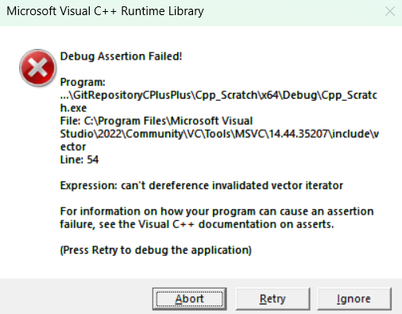

# Das *Erase-Remove*-Idiom / Entfernen von Elementen eines STL-Containers

[Zurück](../../Readme.md)

---

[Quellcode](EraseRemoveIdiom.cpp)

---

## Inhalt

  * [Elemente aus einem sequentiellen STL Container entfernen](#link1)
  * [Elemente an einer bestimmten Position entfernen](#link2)
  * [Elemente entfernen, die einen bestimmten Wert haben](#link3)
  * [Performance Betrachtungen](#link4)
  * [Das &bdquo;*Erase Remove*&rdquo; Idiom](#link5)
  * [Ungültige Iteratorenobjekte](#link6)
  * [Noch ein Idiom: &bdquo;*Swap and Pop*&rdquo;](#link7)
  * [Die Algorithmen `std::remove_copy` und `std::remove_copy_if`](#link8)
  * [Literaturhinweise](#link9)

---

## Elemente aus einem sequentiellen STL Container entfernen <a name="link1"></a> 

### Elemente an einer bestimmten Position entfernen <a name="link2"></a> 

#### 1. Ein Element an einer bestimmten Position entfernen

```cpp
01: void test()
02: {
03:     // removing an element at a given position
04:     std::vector<int> vec{ 1, 2, 3, 4, 5 };
05:     std::vector<int>::iterator pos = vec.begin() + 2;
06:     vec.erase(pos);
07: }
```

*Ausgabe*:

```
Size: 5, Capacity: 5
1 2 3 4 5

Size: 4, Capacity: 5
1 2 4 5
```

#### 2. Mehrere Elemente eines gegebenen Teilbereichs entfernen

```cpp
01: void test()
02: {
03:     // removing the elements of a given subrange
04:     std::vector<int> vec{ 1, 2, 3, 4, 5 };
05:     std::vector<int>::iterator first = vec.begin() + 1;
06:     std::vector<int>::iterator last = vec.end() - 1;
07:     vec.erase(first, last);
08: }
```

*Ausgabe*:

```
Size: 5, Capacity: 5
1 2 3 4 5

Size: 2, Capacity: 5
1 5
```

### Elemente entfernen, die einen bestimmten Wert haben <a name="link3"></a> 

#### 1. Entfernen eines Elements, das einen bestimmten Wert hat

Hierzu müssen wir das Element, das wir entfernen wollen, zunächst im Container lokalisieren.
Die Position (Iterator) kann dann als Argument für `erase` verwendet werden:


```cpp
01: void test()
02: {
03:     // removing the first element equal to a certain value / C++ 20 (!)
04:     std::vector<int> vec{ 1, 2, 3, 4, 5, 6, 7, 8 };
05:     int value{ 5 };
06: 
07:     std::vector<int>::iterator it = std::find(
08:         vec.begin(), 
09:         vec.end(), 
10:         value
11:     );
12: 
13:     // check that this value is actually in our vector
14:     if (it != vec.end()) {
15:         vec.erase(it);
16:     }
17: }

```

*Ausgabe*:

```
Size: 8, Capacity: 8
1 2 3 4 5 6 7 8

Size: 7, Capacity: 8
1 2 3 4 6 7 8
```

#### 2. Entfernen aller Elemente, die einen bestimmten Wert haben

*Bemerkung*:<br />
Dieses Beispiel kann erst ab C++ 20 übersetzt werden:


```cpp
01: void test()
02: {
03:     // removing all elements equal to a certain value - C++ 20 (!)
04:     std::vector<int> vec{ 1, 2, 123, 4, 5, 123, 7, 123, 9 };
05:     int value{ 123 };
06:     std::erase(vec, value);
07: }
```

*Ausgabe*:

```
Size: 9, Capacity: 9
1 2 123 4 5 123 7 123 9

Size: 6, Capacity: 9
1 2 4 5 7 9
```

#### 3. Zweiter Ansatz des Entfernen aller Elemente, die einen bestimmten Wert haben

*Bemerkung*:<br />
Im Gegensatz zum letzten Beispiel kommt der Algorithmus `std::remove` zum Einsatz:

```cpp
01: void test()
02: {
03:     // removing all elements equal to a certain value
04:     std::vector<int> vec{ 1, 2, 123, 4, 5, 123, 7, 123, 9 };
05:     int value{ 123 };
06:     std::remove(vec.begin(), vec.end(), value);
07: }
```

*Ausgabe*:

```
Size: 9, Capacity: 9
1 2 123 4 5 123 7 123 9

Size: 9, Capacity: 9
1 2 4 5 7 9 7 123 9
```

*Beobachtung*:<br />
Der zweite Ansatz zum Entfernen aller Elemente, die einen bestimmten Wert haben,
weist subtile Unterschiede zum ersten Ansatz auf:

  * Die Größe des Containers hat sich nicht geändert, obwohl der zu entfernende Wert im Container vorhanden ist.
  * Der zu entfernende Wert wurde tatsächlich entfernt, zumindest, wenn wir den Anfang des Containers zu Grunde legen.
  * Im hinteren Teil des Containers, der eigentlich gar nicht mehr existieren sollte,
    treten Werte in Erscheinung, die sich nicht schlüssig erklären lassen.

Wir gehen auf diese Beobachtungen im nächsten Abschnitt näher ein.


## Performance Betrachtungen <a name="link4"></a> 

### Überblick

Zwischen den beiden Methoden `erase` (entweder in der Ausprägung als Methode der Klasse `std::vector` oder als STL Algorithmus)
oder der Methode `remove` (existiert nur als STL Algorithmus) gibt es einige wesentliche Unterschiede:

1. Die Methode `erase` (in beiden Ausprägungen) operiert direkt auf dem Container. Das bedeutet zum Beispiel, das Datenbereiche verschoben werden,
  wenn am Anfang des Containers ein Element gelöscht wird.

2. Die Methode `remove` hat nur Iteratoren als Parameter. Sie hat damit keinen direkten Zugriff zum Datenbereich des Containers.
  Mit Hilfe der Iteratoren können ebenfalls Änderungen an den Daten durchgeführt werden (zum Beispiel ein Tausch zweier Elemente),
  aber keine direkten Verschiebe-Operationen im Datenbereich.


Um es kurz und bündig auf den Punkt zu bringen:

  * `std::remove` ist schneller, da es Elemente nicht tatsächlich löscht oder die Größe des Containers verändert &ndash; es
     ordnet die Elemente lediglich an Ort und Stelle neu an.
  * `std::erase` hingegen löscht Elemente tatsächlich, was zusätzlichen Aufwand bedeutet.


### `std::remove` und `std::erase` im Detail

Welche Aufgaben führt `std::remove`durch?

  * Hat keinen direkten Zugriff auf den Container, sondern nur auf der Basis von Iteratoren.
  * Ändert die Größe des Containers nicht.
  * Verschiebt Elemente, die erhalten bleiben sollen, an den Anfang des Bereichs.
  * Gibt einen Iterator des neuen &bdquo;logischen&rdquo; Endes zurück (dazu später noch mehr).

Welche Aufgaben führt `std::erase`durch?

  * Hat **direkten** Zugriff auf den Container.
  * Kann Elemente explizit entfernen.
  * Kann den Container verkleinern.
  * Kann Elemente zerstören (Destruktoren-Aufrufe).
  * Kann Elemente verschieben und die Verwaltungsdaten des Containers ändern.


### Warum nicht immer `std::remove` verwenden?

Für die Beantwortung dieser Frage gibt es mehrere Gründe:

  * Container müssen in ihrem Aufbau / in ihrer Struktur logisch korrekt bleiben.
  * Benutzer erwarten, dass gelöschte Elemente endgültig entfernt / zerstört werden.
  * Speicher muss freigegeben werden.
  * Destruktoren müssen ausgeführt werden.


Daher:

  * `std::remove` &Rightarrow; Low-Level Algorithmus
  * `std::erase` &Rightarrow; High-Level Containeroperation


### Zusammenfassung


| Funktion | `std::remove` | `std::erase` |
|:-|:-|:-|
| Ändert die Containergröße | &#10060;| &#9989; |
| Ruft Destruktoren auf | &#10060;| &#9989; |
| Speicherfreigabe | &#10060;| &#9989; |
| Datenverschiebung | Minimal |  Ja |
| Performance | Schneller | Langsamer |
| Zweck | Umstrukturierung | Tatsächliches Entfernen von Elementen |

*Tabelle* 1: Unterschiede zwischen `std::remove` und `std::erase`.


## Das &bdquo;*Erase Remove*&rdquo; Idiom <a name="link5"></a> 

Wie erlangen wir nach einem Aufruf von `std::remove` die Kenntnis,
welche neue, tatsächliche Länge der Container nun hat?

Es ist der Rückgabewert von `std::remove`, der diese Position in Gestalt eines
Iteratorenobjekts beschreibt. Dieser Iterator kann / sollte an `vec.erase` übergeben werden,
um von dieser Position bis zum Ende des Containers alle Elemente zu löschen.

Da der STL Algorithmus `std::remove` nicht wirklich löscht,
gibt es eine interessante Kombination dieser Funktion mit `std::erase`.
Sie wird als *Erase Remove* Idiom bezeichnet:


```cpp
01: void test()
02: {
03:     // removing and erasing all elements equal to a certain value
04:     std::vector<int> vec{ 1, 2, 123, 4, 5, 123, 7, 123, 9 };
05:     int value{ 123 };
06:     std::vector<int>::iterator last = std::remove(vec.begin(), vec.end(), value);
07:     vec.erase(last, vec.end());
08: }
```

*Ausgabe*:

```
Size: 9, Capacity: 9
1 2 123 4 5 123 7 123 9

Size: 6, Capacity: 9
1 2 4 5 7 9
```

Häufig findet man das &bdquo;*Erase Remove*&rdquo; Idiom auch kompakter programmiert vor:

```cpp
01: void test()
02: {
03:     std::vector<int> vec{ 1, 2, 123, 4, 5, 123, 7, 123, 9 };
04:     int value{ 123 };
05:     vec.erase(std::remove(vec.begin(), vec.end(), value), vec.end());
06: }
```

Die Ausgabe ist identisch zur ersten Ausgabe.

## Ungültige Iteratorenobjekte <a name="link6"></a> 

Wird in einem Container an einer bestimmten Position ein Element entfernt,
so gelangt der Iterator, der diese Position beschreibt, in einen ungültigen Zustand:

&bdquo;Ein ungültiger Iterator ist ein Iterator,
der nicht mehr den aktuellen Zustand seines Containers repräsentiert
oder nicht mehr auf eine gültige Speicheradresse verweist.&rdquo;

*Beispiel*:


```cpp
01: void test()
02: {
03:     // invalid iterator object
04:     std::vector<int> vec{ 0, 1, 2, 3, 4, 5, 6, 7, 8, 9 };
05:     std::vector<int>::iterator it = vec.begin() + 3;
06:     std::println("3. Element: {}", *it);
07:     vec.erase(it);
08:     std::println("3. Element: {}", *it);  // ???
09: }
```

Im Debug-Modus stürzt das Programm ab:



*Abbildung* 1: Ein ungültiges Iteratorenobjekt.

Wie kann man das letzte Programm korrekt schreiben?
Damit ist zunächst die Frage zu klären, was mit einer Position / einem Iteratorenobjekt
geschehen soll, dessen Position als solche nicht mehr existiert?

Die `erase`-Methode der `std::vector`-Klasse liefert ein neues Iteratorenobjekt zurück,
das dem zuletzt entfernten Element folgt.
Damit würde sich folgende sinnvolle Umschreibung des letzten Beispiels ergeben:


```cpp
01: void test()
02: {
03:     // invalid iterator object
04:     std::vector<int> vec{ 0, 1, 2, 3, 4, 5, 6, 7, 8, 9 };
05:     std::vector<int>::iterator it = vec.begin() + 3;
06:     std::println("3. Element: {}", *it);
07:     it = vec.erase(it);
08:     std::println("3. Element: {}", *it);  // ???
09: }
```

Man beachte hier vor allem Zeile 7. Die Variable `it` bekommt einen neuen Wert zugewiesen.

*Ausgabe*:

```
3. Element: 3
3. Element: 4
```

## Noch ein Idiom: &bdquo;*Swap and Pop*&rdquo; <a name="link7"></a> 

Bei einem ungeordneten Datensatz empfiehlt es sich,
das zu löschende Element mit dem letzten Element zu vertauschen und anschließend `pop_back()` zu verwenden.

Diese Technik vermeidet das Verschieben von Elementen im Speicher,
allerdings geht eine möglicherweise beabsichtigte Reihenfolge der Elemente im Container verloren.

Wir demonstrieren dies an folgendem Beispiel.
Es soll das vierte Element (mit dem Wert 3) gelöscht werden:


```cpp
01: void test()
02: {
03:     // "Swap and Pop" idiom
04:     std::vector<int> vec{ 0, 1, 2, 3, 4, 5, 6, 7, 8, 9 };
05:     std::vector<int>::iterator it = vec.begin() + 3;
06:     std::swap(*it, vec.back());
07:     vec.pop_back();
08: }
```

*Ausgabe*:

```
Size: 10, Capacity: 10
0 1 2 3 4 5 6 7 8 9

Size: 9, Capacity: 10
0 1 2 9 4 5 6 7 8
```

## Die Algorithmen `std::remove_copy` und `std::remove_copy_if` <a name="link8"></a> 

### Ein Beispiel zu `std::remove_copy` 

```cpp
01: void test()
02: {
03:     // 'std::remove_copy' algorithm
04:     std::vector<int> src{ 0, 1, 2, 3, 4, 5, 6, 7, 8, 9 };
05:     std::vector<int> dst{};
06:     std::remove_copy(src.begin(), src.end(), std::back_inserter(dst), 5);
07: }
```

*Ausgabe*:

```
src: Size: 10, Capacity: 10
0 1 2 3 4 5 6 7 8 9

src: Size: 10, Capacity: 10
0 1 2 3 4 5 6 7 8 9

dst: Size: 9, Capacity: 9
0 1 2 3 4 6 7 8 9
```

### Ein Beispiel zu `std::remove_copy_if` 

```cpp
01: void test()
02: {
03:     // 'std::remove_copy_if' algorithm
04:     std::vector<int> src{ 0, 1, 2, 3, 4, 5, 6, 7, 8, 9 };
05:     std::vector<int> dst{};
06:     std::remove_copy_if(
07:         src.begin(),
08:         src.end(), 
09:         std::back_inserter(dst),
10:         [](auto elem) { return elem % 2 == 0; }
11:     );
12: }
```

*Ausgabe*:

```
src: Size: 10, Capacity: 10
0 1 2 3 4 5 6 7 8 9

src: Size: 10, Capacity: 10
0 1 2 3 4 5 6 7 8 9

dst: Size: 5, Capacity: 6
1 3 5 7 9
```

---

## Literaturhinweise <a name="link9"></a> 

Diese Serie mit vier Artikeln von Jonathan Boccara widmet sich exklusiv dem Thema, wie sich Elemente aus STL Containern entfernen lassen:

["How to Remove Elements from a Sequence Container in C++"](https://www.fluentcpp.com/2018/09/14/how-to-remove-elements-from-a-sequence-container/)

Auch lesenswert:

["Removal Algorithms"](https://www.studyplan.dev/pro-cpp/removal-algorithms) aus dem Tutorial &bdquo;*StudyPlan.dev*&rdquo;.

---

[Zurück](../../Readme.md)

---
