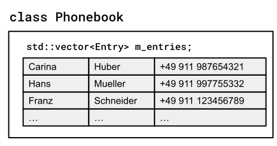
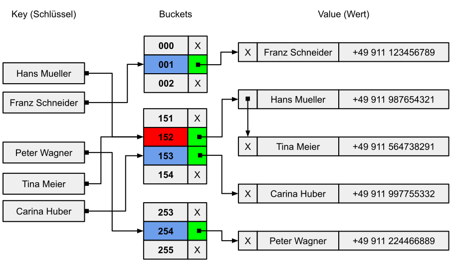

# Aufgaben zur STL


[Zurück](/GeneralSnippets/Exercises/Exercises.md)

---

[Lösungen](Exercises_03_STL.cpp)

---

### Überblick

| Aufgabe | Beschreibung |
| :- | :- |
| *Aufgabe* 1 | Löschen aller ungeraden Elemente eines sequenziellen Containers<br/>(Voraussetzungen: STL-Container `std::vector<int>`, Methode `erase`, STL-Algorithmus `std::remove_if`) |
| *Aufgabe* 2 | *Fibonacci*-Zahlen<br/>(Voraussetzungen: Algorithmen `std::generate`, `std::for_each`, Lambda-Funktionen, Structured Binding) |
| *Aufgabe* 3 | Die STL und eine Klasse `Phonebook`<br/>(Voraussetzungen: STL-Container `std::vector`, `std::unordered_map`, STL-Algorithmen `std::for_each`, `std::find_if`) |
| *Aufgabe* 4 | Der Algorithmus `std::accumulate` in der Anwendung<br/>(Voraussetzungen: `std::accumulate`, `std::initializer_list`) |

*Tabelle* 1: Aufgaben zur STL.

---

## Aufgabe 1: Löschen aller ungeraden Elemente in einem sequenziellen STL-Container

#### Voraussetzungen: STL-Container `std::vector<int>`, Methode `erase`, STL-Algorithmus `std::remove_if`

*Teilaufgabe* 1:

Wir studieren in dieser Aufgabe das folgende kleine Programm
zum Testen der `erase`-Methode an einem `std::vector<int>`-Objekt.
Es sollen alle geraden Elemente eines `std::vector<int>`-Objekts entfernt werden:

```cpp
01: void test ()
02: {
03:     std::vector<int> vec{ 0, 1, 2, 3, 4, 5, 6, 7, 8, 9 };
04: 
05:     // erase all even numbers
06:     for (std::vector<int>::iterator it = vec.begin(); it != vec.end(); ++it)
07:     {
08:         if (*it % 2 == 0) {
09:             vec.erase(it);
10:         }
11:     }
12: }
```

Welchen Inhalt hat der STL-Container `vec` Ihrer Meinung nach am Ende der `test`-Funktion?
Bringen Sie das Programm zum Laufen. Geben Sie den Inhalt des `std::vector<int>`-Containers am Ende der `test`-Funktion
in der Konsole aus. Welche Beobachtungen machen Sie bei der Ausführung des Programms?

*Teilaufgabe* 2:

Welche Änderungen sind an der `test`-Funktion notwendig, so dass die Ausführung korrekt verläuft.
Es ist durchaus möglich, die `for`-Wiederholungsschleife beizubehalten.
Was fällt Ihnen an diesem Beispiel betrachtet zum Thema &bdquo;ungültige Iteratoren&rdquo; ein?

*Teilaufgabe* 3:
Für die Aufgabenstellung eignet sich auch eine Verwendung des STL-Algorithmus `std::remove_if`.
Schreiben Sie die `test`-Funktion so um, dass der STL-Algorithmus `std::remove_if` zum Einsatz kommt.

*Teilaufgabe* 4:
Mit Teilaufgabe 2 und 3 stehen sich nun zwei Lösungen gegenüber:

  * Lösung mit einer `for`-Kontrollstruktur und wiederholtem Aufruf der `erase`-Methode.
  * Lösung mit STL-Algorithmus `std::remove_if` und einmaligem Aufruf der `erase`-Methode.

Schreiben Sie ein kleines Testprogramm, in dem Sie die beiden Realisierungen in einer Wiederholungsschleife aufrufen.
Zum Messen der Zeit verwenden Sie eine Klasse `ScopedTimer`,
deren Quellcode Sie [hier](https://github.com/pelocpp/cpp_modern/blob/master/GeneralSnippets/ScopedTimer/ScopedTimer.h) finden.
Welche Beobachtungen können Sie in Bezug auf die Ausführungszeiten des Vergleichs machen?

---

## Aufgabe 2: *Fibonacci*-Zahlen

#### Voraussetzungen: Algorithmen `std::generate`, Lambda-Funktionen, Structured Binding

In der Mathematik bilden die *Fibonacci*-Zahlen eine Folge,
so dass jede Zahl die Summe der beiden vorhergehenden Zahlen ist, beginnend mit 0 und 1. 
Für die *n*.-te Fibonacci F<sub>*n*</sub> bedeutet das F<sub>*n*</sub> = F<sub>*n*-1</sub> + F<sub>*n*-2</sub>,
wobei F<sub>0</sub> = 0 und F<sub>1</sub> = 1 gelten.
Die durch Fibonacci-Zahlen gebildete Sequenz wird als *Fibonacci*-*Sequenz* bezeichnet.

Verwenden Sie in dieser Aufgabe den Algorithmus `std::generate` mit einer geeigneten Lambda-Funktion,
um die *Fibonacci*-Zahlen zu berechnen. Die Größe des Containers, der an `std::generate` 
in den ersten beiden Parametern übergeben wird (Start- und Ende-Iterator), entscheidet, 
wieviele *Fibonacci*-Zahlen berechnet werden.

Die ersten zwei Werte 0 und 1 der Zahlenfolge können Sie in einem `std::pair`-Objekt ablegen: `std::pair{0,1}`.
Von Aufruf zu Aufruf der Lambda-Funktion können Sie dieses Objekt geeignet modifizieren:

  * Das erste Element des neuen Paares ist das zweite Element des alten Paares.
  * Das zweite Element des neuen Paares ist die Summe der beiden Elemente des alten Paares.

Wie müssen Sie diese Lambda-Funktion definieren, so dass das `std::pair`-Objekt veränderbar ist?

*Hinweis*: Die ersten 20 *Fibonacci*-Zahlen lauten

```
0 1 1 2 3 5 8 13 21 34 55 89 144 233 377 610 987 1597 2584 4181
```

---

## Aufgabe 3: Die STL und eine Klasse `Phonebook`

#### Voraussetzungen: STL-Container `std::vector`, `std::unordered_map`, STL-Algorithmen `std::for_each`, `std::find_if`

Schreiben Sie eine Klasse `Phonebook`, die die grundlegende Funktionalität eines Telefonbuchs realisiert.
Eine Person hat einen Vor- und Nachnamen (`std::string`) und besitzt eine Telefonnummer (`std::size_t`).
Das Telefonbuch unterstützt das Hinzufügen, das Nachschauen, das Entfernen und das Ausgeben aller Einträge.

*Teilaufgabe* 1: Erste Realisierung einer Klasse `Phonebook`

Folgende Aspekte werden betrachtet:
  * Entwicklung einer Anwendung mit der STL (*Standard Template Library*).
  * Anwendung eines sequentiellen oder assoziativen STL-Containers (`std::vector` oder `std::unordered_map`).
  * Anwendung elementarer STL Algorithmen wie z. B. `std::find_if` und `std::for_each`.
  * Einsatz von Lambdas.
  * Gebrauch von Iteratoren.

Im Großen und Ganzen kann man sagen, dass die Funktionsweise der Methoden der Klasse `Phonebook` selbsterklärend ist.
Weitere Details zur Definition ihrer Methoden entnehmen Sie bitte *Tabelle* 1:

| Methode        | Schnittstelle und Beschreibung |
|:-------------- |:-----------------------------------------|
| `size` | `size_t size() const;`<br/>Liefert die Anzahl der Einträge im Telefonbuch zurück. |
| `insert` | `bool insert(const std::string& first, const std::string& last, size_t number);`<br/>Fügt einen Eintrag, bestehend aus den Werten Vorname (`const std::string& first`), Nachname (`const std::string& last`) und Telefonnummer (`std::size_t number`), in das Telefonbuch ein. Ist der Name (Vor- und Nachname) im Telefonbuch schon enthalten, liefert die Funktion `false` zurück, andernfalls `true`. |
| `update` | `bool update(const std::string& first, const std::string& last, size_t number);`<br/>Ändert einen Eintrag im Telefonbuch. Zu vorgegebenem Namen (`const std::string& first` und `const std::string& last`) wird eine neue Nummer im Telefonbuch eingetragen. Sind die Angaben des Namens falsch, liefert die Funktion `false` zurück, andernfalls `true`. |
| `search` | `std::optional<std::size_t> search(const std::string& first, const std::string& last) const;`<br/>Sucht einen Eintrag im Telefonbuch. Sind die Namensangaben korrekt, liefert die Funktion die Telefonnummer in einem `std::optional<std::size_t>`-Objekt zurück, andernfalls wird `std::nullopt` zurückgegeben. |
| `remove` | `bool remove(const std::string& first, const std::string& last);`<br/>Entfernt einen Eintrag im Telefonbuch. Sind die Namensangaben korrekt, liefert die Funktion `true` zurück, andernfalls `false`. |
| `contains` | `bool contains(const std::string& first, const std::string& last) const;`<br/>Liefert die Information zurück, ob ein bestimmter Eintrag (Vor- und Nachname) im Telefonbuch vorhanden ist oder nicht. |
| `print` | `void print() const;`<br/>Gibt den Inhalt des Telefonbuchs in der Konsole aus. |

*Tabelle* 1: Beschreibung der öffentlichen Schnittstelle einer Telefonbuch-Realisierung.

Es folgen einige Hinweise zur Realisierung:

Die Klasse `std::vector` ist der STL-Allzweck Container für eine Ansammlung von Daten,
deren Umfang sich zur Laufzeit eines Programms ändern kann.

Wie müssen Sie ein konkretes `std::vector`-Objekt bzw. eine Klasse `Entry` definieren,
wenn wir pro Eintrag die drei Informationen Vorname (`const std::string& first`), Nachname (`const std::string& last`) und Telefonnummer (`std::size_t number`)
im Telefonbuch ablegen wollen? Es bieten sich für Klasse `Entry` mehrere Möglichkeiten zur Realisierung an!



*Abbildung* 1. Struktureller Aufbau eines `std::vector`-Objekts mit mehreren Telefonbucheinträgen.

Bilden Sie die in *Tabelle* 1 geforderten Methoden der öffentlichen Schnittstelle einer `PhoneBook`-Klasse
geeignet auf STL-Algorithmen ab.
Denkbar wäre zum Beispiel:

  * Methode `search` &Rightarrow; `std::find_if`
  * Methode `print` &Rightarrow; `std::for_each`


*Teilaufgabe* 2: Eine verbesserte Realisierung auf Basis des STL-Containers `std::unordered_map`

In einer eher einfachen Realisierung wurden die Einträge des Telefonbuchs wie ein Teilaufgabe 1 angedacht
in einem `std::vector`-Objekt abgelegt.
Überlegen Sie, ob diese Container-Klasse ideal für den vorliegenden Anwendungsfall ist.
Nehmen Sie eine zweite Realisierung vor, die auf einem `std::unordered_map`-Container fußt.



*Abbildung* 2. Struktureller Aufbau einer Hashtabelle (hier: Hash-Kollision durch separate Verkettung gelöst).

---

## Aufgabe 4: Der Algorithmus `std::accumulate` in der Anwendung

#### Voraussetzungen: `std::accumulate`, `std::initializer_list` (Initialisierungliste)

Schreiben Sie zwei Funktionen `andAll` und `orAll`, die eine variable Anzahl von `bool`-Parametern
logisch UND oder logisch ODER verknüpfen. Mögliche Testbeispiele können so aussehen:

```cpp
bool result = andAll({ true, false, true });
std::cout << std::boolalpha << result << std::endl;

result = orAll({ false, false, false, false, false, false, false, false, false, true });
std::cout << std::boolalpha << result << std::endl;
```

Setzen zur Lösung der Aufgabe den STL-Algorithmus `std::accumulate` ein!

*Ausgabe*:

```cpp
false
true
```

---

[Lösungen](Exercises_03_STL.cpp)

---

[Zurück](/GeneralSnippets/Exercises/Exercises.md)

---
