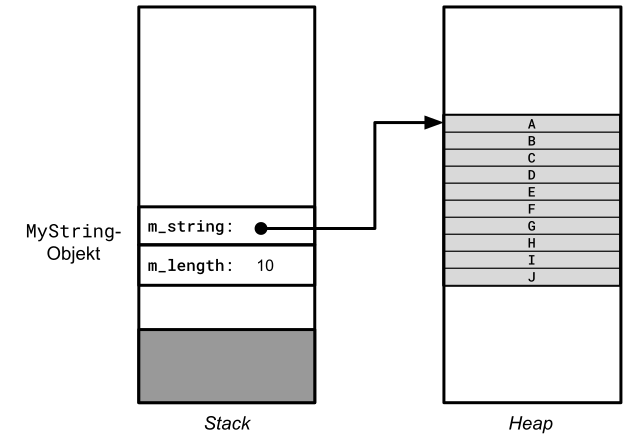

# Aufgaben zu Smart Pointer Klassen

[Zurück](/GeneralSnippets/Exercises/Exercises.md)

---

[Lösungen](Exercises_15_SmartPointers.cpp)

---

### Überblick

| Aufgabe | Beschreibung |
| :- | :- |
| *Aufgabe* 1 | Quiz zu Smart Pointer Klassen<br/>(Voraussetzungen: `std::shared_ptr<>`) |
| *Aufgabe* 2 | Noch ein Quiz zu Smart Pointer Klassen<br/>(Voraussetzungen: `std::shared_ptr<>`) |
| *Aufgabe* 3 | Betrachtungen eines &bdquo;nicht besitzenden&rdquo; Zeigers<br/>(Voraussetzungen: `std::shared_ptr<>`, `std::weak_ptr<>`) |
| *Aufgabe* 4 | Verwendung von Smart Pointern für Membervariablen einer Klasse<br/>(Voraussetzungen: `std::unique_ptr<>` und `std::shared_ptr<>`) |
| *Aufgabe* 5 | Rückgabe eines `std::unique_ptr<>`-Objekts aus einer Funktion<br/>(Voraussetzungen: `std::unique_ptr<>`, bei Bedarf `std::tuple<>` und `std::optional`) |

*Tabelle* 1: Aufgaben zu Smart Pointer Klassen.

---

## Aufgabe 1: Quiz zu Smart Pointer Klassen

#### Voraussetzungen: `std::shared_ptr<>`

Studieren Sie das folgende Code-Fragement genau.
Welchen Wert hat der Referenzzähler des Objekts `pC` in der letzten Zeile?

```cpp
01: class X {};
02: 
03: std::shared_ptr<X> pA;
04: std::shared_ptr<X> pB;
05: std::shared_ptr<X> pC;
06: 
07: pA = std::make_shared<X>();
08: pB = pA; 
09: pC = std::move(pA);
10: pB = nullptr;
```

---

## Aufgabe 2: Noch ein Quiz zu Smart Pointer Klassen

#### Voraussetzungen: `std::shared_ptr<>`

Studieren Sie das folgende Code-Fragement genau.

  * Welchen Wert erwarten Sie in der Ausgabe von Zeile 19?
  * Wie erklären Sie sich das vorliegende Laufzeitverhalten des Programms?
  * Welcher prinzipielle Programmierfehler liegt in diesem Code-Fragment vor?

```cpp
01: class X
02: {
03: public:
04:     X() : m_value{ 123 } {}
05:     int getValue() const { return m_value; }
06: 
07: private:
08:     int m_value;
09: };
10: 
11: std::shared_ptr<X> pA{ new X{} };
12: std::shared_ptr<X> pB;
13: std::shared_ptr<X> pC;
14: 
15: pB = pA;
16: pC = std::shared_ptr<X>{ pB.get() };
17: pC = nullptr; 
18: int value = (*pB).getValue();
19: std::cout << "Value: " << value << std::endl;
```

---

## Aufgabe 3: Betrachtungen eines &bdquo;nicht besitzenden&rdquo; Zeigers

#### Voraussetzungen: `std::shared_ptr<>` und `std::weak_ptr<>`

Wir betrachten in dieser Übungsaufgabe die Situation, dass wir zu einem Objekt
(hier: dynamisch allokierte Variable vom Typ `int`)
eine Zeigervariable haben möchten, aber nicht um den Preis, dass wir damit
einen Anspruch auf Eigentum erheben.
Natürlich könnten wir einen klassischen &bdquo;raw&rdquo; Zeiger verwenden,
um die Idee eines &bdquo;nicht besitzenden&rdquo; Zeigers auszudrücken,
aber in Zeiten von *Modern C++* ist das keine opportune Lösung.
Außerdem bestünde dann die Gefahr, dass der tatsächliche Eigentümer des referenzierten Objekts beschließen könnte,
dieses freizugeben.
Wenn wir dann den &bdquo;nicht besitzenden&rdquo; Zeiger dereferenzieren, käme es zu einem Absturz.

Studieren Sie vor dem geschilderten Hintergrund das folgende Szenario:

  * Wie erklären Sie sich das vorliegende Laufzeitverhalten dieses Code-Fragments?
  * Welcher prinzipielle Programmierfehler liegt in diesem Code-Fragment vor?

```cpp
#include <iostream>
#include <memory>

class UnsafeWatcher {
private:
    int* m_ptr;

public:
    UnsafeWatcher() : m_ptr{ nullptr } {}

    void watch(const std::shared_ptr<int>& sp)
    {
        m_ptr = sp.get();
    }

    int currentValue() const
    {
        return *m_ptr;
    }
};

int main()
{
    UnsafeWatcher watcher;

    {
        std::shared_ptr<int> sp{ std::make_shared<int>(123) };
        watcher.watch(sp);
        std::cout << "Value: " << watcher.currentValue() << std::endl;
    }

    std::cout << "Value: " << watcher.currentValue() << std::endl;
}
```

---

Alternativ zum letzten Beispiel könnten wir in der Klasse `UnsafeWatcher` eine `std::shared_ptr`-Variable verwenden.
Damit würden wir aber zu einem Besitzer des Zeigers und verlassen den Ansatz eines &bdquo;nicht besitzenden&rdquo; Zeigers!
Auch dies wollen wir mit einem Beispiel untermauern:

```cpp
#include <iostream>
#include <memory>

class HeavyAndSafeWatcher {
private:
    std::shared_ptr<int> m_ptr;

public:
    HeavyAndSafeWatcher() {}

    void watch(const std::shared_ptr<int>& sp)
    {
        m_ptr = sp;
    }

    int currentValue() const
    {
        return *m_ptr;  // m_ptr is always alive!
    }
};

int main()
{
    HeavyAndSafeWatcher watcher;

    {
        std::shared_ptr<int> sp{ std::make_shared<int>(123) };
        watcher.watch(sp);
        std::cout << "Value: " << watcher.currentValue() << std::endl;
    }

    std::cout << "Value: " << watcher.currentValue() << std::endl;
}
```

*Aufgabe*: 

  * Vergleichen und erklären Sie das Laufzeitverhalten der beiden Code-Fragmente (Klassen `UnsafeWatcher` und `HeavyAndSafeWatcher`)?
  * Schreiben Sie das letzte Code-Fragment so um, dass die `HeavyAndSafeWatcher`-Klasse
    einen nicht-besitzenden Zeiger besitzt, der Zugang zu einem korrespondierenden `std::shared_ptr`-Objekt hat und in der Lage ist, 
    dessen Kontrollblock abzufragen und zu entscheiden, ob das referenzierte Objekt noch existiert oder nicht.

*Hinweis*: 

Die gesuchte primitive Operation ist *multithreading sicher*!
Sie liefert eine besitzende Referenz (`std::shared_ptr`-Variable) auf das
referenzierte Objekt zurück, wenn dieses noch existiert, oder zeigt andernfalls einen Fehler an.

Man könnte auch die Formulierung wählen, dass wir auf der Suche nach einer &bdquo;Fahrkarte&rdquo;
für ein `std::shared_ptr`-Objekt sind.
Das Ticket selbst steht für einen nicht-besitzenden Zeiger,
man kann es zu einem späteren Zeitpunkt gegen ein `std::shared_ptr`-Objekt eintauschen &ndash; sofern
das referenzierte Objekt noch existiert.

---

## Aufgabe 4: Verwendung von Smart Pointern für Membervariablen einer Klasse

#### Voraussetzungen: `std::unique_ptr<>` und `std::shared_ptr<>`

In dieser Aufgabe gehen wir auf den Gebrauch eines Smartpointers als Membervariable einer Klasse ein.

Schreiben Sie eine Klasse `MyString`,
die die ersten Schritte einer Realisierung für eine Zeichenketten-Klasse darstellen könnte.
Die Zeichen sind auf der Halde (*Heap*) abzulegen,
ihre Anzahl soll prinzipiell beliebig groß sein dürfen.

*Abbildung* 1 zeigt ein `MyString`-Objekt, das die Zeichenkette `ABCDEFGHIJ`
der Länge 10 enthält.
Die Variable `m_length` ist vom Typ `std::size_t`, 
der Typ der Variablen `m_string` ist bewusst offen gehalten.

Betrachten Sie genau, welche Anteile eines `MyString`-Objekts auf dem Stack
und welche auf dem Heap liegen:



*Abbildung* 1: Aufteilung eines `MyString`-Objekts auf die beiden Speicherbereiche *Stack* und *Heap*.

### `std::shared_ptr`- oder `std::unique_ptr`-Objekt?

Der Gebrauch von `new` und `delete` ist in einem Modern C++ Programm nicht mehr angesagt.
Wir greifen deshalb auf eine *Smart Pointer* Klasse zurück,
um die Adresse der Zeichen auf dem Heap zu verwalten.

Es ist sorgfältig zu überlegen und zu begründen,
ob sich hierfür ein `std::shared_ptr`- oder ein `std::unique_ptr`-Objekt besser eignet.

*Hinweis*:
Technisch gesehen ist es möglich, mit beiden Klassen eine `MyString`-Realisierung
auf die Beine zu stellen. Bei näherem Hinsehen sollte jedoch deutlich werden,
dass auf Grund der Anforderungen an die `MyString`-Klasse nur eine der beiden Klassen in Betracht kommt.

### Minimaler Funktionsumfang der Klasse `MyString`

Für eine minimale Ausstattung der `MyString`-Klasse realisieren wir

  * einen benutzerdefinierten Konstruktor, der eine `const char*` Zeichenkette entgegennimmt,
  deren Zeichen im `MyString`-Objekt aufzunehmen sind,
  * eine `print`-Methode zur Ausgabe der Zeichen in der Konsole,
  * eine `length`-Methode, die die Anzahl der Zeichen zurückliefert und
  * einen Index-Operator, um auf einzelne Zeichen in der Zeichenkette lesend und schreibend zugreifen zu können.


| Name | Beschreibung |
|:-|:-|
| `MyString(const char* s)` | Benutzerdefinierter Konstruktor &ndash; die Zeichen des Parameters `s` werden in das Objekt aufgenommen. |
| `void print()` | Ausgabe der Zeichenkette auf der Konsole. |
| `std::size_t length()` | Liefert die Anzahl der Zeichen zurück. |
| `char& operator[] (int index);` | Lesender oder schreibender Zugriff auf ein einzelnes Zeichen der Zeichenkette. |

*Tabelle* 1: Minimaler Funktionsumfang der Klasse `MyString`.

Nun kommen wir auf den zweiten Schwerpunkt der Aufgabe zu sprechen:

### Regelwerk Rule-of-Zero oder Rule-of-Three?

Es ist das *Rule-of-Zero* oder *Rule-of-Three* Regelwerk zu betrachten und in seiner Umsetzung
in der Klasse `MyString` zu begründen. 

1. Frage:<br />
Kann man das *Rule-of-Zero* Regelwerk in Anspruch nehmen?
 
In diesem Fall wäre folglich keine der drei fraglichen Methoden/Operatoren Kopierkonstruktor, Zuweisungsoperator und Destruktor zu realisieren.
Verifizieren Sie, ob in Ihrer Realisierung der `MyString`-Klasse diese drei Methoden/Operatoren zur Laufzeit zur Verfügung stehen?
Welche Ergebnisse erhalten Sie bei der Ausführung?


2. Frage:<br />
Wenn die Antwort auf die erste Frage &bdquo;Nein&rdquo; lautet,
wie sieht dann eine Realisierung dieser drei Methoden/Operatoren aus?
Testen Sie die Implementierung mit entsprechenden Beispielen.

### Klasse `MyString` und die Verschiebe-Semantik: Regelwerk Rule-of-Five

Neben dem Kopieren lassen sich ab C++ 11 Objekte auch verschieben.
Welche Methoden/Operatoren muss die Klasse `MyString` bereitstellen,
so dass deren Objekte auch verschoben werden können.

Zeigen Sie das Verschieben an entsprechenden Beispielen auf.

---

## Aufgabe 5: Rückgabe eines `std::unique_ptr<>`-Objekts aus einer Funktion

#### Voraussetzungen: `std::unique_ptr<>`, bei Bedarf `std::tuple<>` und `std::optional`


In dieser Aufgabe wollen wir ein `std::unique_ptr<>`-Objekt in einem Unterprogramm (Funktion, Methode) anlegen.
Es sollen verschiedene Wege aufgezeigt und bewertet werden, wie diese `std::unique_ptr<>`-Variable aus dem Unterprogramm
zurückgegeben werden kann.

Da man meistens auch andere Werte zurückgeben möchte, gibt es mehrere gängige Vorgehensweisen.
Im Folgenden finden Sie die wichtigsten Methoden mit Hinweisen, wann welche anzuwenden ist.

Schreiben Sie eine Funktion `splitToDigits`, die eine ganze Zahl in ihre einzelnen Ziffern zerlegt.
Die Ziffern der Zahl sind der Reihe nach in einem dynamisch allokierten Speicherblock abzulegen.
Offensichtlich muss die Funktion neben der Zerlegung der Zahl auch die Anzahl der einzelnen Ziffern berechnen,
um so die Länge des dynamisch zu allokierenden Speichbereichs zu kennen.

Natürlich wird der Speicherblock für die einzelnen Ziffern mit dem `new`-Operator angelegt,
die Adresse ist aber &ndash; ganz konform zu Modern C++ &ndash; durch ein `std::unique_ptr<>`-Objekt zu verwalten.

  * Welche Möglichkeiten gibt es, das `std::unique_ptr<>`-Objekt aus der Funktion zurückzugeben?

  * Welche Vorteile hat es, mit einem `std::unique_ptr<std::size_t[]>`-Objekt anstatt mit einem `std::size_t*`-Zeiger zu arbeiten?

Beachten Sie dabei, dass neben dem Zeiger auch die Anzahl der Ziffern in einer zweiten Variablen zurückgegeben werden soll.
Und zu guter Letzt soll auch noch eine boolsche Variable zurückgeliefert werden, die angibt,
ob die Funktion `splitToDigits` in ihrer Funktionsweise korrekt gearbeitet hat oder nicht.
Die Berechnung des Ergebnisses stellt hier weniger das Problem dar,
aber die interne Speicherplatzanforderung mit `new` muss nicht immer funktionieren.
Ein Wert von `true` bedeutet, dass der Speicherbereich und die Längenangabe eine korrekte Zerlegung der Zahl darstellen,
in allen anderen Fällen wird `false` zurückgeben.

Um Ihnen eine kleine Hilfestellung zu geben, folgen hier einige Hinweise für die Spezifikation der `splitToDigits`-Funktion:

  * Liefere direkt ein `std::unique_ptr<>`-Objekt zurück (Verschiebe-Semantik oder *Copy-Move-Elision* hinter den Kulissen).
  * Liefere eine Strukturvariable zurück (klassische Herangehensweise, im Prinzip der zu favorisierende Ansatz).
  * Liefere ein `std::tuple`-Objekt zurück (moderne, leichtgewichtige Herangehensweise, Lesbarkeit nicht ganz so gut).
  * Verwende Rückgabewert und eine Menge an Out-Parametern (*Call-by-Reference* &ndash; ähnlich wie die Variante mit Strukturvariablen zu bewerten).
  * Liefere ein `std::pair` zurück (wenn es kompakt sein soll und man mit zwei Werten auskommt).
  * Rückgabe mit Hilfe von `std::optional` und `std::pair` (interessant, wenn nicht immer ein Ergebnis vorliegen muss).

*Beispiel*:

```cpp
01: void test()
02: {
03:     // pass all parameters by reference
04:     std::size_t number{ 54321 };
05:     std::size_t count{};
06:     std::unique_ptr<std::size_t[]> buffer{};
07: 
08:     bool success { splitToDigitsByRef(number, buffer, count) };
09: 
10:     if (success) {
11:         std::span<size_t> digits{ buffer.get(), count };
12: 
13:         std::println("Splitting of {}:", number);
14:         for (std::size_t i{}; auto digit : digits) {
15:             std::println("{}: {}", i, digit);
16:             ++i;
17:         }
18:     }
19: }
```

*Ausgabe*:

```
Splitting of 12345:
0: 1
1: 2
2: 3
3: 4
4: 5
```

---

[Lösungen](Exercises_15_SmartPointers.cpp)

---

[Zurück](/GeneralSnippets/Exercises/Exercises.md)

---
