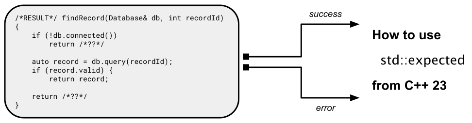

# Neue Klasse zur Fehlerbehandlung: `std::expected`

[Zurück](../../Readme.md)

---

[Quellcode](Variant.cpp)

---

## Inhalt

  * [Allgemeines](#link1)
  * [Tradionelle Vorgehensweisen bei der Behandlung von Fehlersituationen](#link2)
  * [Klasse `std::expected`](#link3)
  * [Methode `and_then`](#link4)
  * [ Methode `transform`](#link5)
  * [Ein weiteres Beispiel zum Verketten von Methoden](#link6)
  * [Literaturhinweise](#link7)

---

## Allgemeines <a name="link1"></a>



`std::expected` ist eine leistungsstarke Klasse, die in C++ 23 eingeführt wurde
und eine moderne, typsichere Alternative zu herkömmlichen Methoden der Fehlerbehandlung bietet.

`std::expected` ermöglicht es Entwicklern, einen Wert oder einen Fehler in einem einzelnen Objekt darzustellen,
wodurch die Handhabung von Erfolgs- und Fehlerszenarien auf saubere und lesbarere Weise vereinfacht wird.

Gewisse Ähnichkeiten von `std::expected` zu `std::optional` und `std::variant` lassen
sich nicht von der Hand weisen.

---

## Tradionelle Vorgehensweisen bei der Behandlung von Fehlersituationen <a name="link2"></a>

Im herkömmlichen C/C++&ndash;Stil kennt man zwei Vorgehensweisen bei der Betrachtung von Fehlersituationen:

  * Return Codes
  * Werfen und Fangen von *Exception*-Objekten


#### Ein Beispiel zu Return Codes:

```cpp
01: bool divideUsingReturnCodes(double numerator, double denominator, double& result, std::string& error) {
02: 
03:     if (denominator == 0.0) {
04:         error = "Error: Division by zero";
05:         return false;
06:     }
07: 
08:     result = numerator / denominator;
09:     return true;
10: }
```

#### Ein Beispiel zum Werfen und Fangen von *Exception*-Objekten:


```cpp
01: double divideException(double numerator, double denominator) {
02: 
03:     if (denominator == 0.0) {
04:         throw std::runtime_error("Error: Division by zero");
05:     }
06: 
07:     return numerator / denominator;
08: }
09: 
10: void testDivideException()
11: {
12:     try
13:     {
14:         divideException(10, 0);
15:     }
16:     catch (const std::runtime_error& error)
17:     {
18:         std::println("Error: {}", error.what());
19:     }
20:     catch (const std::exception& error)
21:     {
22:         std::println("Error: {}", error.what());
23:     }
24: }
```

---

## Klasse `std::expected` <a name="link3"></a>

Die Verwendung der Klasse `std::expected` beginnt mit der Erstellung eines Objekts, das entweder einen Wert oder einen Fehler enthalten kann.
Der Typ `std::expected<T, E>` repräsentiert einen erwarteten Wert vom Typ `T` oder einen Fehler vom Typ `E`.

In nächsten Beispiel ist `divide` eine Funktion, die zwei Gleitpunktwerte verarbeitet
und ein `std::expected<int, std::string>`-Objekt zurückgibt.

Wenn der Nenner Null ist, gibt die Funktion eine Fehlermeldung mit `std::unexpected` zurück;
andernfalls gibt sie das Ergebnis der Division zurück.

Wenn man ein `std::expected`-Objekt hat, muss man prüfen, ob es einen gültigen Wert oder einen Fehler enthält.
Mit der Methode `has_value()` kann man feststellen, ob die Operation erfolgreich war,
und mit den Methoden `value` und `error()` könnte man auf den enthaltenen Wert bzw. Fehler zugreifen.

```cpp
01: std::expected<double, std::string> divide(double numerator, double denominator) {
02: 
03:     if (denominator == 0.0) {
04:         return std::unexpected{ "Error: Division by zero" };
05:     }
06: 
07:     return std::expected<double, std::string> { numerator / denominator};
08: }
09: 
10: void test()
11: {
12:     auto numerator = 10.0;
13:     auto denominator = 2.5;
14: 
15:     auto result = divide(numerator, denominator);
16: 
17:     if (result.has_value()) {
18:         std::println("{} / {} = {}", numerator, denominator, result.value());
19:     }
20: 
21:     denominator = 0.0;
22: 
23:     result = divide(numerator, denominator);
24: 
25:     if (!result.has_value()) {
26:         std::println("Error: {}", result.error());
27:     }
28: }
```

---

## Methode `and_then` <a name="link4"></a>

In diesem Code wird die Methode `and_then` demonstriert,
um eine Operation zu verketten, die das Ergebnis einer erfolgreichen Division quadriert:

```cpp
01: auto square(auto value) {
02:     return value * value;
03: }
04: 
05: std::expected<double, std::string> squareIfSuccess(double numerator, double denominator) {
06: 
07:     auto result{ divide(numerator, denominator) };
08: 
09:     auto squareResult{ result.and_then(
10:         [](auto value) {
11:             return std::expected<double, std::string>{ square(value) };
12:         })
13:     };
14: 
15:     return squareResult;
16: }
17: 
18: std::expected<double, std::string> squareIfSuccessEx(double numerator, double denominator) {
19: 
20:     return divide(numerator, denominator).and_then(
21:         [](auto value) {
22:             return std::expected<double, std::string>(square(value));
23:         }
24:     );
25: }
26:  
27: void test()
28: {
29:     auto numerator = 10.0;
30:     auto denominator = 2.5;
31: 
32:     auto result = squareIfSuccess(numerator, denominator);
33: 
34:     if (result.has_value()) {
35:         std::println("Square: {}", result.value());
36:     }	
37: 
38:     denominator = 0.0;
39: 
40:     result = squareIfSuccess(numerator, denominator);
41: 
42:     if (!result.has_value()) {
43:         std::println("Error: {}", result.error());
44:     }
45: }
```

---

## Methode `transform` <a name="link5"></a>

Die Methode `transform` kann ebenfalls verwendet werden, um eine Transformation auf den Wert einer vorangehenden Berechnung anzuwenden,
falls dieser vorhanden ist:

```cpp
01: void test()
02: {
03:     auto numerator = 10.0;
04:     auto denominator = 2.5;
05: 
06:     auto result = divide(numerator, denominator);
07: 
08:     if (result.has_value())
09:     {
10:         auto transformedResult = result.transform([](auto value) { return value + 1; });
11: 
12:         // check result
13:         if (transformedResult.has_value()) {
14:             std::println("Result: {}", transformedResult.value());
15:         }
16:     }
17: 
18:     denominator = 0.0;
19: 
20:     result = divide(numerator, denominator);
21: 
22:     if (!result.has_value()) {
23: 
24:         std::println("Error: {}", result.error());
25:     }
26: }
27: 
28: void another_test()
29: {
30:     auto numerator = 10.0;
31:     auto denominator = 2.5;
32: 
33:     // using transform to apply a transformation to the value if it exists
34:     auto result = divide(numerator, denominator).transform([](auto value) {
35:         return value + 1;
36:         }
37:     );
38: 
39:     // check result
40:     if (result.has_value()) {
41:         std::println("Result: {}", result.value());
42:     }
43: 
44:     denominator = 0.0;
45: 
46:     result = divide(numerator, denominator).transform([](auto value) {
47:         return value + 1;
48:         }
49:     );
50: 
51:     // check result
52:     if (!result.has_value()) {
53:         std::println("Error: {}", result.error());
54:     }
55: }
```

---

## Ein weiteres Beispiel zum Verketten von Methoden <a name="link6"></a>

Wir stellen ein weiteres Beispiel zum Verketten mehrerer Methoden vor.
Je nach dem Eingabewert im ersten Methodenaufruf können wir in einer der verketteten Methoden einen Fehler beobachten bzw. verursachen.

Es geht bei diesem Beispiel darum zu veranschaulichen, dass es nicht um die mögliche Fehlerursache in
der zweiten oder dritten Methode geht.

Es geht darum,  dass entweder die ganze Kette funktioniert oder eben nicht.
Man ist nicht daran interessiert, in Erfahrung zu bringen, in welchem Kettenglied ein Fehler aufgetreten ist.


```cpp
01: // add five
02: std::expected<double, std::string> add_five(double value) {
03:     return value + 5;
04: }
05: 
06: // to the power of three
07: std::expected<double, std::string> powerOfThree(double value) {
08:     return value * value * value;
09: }
10: 
11: // now we are calling a dangerous function
12: std::expected<double, std::string> russianRoulette(double value) {
13: 
14:     auto remainder = static_cast<int>(value) % 2;
15: 
16:     if (remainder == 0) {
17:         return std::unexpected{ "Error: Value is multiple of Two" };
18:     }
19:     else
20:     {
21:         return static_cast<double>(value);
22:     }
23: }
24: 
25: void test()
26: {
27:     auto numerator = 20.0;
28:     auto denominator = 2.5;         // success
29: 
30:     auto result = divide(numerator, denominator)
31:         .and_then(add_five)
32:         .and_then(powerOfThree)
33:         .and_then(russianRoulette)
34:         .and_then(powerOfThree);
35: 
36:     // check
37:     if (result.has_value()) {
38:         std::println("Final Result: {}", result.value());
39:     }
40:     else {
41:         std::println("Error: {}", result.error());
42:     }
43: }
```

---

## Literaturhinweise  <a name="link7"></a>

Die Anregungen zu diesem Code-Snippet finden sich unter anderem in
[The Definitive Guide to std::expected in C++](https://johnfarrier.com/the-definitive-guide-to-std-expected-in-c/)<br>(abgerufen am 04.09.2025)
vor.

Weitere gute Beispiele gibt Bartlomiej Filipek in seinen zwei Artikeln
[Using std::expected from C++23](https://www.cppstories.com/2024/expected-cpp23/) (abgerufen am 04.09.2025)
und
[Function Composition and the Pipe Operator in C++23 &ndash; with `std::expected`](https://www.cppstories.com/2024/pipe-operator/) (abgerufen am 04.09.2025).

---

[Zurück](../../Readme.md)

---
