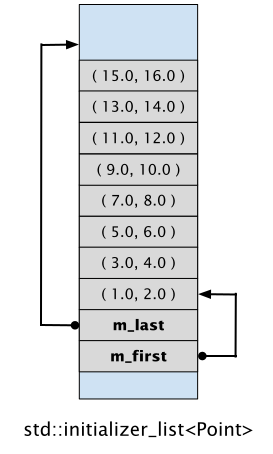

# Klasse `std::initializer_list<T>`

[Zurück](../../Readme.md)

---

[Quellcode](InitializerList.cpp)

---

## Allgemeines

Wenn der Compiler ein `std::initializer_list`-Objekt erstellt,
werden die Elemente der Liste auf dem Stapel konstruiert (als konstante Objekte).

Danach erstellt der Compiler das `std::initializer_list`-Objekt selbst,
das die Adresse des ersten und letzten Elements enthält
(genauer in Bezug auf das letzte Element: die Adresse des ersten Elements *nach* dem letzten Element).

Folglich besteht ein `std::initializer_list`-Objekt nur aus zwei Zeigervariablen,
es handelt sich also um ein recht kleines Objekt.
Damit ist es nicht wirklich notwendig, bei der Parameterübergabe 
eine Referenz zu verwenden &ndash; die Parameterübergabe *Call-by-Value* ist völlig ausreichend.



*Abbildung* 1: Konstruktion des Inhalts eines `std::initializer_list`-Objekts auf dem Stack.

*Hinweis*:
Ein `std::initializer_list`-Objekt ist immer *per-Value* zu übergeben.
Eine mögliche *per-Reference*-Übergabe könnte möglichen Optimierungen des Compilers im Wege stehen. 

---

## Zusammenspiel der Klassen `std::initializer_list` und `std::vector`

Die Klasse `std::vector` ist dafür ausgelegt,
mit einem `std::initializer_list`-Objekt initialisiert zu werden:

```cpp
std::initializer_list<int> list{ 1, 2, 3, 4, 5 };
std::vector<int> vec{ list };
```

---

## Konstruktoren mit einem `std::initializer_list<T>`-Parameter

Um für Konstruktoren eine variable Anzahl von Parametern (desselben Typs) zu ermöglichen,
wurde in C++ das Konzept von *Initialisierungs-Listen* eingeführt.

Eine Klasse muss dann einen entsprechenden Konstruktor zur Verfügung stellen,
der das Klassentemplate `std::initializer_list<>` verwendet.

*Beispiel*:

```cpp
std::map (std::initializer_list<T> init);
std::vector (std::initializer_list<T> init);
```

Die Anweisung

```cpp
std::vector<int> vec = { 1, 2, 3 };
```

erzeugt *zunächst* ein `std::initializer_list<int>`-Objekt mit den Werten 1, 2 und 3
und benutzt dieses dann anschließend, um den entsprechenden Konstruktor des Vektors aufzurufen.

  * Ein Konstruktor mit `std::initializer_list<T>`-Parameter wird auch *Sequenzkonstruktor* genannt.
  * Bei der Suche nach einem passenden Konstruktor für einen bestimmten Aufruf wird im
    Regelfall der Sequenzkonstruktor bevorzugt ausgewählt.


Sequenzkonstruktoren lassen sich auch in benutzer-definierten Klassen &ndash; oder auch 
Funktionen/Methoden &ndash; einsetzen:

```cpp
class Polygon {
public:
    Polygon(std::initializer_list<Point> elements)
        : m_elements{ elements } {};
    ...

private:
    std::vector<Point> m_elements;
};
```

Bei Funktionen, die eine Initialisierungs-Liste als Parameter haben,
sind die geschweiften Klammern direkt als Argument anzugeben:

```cpp
int sum = adder( { 1, 3, 5, 7, 9 } );
```

## Regeln für Klassen mit Konstruktoren mit `std::initializer_list`-Parameter

Unterschiedliche Deklarationen von Konstruktoren in einer Klasse
im Zusammenspiel mit `std::initializer_list<T>`-Parametern
führen zu unterschiedlichen (und möglicherweise unerwarteten!) Ergebnissen:

```cpp
class TinyContainer {
public:
    TinyContainer() {}
    TinyContainer(int value) {}
    TinyContainer(std::initializer_list<int>) {};
    TinyContainer(const std::vector<int>&) {};
};

void test_03() {
    TinyContainer tc0;                                 // TinyContainer::TinyContainer ()
    TinyContainer tc1{ 1, 2, 3, 4 };                   // TinyContainer::TinyContainer (std::initializer_list<int>)
    TinyContainer tc2{ 1 };                            // TinyContainer::TinyContainer (std::initializer_list<int>)
    TinyContainer tc3(1);                              // TinyContainer::TinyContainer (int)
    TinyContainer tc4{ };                              // TinyContainer::TinyContainer ()
    TinyContainer tc5{ std::vector<int> { 1, 2, 3} };  // TinyContainer::TinyContainer (const std::vector<int>&)
}
```

---

[Zurück](../../Readme.md)

---
