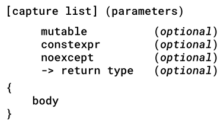

# Lambda-Objekte

[Zurück](../../Readme.md)

---

[Quellcode 1 - Motivation, allgemeine Beispiele](Lambda01.cpp)<br />
[Quellcode 2 - Lambda und Closure](Lambda02.cpp)<br />
[Quellcode 3 - Lambda und Closure: Spezialfall `this`](Lambda03.cpp)

---

## Inhalt

  * [Allgemeines](#link1)
  * [Weitere Besonderheiten im Aufbau eines Lambda-Objekts](#link2)
  * [IIFE - Immediately Invoked Functional Expressions](#link3)
  * [Generalized Lambda Captures](#link4)

---

## Allgemeines <a name="link1"></a>

*Tabelle* 1 vermittelt einen Überblick bzgl. der Gestaltungsmöglichkeiten der
Zugriffsklausel (*Capture Clause*):

| Zugriffsklausel | Erläuterung |
|:- |:-|
| `[]` | Nichts zu erfassen. |
| `[&]` | Jede referenzierte Variable wird per Referenz erfasst / angesprochen. |
| `[=]` | Jede referenzierte Variable wird durch eine Kopie erfasst / angesprochen. |
| `[=, &foo]` | Jede referenzierte Variable wird durch eine Kopie erfasst / angesprochen, mit Ausnahme von `foo`, das per Referenz erfasst / angesprochen wird. |
| `[&, foo]` | Jede referenzierte Variable wird per Referenz erfasst / angesprochen, mit Ausnahme von `foo`, das durch eine Kopie erfasst / angesprochen wird. |
| `[this]` | Erfasst den `this`-Zeiger der umschließenden Klasse. |

*Tabelle* 1: Liste aller Optionen für die Lambda-Zugriffsklausel.


Das Feature der *Capture Clause*, den Zugriff auf Variablen der &bdquo;Umgebung&rdquo; genauer festzulegen,
ist nicht mit der Möglichkeit zu verwechseln, **innerhalb** einer *Capture Clause*
Instanzvariablen des zu einer Lambda-Funktion gehörenden Funktions-Objekts zu definieren:

```cpp
auto lambda = [counter = 10]() { ... };
```

Die `counter`-Variable ist nur **in** der Lambda-Funktion verfügbar.

---

## Weitere Besonderheiten im Aufbau eines Lambda-Objekts <a name="link2"></a>

Neben der Zugriffsklausel kann ein Lambda-Objekt mit zahlreichen Schlüsselwörtern *garniert* werden.
Siehe hierzu *Abbildung* 1:



*Abbildung* 1: Besonderheiten im Aufbau eines Lambda-Objekts.

---

## IIFE - Immediately Invoked Functional Expressions <a name="link3"></a>

In C++ ist ein &bdquo;*Immediately Invoked Function Expression*&rdquo; (*IIFE*) ein Ausdruck,
mit dem man eine Funktion unmittelbar nach ihrer Erstellung ausführen kann.

Diese Technik wurde aus Sprachen wie JavaScript übernommen und wird normalerweise verwendet,
um Code in einem lokalen Bereich zu kapseln und sofort auszuführen.


```cpp
01: auto power = [] (int m, std::size_t n) constexpr {
02: 
03:     auto result = m;
04:     for (std::size_t i{ 1 }; i != n; ++i) {
05:         result *= m;
06:     }
07:     return result;
08: };
09: 
10: template <typename T>
11: auto powerGeneric = [](T m, std::size_t n) constexpr {
12: 
13:     T result = m;
14:     for (std::size_t i{ 1 }; i != n; ++i) {
15:         result *= m;
16:     }
17:     return result;
18: };
19: 
20: auto powerAuto = [](auto m, std::size_t n) constexpr {
21: 
22:     auto result = m;
23:     for (std::size_t i{ 1 }; i != n; ++i) {
24:         result *= m;
25:     }
26:     return result;
27: };
```

Folgende Aufrufe der `power`-Funktionen führt der Compiler aus,
die Werte sind damit zur Übersetzungszeit bekannt:

```cpp
01: void test() {
02:     constexpr auto twoTimesTen = power(2, 10);
03:     constexpr auto fiveTimesTen = power(5, 10);
04: 
05:     constexpr auto threeTimesThree = powerGeneric<float>(3.0f, 3);
06:     constexpr auto fiveTimesFive = powerGeneric<double>(5.0, 5);
07: 
08:     constexpr auto twoTimesThree = powerAuto(2.0f, 3);
09:     constexpr auto fiveTimesThree = powerAuto(5.0, 3);
10: }
```


Bei mehreren Parametern gibt es unterschiedliche Möglichkeiten,
auf die *Type Deduction* Einfluss zu nehmen. Also auf die Entscheidung,
welcher Datentyp einem mit `auto` deklarierten Parameter zuzuordnen ist.

Betrachten Sie vor diesem Hintergrund die folgenden Definitionen:

```cpp
01: // More IIFE Examples:
02: // Parameters of the 'constexpr' callable (function, lambda)
03: // should have the same data type
04: 
05: // works for int arguments
06: auto minimum = [](int n, int m) constexpr {
07:     return (n <= m) ? n : m;
08: };
09: 
10: // works for arguments of different type (?!?)
11: // type of the ternary ?: expression is
12: // the common type of its second and third argument
13: auto minimumAuto = [](auto n, auto m) constexpr {
14:     return (n <= m) ? n : m;
15: };
16: 
17: // works for arguments of different type (?!?)
18: // type of the ternary ?: expression is
19: // the common type of its second and third argument
20: auto minimumMoreAuto = [](auto n, auto m) constexpr {
21: 
22:     if (n <= m) {
23:         return n;
24:     }
25:     else {
26:         return m;
27:     }
28: };
29: 
30: // works for arbitrary arguments of the same type (!)
31: template <typename T>
32: auto minimumGeneric = [](T n, T m) constexpr {
33:     return (n <= m) ? n : m;
34: };
35: 
36: // works for arbitrary arguments of the same type (!)
37: // different syntax
38: auto minimumMoreGeneric = []<typename T>(T n, T m) constexpr {
39:     return (n <= m) ? n : m;
40: };
41: 
42: void test() {
43: 
44:     // IIFE - Immediately Invoked Functional Expression:
45:     // some more real-world examples: regarding argument data types
46: 
47:     constexpr auto value1 = minimum(10, 20);
48: 
49:     constexpr auto value2 = minimumAuto(10.0, 5.0);
50:     constexpr auto value3 = minimumAuto(11.11, 5.5f);             // Why does this compile, different argument types (?)
51: 
52:     constexpr auto value4 = minimumMoreAuto(11.11, 5.5); 
53:     // constexpr auto value5 = minimumMoreAuto(11.11, 5.5f);      // does NOT compile (!)
54: 
55:     constexpr auto value6 = minimumAuto(11.11, 5.5f);             // Why does this compile (?)
56: 
57:     constexpr auto value7 = minimumGeneric<int>(30, 40);
58:     constexpr auto value8 = minimumGeneric<double>(30.0f, 40.0);  // Compiles, but different argument types (!)
59: 
60:     constexpr auto value9 = minimumMoreGeneric(60, 50);
61:     // constexpr auto value10 = minimumMoreGeneric(50.0f, 60.0);  // does NOT compile (!), compare with 'minimumGeneric' (?!?!)
62: }
```

---

## Generalized Lambda Captures <a name="link4"></a>

C++ 11 bietet im Kontext der Capture-Klausel nur die Möglichkeit *by-value*- oder *by-reference* an, 
um auf Variablen im umgebenden Scope zuzugreifen.

Es fehlt also die Möglichkeit, mit der Move-Semantik Variablen / Objekte in ein Lambda-Objekt zu verschieben
(*by-move*).

Anstatt dieses Feature explizit zu ergänzen,
führte C++ 14 das so genannte *Generalized Lambda Capture* Feature ein,
auch bekannt als *Init*-Capture.

---

[Zurück](../../Readme.md)

---
