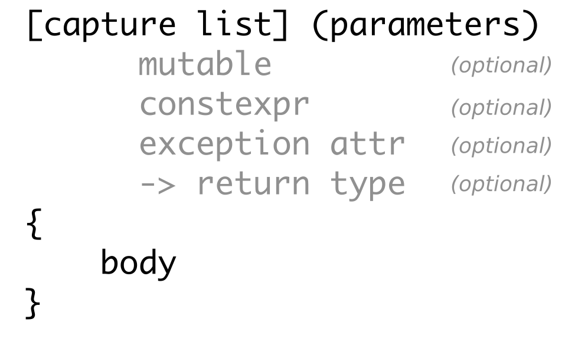

# Lambda-Funktionen

*Allgemeines*:

Es werden folgende Überlegungen der Reihe nach betrachtet:

  * Betrachtung 1:</br>Sortieren eines Vektors mit einem Funktionsobjekt (also ohne Lambda-Methode):</br>
    Man erkennt, dass es im Prinzip einer zusätzlichen Klasse (Struktur) bedarf, um
    den std::sort-Methodenaufruf mit einer Vergleichsmethode aufrufen zu können.

  * Betrachtung 2:</br>Sortieren eines Vektors mit Lambda-Methode:</br>
    Er werden die Vereinfachungen bzgl. der ersten Variante vorgestellt.

  * Betrachtung 3:</br>Blick auf die *Capture Clause*: / Zugriffsklausel</br>
    Es wird auf die Lambda-Zugriffsklausel (engl.: *Capture Clause*) eingegangen.

* Betrachtung 4:</br>`std::function`<> Methode:</br>
    Der generische Wrapper `std::function` wird eingeführt.


Teilweise werden Beispiele (mit gutem und schlechtem Vorbildcharakter) entworfen,
um auf die Problematik der Lambda-Zugriffsklausel näher einzugehen.


Die Ausgabe von Betrachtung 3 sieht auf meinem Rechner wie folgt aus:

```cpp
Copy:      1 2
Reference: -858993460 -858993460
```

In der vierten Betrachtung ist es mit Hilfe des Standard-Wrappers `std::function` möglich, Lambda-Funktionen
auch als (Aktual-)Parameter an andere Methoden/Funktionen zu übergeben.

Die Vielfältigkeiten im Umgang mit Lambda-Funktionen werden damit noch größer - es ändert sich aber nichts an dem Umstand,
dass Zugriffsklauseln mit Referenzen nicht zum erwünschten Resultat führen:

Die Ausgabe von Betrachtung 4 sieht auf meinem Rechner wie folgt aus:

```cpp
in test_05     Copy:      1 2
in test_helper Copy:      1 2
in test_05     Reference: -858993460 -858993460
in test_helper Reference: 15725908 15726376
```

Aus dem engl. C++-Manual habe ich einen Überblick bzgl. der Gestaltungsmöglichkeiten der Zugriffsklausel übernommen:

| Capture Clause Example | Explanation |
|:-------------- |-----------------------------------------|
| `[]` | Capture nothing |
| `[&]` | Capture any referenced variable by reference |
| `[=]` | Capture any referenced variable by making a copy |
| `[=, &foo]` | Capture any referenced variable by making a copy, but capture variable `foo` by reference |
| `[bar]` | Capture `bar` by making a copy; don't copy anything else |
| `[this]` | Capture the `this` pointer of the enclosing class |

Tabelle 1: Liste aller Optionen für die Lambda-Zugriffsklausel.

Neben der Zugriffsklausel kann eine Lambda-Funktion mit zahlreichen Schlüsselwörtern *garniert* werden.
Siehe hierzu Abbildung 1:



Abbildung 1: Besonderheiten im Aufbau einer Lambda-Funktion.

---

[Zurück](../../Readme.md)

---
