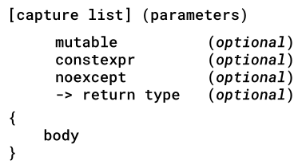
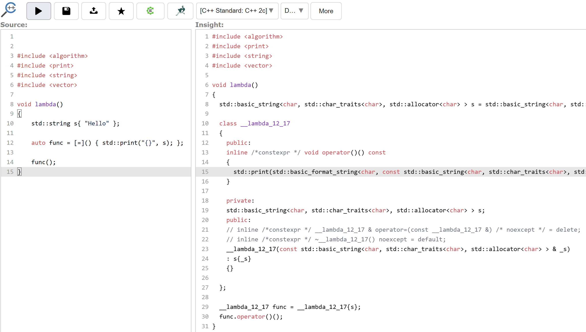
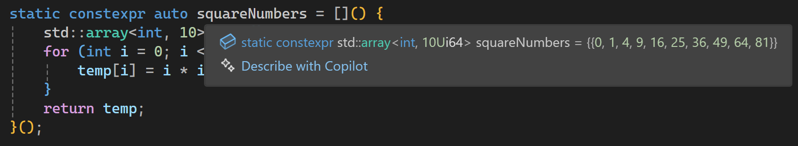

# Lambdas in Modern C++

[Zurück](../../Readme.md)

---

[Quellcode 1 - Motivation, allgemeine Beispiele](Lambda01.cpp)<br />
[Quellcode 2 - Lambda und Closure](Lambda02.cpp)<br />
[Quellcode 3 - Lambda und Closure: Spezialfall `this`](Lambda03.cpp)

---

[Zurück](../../Readme.md)

---

## Inhalt

  * [Allgemeines](#link1)
  * [Anonyme Funktionsobjekte](#link2)
  * [Erfassung lokaler Variablen aus dem umgebenden Bereich](#link3)
  * [Generische Lambdas](#link4)
  * [*Closure Types* und *Closure Objects*](#link5)
  * [Rückgabetyp von Lambdas: *Trailing Return Type*](#link6)
  * [Veränderbare Lambdas](#link7)
  * [Lambdas mit Instanzvariablen](#link8)
  * [Lambdas in einer Variablen abspeichern: `auto`](#link9)
  * [Lambdas in einer Variablen abspeichern: `std::function<>`](#link10)
  * [Lambdas in einer Variablen abspeichern: Funktionszeiger](#link11)
  * [Lambdas sind vollwertige Datentypen](#link12)
  * [Lambdas und `constexpr`](#link13)
  * [IIFE - *Immediately Invoked Functional Expression*](#link14)
  * [Variablen in eine &bdquo;*Capture Clause*&rdquo; verschieben / &bdquo;*Generalized Lambda Capture*&rdquo;](#link15)
  * [Nicht kopierbare Lambda-Objekte: `std::move_only_function`](#link16)
  * [Lambdas und `noexcept`](#link17)
  * [C++20: &bdquo;*Variadic Capture*&rdquo;](#link18)

---

## Allgemeines <a name="link1"></a>

Lambdas sind zustandsbehaftete Inline-Funktionsobjekte mit einer flexiblen &bdquo;Erfassungsklausel&rdquo; (&bdquo;*Capture Clause*&rdquo;),
ideal für prägnanten und ausdrucksstarken Code.

  * Sie sind kurz in der Schreibweise, haben eine minimalistische Syntax, sind ausdruckstark.
  * Sie sind kopierbar oder nur verschiebbar.
  * Sie können neben einer Methode auch Daten (Werte, Referenzen) transportieren.
  * Sie sind vollwertige Datentypen. Lambda-Objekte können als Argumente übergeben werden, von Funktionen zurückgegeben werden und in Variablen gespeichert werden.

---

## Anonyme Funktionsobjekte <a name="link2"></a>

Mit Lambdas können Sie Funktionen definieren, ohne sie zu benennen &ndash; genau dort, wo Sie sie benötigen:


```cpp
01: std::vector<int> vec { 1, 2, 3 };
02: 
03: std::for_each(
04:     vec.begin(), 
05:     vec.end(),
06:     [] (int n) {
07:         std::print("{} ", n);
08:     }
09: );
```

Damit sind folgende klassische Schreibweisen obsolet geworden:

  * Schreibweise mit einer freien Funktion:

```cpp
01: void print(int n)
02: {
03:     std::print("{} ", n);
04: }
05: 
06: void lambda_classic()
07: {
08:     std::vector<int> vec{ 1, 2, 3 };
09: 
10:     std::for_each(
11:         vec.begin(),
12:         vec.end(),
13:         print
14:     );
15: }
```

  * Schreibweise mit einem aufrufbaren Objekt:

```cpp
01: class Printer
02: {
03: public:
04:     void operator() (int n) {
05:         std::print("{} ", n);
06:     }
07: };
08: 
09: void lambda_classic()
10: {
11:     std::vector<int> vec{ 1, 2, 3 };
12: 
13:     Printer printer{};
14: 
15:     std::for_each(
16:         vec.begin(),
17:         vec.end(),
18:         printer
19:     );
20: }
21: 
```

---

## Erfassung lokaler Variablen aus dem umgebenden Bereich <a name="link3"></a>

Lambdas können Variablen aus dem umgebenden Gültigkeitsbereich erfassen.
Dazu gibt es die so genannte &bdquo;*Capture Clause*&rdquo; (zu dt. etwa &bdquo;Erfassungsklausel&rdquo;), sie wird in eckigen Klammern `[]` angegeben. 
Sie bestimmt, wie auf externe Variablen innerhalb des Lambda-Objekts zugegriffen wird.

Es gibt drei Möglichkeiten, externe Variablen mithilfe der *Capture Clause* zu erfassen:

  * Erfassung per Referenz
  * Erfassung per Wert
  * Erfassung per Referenz und Wert (gemischte Erfassung)


| Option | Syntax |
|:-|:-|
| Nichts zu erfassen                                  | `[]` |
| Per Wert                                            | `[=]` |
| Per Referenz                                        | `[&]` |
| Explizit                                            | `[x, &y]` |
| Gemischt                                            | `[=, &y]` oder `[&, y]` |
| Erfasst den `this`-Zeiger der umschließenden Klasse | `[this]` |


*Tabelle* 1: Syntax der &bdquo;*Capture Clause*&rdquo;.

Neben der Zugriffsklausel kann ein Lambda-Objekt mit zahlreichen Schlüsselwörtern garniert werden.
Siehe hierzu *Abbildung* 1:



*Abbildung* 1: Besonderheiten im Aufbau eines Lambda-Objekts.


*Beispiel*:

```cpp
01: void lambda()
02: {
03:     std::vector<int> vec{ 1, 2, 3 };
04: 
05:     std::string header{ ">>> " };
06: 
07:     std::for_each(
08:         vec.begin(),
09:         vec.end(),
10:         [=](int n) {
11:             std::println("{}{} ", header, n);
12:         }
13:     );
14: }
```

*Ausgabe*:

```
>>> 1
>>> 2
>>> 3
```


Für Zeile 10 sind folgende alternative Schreibweisen möglich, teilweise mit Auswirkungen
auf die Art und Weise, wie auf die Variable(n) aus der Umgebung zugegriffen wird:


```
[=]             // 'header' wird kopiert
[&]             // 'header' ist ein Alias (Referenz)
[header]        // 'header' wird kopiert
[&header]       // 'header' ist ein Alias (Referenz)
```

*Beispiel*:

```cpp
01: void lambda()
02: {
03:     int n{ 1 };
04:     int m{ 2 };
05: 
06:     auto l1 { [=] { std::println("Copy:      {} {}", n, m); } };
07:     auto l2 { [&] { std::println("Reference: {} {}", n, m); } };
08:     auto l3 { [&, m] { std::println("Both:      {} {}", n, m);} };
09:     auto l4 { [=, &m] { std::println("More both: {} {}", n, m); } };
10: 
11:     n = 3;
12:     m = 4;
13: 
14:     l1();
15:     l2();
16:     l3();
17:     l4();
18: }
```

*Ausgabe*:

```cpp
Copy:      1 2
Reference: 3 4
Both:      3 2
More both: 1 4
```

*Bemerkung*:<br />
Der Vollständigkeit halber: Es gibt für die *Capture Clause* auch noch die Notation

```cpp
[this]
```

Dadurch wird der Zugriff auf Instanzvariablen eines umgebenden Objekts &ndash; per Referenz &ndash; ermöglicht.

---

## Generische Lambdas <a name="link4"></a>

Die Parameter von Lambdas können ab C++ 14 mit `auto` definiert werden:

```cpp
01: void lambda()
02: {
03:     std::vector<int> vec{ 1, 2, 3 };
04: 
05:     std::for_each(
06:         vec.begin(),
07:         vec.end(),
08:         [](auto n) {
09:             std::print("{} ", n);
10:         }
11:     );
12: }
```

*Bemerkung*:<br />
`auto`-Parameter können in den Schreibweisen `auto`, `auto&`, `const auto&` und `auto&&` definiert werden.

---

## *Closure Types* und *Closure Objects* <a name="link5"></a>

Aus Sicht der Sprachdefinition von C++ wird zu jedem Lambda-Objekt während des Übersetzungsvorgangs
eine anyonyme Klasse erzeugt (so genannter *Closure Typ*).
Die Lambda-Funktion des Quelltexts wird in dieser Klasse auf den Rumpf einer Überladung
des Aufrufoperators `operator()` abgebildet.
Die Variablen in der &bdquo;*Capture Clause*&rdquo; werden auf entsprechende Instanzvariablen
in dem *Closure Object* abgebildet.


```cpp
01: void lambda()
02: {
03:     std::string s{ "Hello" };
04: 
05:     auto func = [=]() { std::print("{}", s); };
06: 
07:     func();
08: }
```

Wie könnte der *Closure Typ* des Lambdas `func` aussehen?
Das Tool [Cpp Insights](https://cppinsights.io/) von Andreas Fertig bietet hier eine Unterstützung an:



*Abbildung* 2: Transformation von &bdquo;*Modern C++*&rdquo; Quellcodefragmenten nach &bdquo;*Classic C++*&rdquo;.

Die Transformation von &bdquo;*Modern C++*&rdquo; Quellcodefragmenten nach &bdquo;*Classic C++*&rdquo;
durch das *Cpp Insights*-Tool fällt manchmal etwas &bdquo;ausladend&rdquo; aus,
ich habe im Fall des einfachen Lambdas aus dem letzten Listing die Umsetzung etwas
vereinfacht:


```cpp
01: void lambda()
02: {
03:     std::string s{ "Hello" };
04: 
05:     class LambdaClosure
06:     {
07:     private:
08:         std::string m_s;
09: 
10:     public:
11:         LambdaClosure(const std::string& s) : m_s{ s } {}
12: 
13:         inline void operator() () const { std::print("{}", m_s); }
14:     };
15: 
16:     LambdaClosure func = LambdaClosure{ s };
17: 
18:     func.operator() ();
19: }
```

Wir ändern im Lambda die Erfassung von `=` in `&` ab:

```cpp
auto func = [&]() { std::print("{}", s); };
```

Welche Auswirkungen hat diese Änderung auf die *Closure Type*-Klasse?
Studieren Sie dazu das nächste Listing genau:

```cpp
01: void lambda()
02: {
03:     std::string s{ "Hello" };
04: 
05:     class LambdaClosure
06:     {
07:     private:
08:         std::string& m_s;
09: 
10:     public:
11:         LambdaClosure(std::string& s) : m_s{ s } {}
12: 
13:         inline void operator() () const { std::print("{}", m_s); }
14:     };
15: 
16:     LambdaClosure func = LambdaClosure{ s };
17: 
18:     func.operator() ();
19: }
```

---

## Rückgabetyp von Lambdas: *Trailing Return Type* <a name="link6"></a>

In C++ wird der Rückgabetyp eines Lambdas meist automatisch per *Automatic Return Type Deduction* ermittelt.
Ein expliziter Rückgabetyp (mittels der *Trailing Return Type Syntax* `-> type`)
ist möglich.

Wenn ein Lambda mehrere `return`-Statements hat, die unterschiedliche Typen liefern würden,
kann der Compiler den Typ nicht eindeutig bestimmen.
Hier ist die explizite Angabe des Rückgabetyps zwingend erforderlich:


```cpp
01: void lambda()
02: {
03:     auto getValue = [] (bool condition) -> std::variant<int, std::string> {
04: 
05:         if (condition) {
06:             return 123; // int
07:         }
08:         else {
09:             return std::string{ "Hello World" }; // std::string
10:         }
11:     };
12: 
13:     auto value{ getValue(false) };
14: }
```

---

## Veränderbare Lambdas <a name="link7"></a>

Standardmäßig sind Variablen, die per Wert erfasst werden, konstant.
Um diese Aussage noch einmal anders zu formulieren:
In der Implementierung des Aufrufoperators `operator()` in der exemplarischen *Closure Type*-Klasse
war der Einsatz des `const`-Schlüsselwort nicht zufällig vorhanden:

```cpp
inline void operator() () const { ... }
```

Möchte man erfasste Variablen ändern, ist als Gegenreaktion das `mutable`-Schlüsselwort zu verwenden,
um die *Const Correctness* des Aufrufoperators auszuschalten:


```cpp
01: void lambda()
02: {
03:     std::size_t value{ 123 };
04: 
05:     auto increment = [=] () mutable -> std::size_t {
06: 
07:         ++value;
08:         return value;
09:     };
10: 
11:     value = increment(); std::println("{}", value);
12:     value = increment(); std::println("{}", value);
13:     value = increment(); std::println("{}", value);
14: }
```

*Ausgabe*: 

```
124
125
126
```

---

## Lambdas mit Instanzvariablen <a name="link8"></a>

Wir wissen bereits, dass Lambdas &bdquo;unter der Haube&rdquo; Objekte einer
*Closure Type* Klasse sind. Die Variablen aus dem umgebenden Scope werden
auf entsprechende Instanzvariablen in dem *Closure Object* abgebildet.

Können *Closure* Objekte daneben auch eigene Instanzvariablen haben?

Mit der so genannten &bdquo;*Capture Initialization*&rdquo; geht auch dies:

```cpp
01: void lambda()
02: {
03:     auto increment = [start = 123] () mutable -> std::size_t {
04: 
05:         ++start;
06:         return start;
07:     };
08: 
09:     std::size_t value{ 0 };
10: 
11:     value = increment(); std::println("{}", value);
12:     value = increment(); std::println("{}", value);
13:     value = increment(); std::println("{}", value);
14: }
```

*Ausgabe*: 

```
124
125
126
```

---

## Lambdas in einer Variablen abspeichern: `auto` <a name="link9"></a>

Wie lassen sich Lambdas in Variablen abspeichern?
Eine erste Möglichkeit haben wir bereits kennen gelernt:

```cpp
auto func = [=] () { std::print("{}", s); };
```

Die `func`-Variable ist in diesem Beispiel vom Typ der anonymen  *Closure Type* Klasse.
Und ja, in diesem Fall ist das Schlüsselwort `auto` die einzige Möglichkeit in der Definition einer Variablen
vom Typ des Lambda-Objekts. Der Name der *Closure Type*&ndash;Klasse ist von Compiler zu Compiler verschieden
und für den Ersteller des Programms nicht zugänglich.

---

## Lambdas in einer Variablen abspeichern: `std::function<>` <a name="link10"></a>

Wie könnte man nun Lambdas beispielsweise in einem STL-Container abspeichern?
Die Schreibweise

```cpp
std::vector<auto> lambdas;
```

tut es naheliegenderweise nicht. Der Standardweg besteht im Gebrauch der STL-Wrapperklasse `std::function<>`.

Die `std::function<>`-Klasse ist ein polymorpher Wrapper, der jedes aufrufbare Objekt (Lambda, freie Funktionen, aufrufbare Objekte, Funktionszeiger)
mit einer passenden Signatur speichern kann.

  * Vorteil:<br />Man kann unterschiedliche Lambdas im selben Container mischen, solange die Parameter und der Rückgabetyp übereinstimmen.
  * Nachteil:<br />Es entsteht ein Laufzeit-Overhead durch *Type-Erasure*, oft inklusive Heap-Allokation und virtuellem Funktionsaufruf,
    da wir das Lambda-Objekt in einem Hüllenobjekt abspeichern.


```cpp
01: void lambda()
02: {
03:     auto lambdaOne = [] () { std::println("One"); };
04:     auto lambdaTwo = [] () { std::println("Two"); };
05: 
06:     std::vector<std::function<void()>> myLambdas;
07: 
08:     myLambdas.push_back(lambdaOne);
09:     myLambdas.push_back(lambdaTwo);
12: 
11:     for (const auto& lambda : myLambdas) {
12:         lambda();
13:     }
14: }
```

*Ausgabe*: 

```
One
Two
```

---

## Lambdas in einer Variablen abspeichern: Funktionszeiger <a name="link11"></a>

Die performanteste Lösung zum Abspeichern von Lambdas könnte man anwenden, wenn das Lambda-Objekt
eine leere Erfassungsliste hat, also &bdquo;nichts einfängt&rdquo;.
Derartige Lambdas können implizit in klassische C-Funktionszeiger umgewandelt werden. 

  * Vorteil: Extrem performant (kein Overhead durch `std::function`).
  * Nachteil: Funktioniert nur für zustandslose Lambdas ohne Capture.


*Beispiel*:

```cpp
01: void lambda()
02: {
03:     auto lambda1 = [] () { std::println("1"); };
04:     auto lambda2 = [] () { std::println("2"); };
05: 
06:     std::vector<void(*)()> myLambdas;
07: 
08:     myLambdas.push_back(lambda1);
09:     myLambdas.push_back(lambda2);
10: 
11:     for (const auto& lambda : myLambdas) {
12:         lambda();
13:     }
14: }
```

*Ausgabe*: 

```
1
2
```

---

## Lambdas sind vollwertige Datentypen <a name="link12"></a>

Sie können:

  * als Argumente übergeben werden,
  * von Funktionen zurückgegeben werden und
  * in Variablen gespeichert werden (`auto`, `std::function`).

*Beispiel*:

```cpp
01: auto helper_a() {
02: 
03:     int n{ 1 };
04:     int m{ 2 };
05: 
06:     auto lambda{ [=] { std::println("Copy:      {} {}", n, m); } };
07:     return lambda;
08: }
09: 
10: auto helper_b() {
11: 
12:     int n{ 1 };
13:     int m{ 2 };
14: 
15:     auto lambda{ [&] { std::println("Reference: {} {}", n, m); } };
16:     return lambda;             // I would't do this never ever :-)
17: }
18: 
19: void lambda()
20: {
21:     auto outerLambda1{ helper_a() };
22:     auto outerLambda2{ helper_b() };
23: 
24:     outerLambda1();
25:     outerLambda2();
26: }
```

*Ausgabe*: 

```
Copy:      1 2
Reference: 155 2
```

---

## Lambdas und `constexpr` <a name="link13"></a>

Lambdas können als `constexpr` definiert werden, zum Beispiel

```cpp
constexpr auto sum = [](int a, int b) { return a + b; };
```

Auf diese Weise wird die Variable `sum` als konstant zur Kompilierzeit definiert.
Das Lambda-Objekt muss deshalb zur Kompilierzeit konstruiert werden können.
Dies hat zur Folge, dass der interne Aufruf-Operator (`operator()`) automatisch ebenfalls als `constexpr` behandelt wird.
Die Logik in der Implementierung des Operators muss dies zulassen!

`constexpr`-Lambdas sind häufig für kleinere Hilfsfunktionen hilfreich, die nicht zwingend zur Laufzeit des
Programms ausgeführt werden müssen:

```cpp
01: constexpr auto sum = [](int a, int b) { return a + b; };
02: 
03: constexpr auto power = [](int m, std::size_t n) {
04:     auto result = m;
05:     for (std::size_t i{ 1 }; i != n; ++i) {
06:         result *= m;
07:     }
08:     return result;
09: };
10: 
11: void lambda()
12: {
13:     constexpr auto result{ sum(10, 11) };         // sum = 21 at compile time
14:     constexpr auto twoPowerTen{ power(2, 10) };   // twoPowerTen = 1024 at compile time
15:     constexpr auto fivePowerTen{ power(5, 10) };  // fivePowerTen = 9765625 at compile time
16: }
```

---

## IIFE - *Immediately Invoked Functional Expression* <a name="link14"></a>

Neben `constexpr` Funktionen / Lambdas gibt es in C++ auch das Konzept von  IIFE - &bdquo;*Immediately Invoked Function Expressions*&rdquo;.
Ein *Immediately Invoked Function Expression* ist ein Ausdruck,
mit dem man eine Funktion (Lambda) unmittelbar nach ihrer Erstellung ausführt.

Diese Technik wurde aus Sprachen wie JavaScript übernommen und wird normalerweise verwendet,
um Code in einem lokalen Bereich zu kapseln und sofort auszuführen.

Ein Beispiel ohne IIFE:

```cpp
01: constexpr int complexValueComputation(int x) {
02:     if (x > 10) {
03:         return x * 2;
04:     }
05:     return x + 5;
06: }
07: 
08: constexpr auto value = complexValueComputation(5);  // value == 10 at compile time
```


Dasselbe Beispiel mit IIFE:

```cpp
01: constexpr auto anotherValue = [](int x)             // anotherValue == 10 at compile time
02: {
03:     if (x > 10) {
04:         return x * 2;
05:     }
06:     return x + 5;
07: }(5);
```

Mit `constexpr` IIFEs lassen sich sogar ganze Tabellen oder Arrays zur Kompilierzeit vorbelegen,
was die Laufzeit-Performance massiv steigert:

```cpp
01: constexpr auto squareNumbers = []() {
02:     std::array<int, 10> temp{};
03:     for (int i = 0; i < 10; ++i) {
04:         temp[i] = i * i;
05:     }
06:     return temp;
07: }();
```

Da es sich um Übersetzungszeitberechnungen handelt,
demonstrieren wir die Ausführung des `squareNumbers`-IIFE mit einem Tooltip (*Abbildung* 3):



*Abbildung* 3: Vorbelegung eines komplexen `constexpr` Arrays zur Übersetzungszeit.

---

## Variablen in eine &bdquo;*Capture Clause*&rdquo; verschieben / &bdquo;*Generalized Lambda Capture*&rdquo; <a name="link15"></a>

In einer ursprünglichen Definition der Lambdas bieten diese im Kontext der Erfassungsklausel nur zwei Möglichkeiten an,
um auf Variablen im umgebenden Scope zugreifen zu können:

  * Über den Wert (Value / Kopie).
  * Über eine Referenz (Alias).

Es fehlt also die Möglichkeit, mit der Move-Semantik Variablen / Objekte in ein Lambda-Objekt *verschieben* zu können.

Anstatt dieses Feature explizit zu ergänzen, wurde in C++ 14 das so genannte *Generalized Lambda Capture Feature* eingeführt,
auch bekannt als *Init-Capture*.

Das folgende Code-Fragment demonstriert das &bdquo;*Generalized Lambda Capture Feature*&rdquo;
in mehreren Facetten:

```cpp
01: void lambda()
02: {
03:     class SampleClass
04:     {
05:     private:
06:         std::string m_text;
07:     public:
08:         SampleClass() : m_text{ "Doing something" } {}
09:         void doSomething() { std::println("{}", m_text); };
10:     };
11: 
12:     std::unique_ptr<SampleClass> ptr{ std::make_unique<SampleClass>() };
13: 
14:     // Does not compile: by-value capture with move-only type (!)
15:     // auto lambda = [=] () { ptr->doSomething(); };
16: 
17:     // Compiles: by-reference capture with move-only type (!)
18:     auto lambda = [&]() { ptr->doSomething(); };
19: 
20:     // Compiles: "Generalized Lambda Capture"
21:     auto lambda2 = [ptrSampleClass = std::move(ptr)]() {
22:         ptrSampleClass->doSomething();
23:     };
24:     lambda2();
25: 
26:     ptr = std::make_unique<SampleClass>();
27: 
28:     // Compiles too: Same name for captured variable and internal variable of lambda object
29:     auto lambda3 = [ptr = std::move(ptr)]() {
30:         ptr->doSomething();
31:     };
32:     lambda3();
33: }
```

*Ausgabe*:

```
Doing something
Doing something
```

---

## Nicht kopierbare Lambda-Objekte: `std::move_only_function` <a name="link16"></a>

In manchen Situationen kann ein Lambda-Objekt nicht kopierbar sein.
Zum Beispiel solche Lambda-Objekte, die ein Objekt erfassen (*capture*),
welches nur verschoben, aber nicht kopiert werden kann (wie z. B. ein `std::unique_ptr`-Objekt).


```cpp
01: void lambda()
02: {
03:     std::unique_ptr<std::string> ptr{ std::make_unique<std::string>("12345") };
04: 
05:     // lambda capturing a move-only type
06:     auto lambda{ [ptr = std::move(ptr)]() { return *ptr; } };
07: 
08:     auto value{ lambda() };               // invoking lambda
09:     std::println("{}", value);
10: 
11:     // auto lambda2{ lambda };            // lambda cannot be copied
12: 
13:     auto lambda2{ std::move(lambda) };    // lambda can be moved
14: 
15:     value = lambda2();                    // invoking lambda2
16:     std::println("{}", value);
17: }
```

*Ausgabe*:

```
12345
12345
```


Möchte man solche Objekt z. B. in einem `std::function<>`-Hüllenobjekt abspeichern, geht das nicht!

Aus diesem Grund gibt es eine weitere Hüllentyp-Klasse: `std::move_only_function`.

Die `std::move_only_function`-Klasse ist ideal für Lambda-Objekte,
die Move-Only Objekte in ihrer Erfassungsliste verwenden (`std::unique_ptr`, `std::thread`):


```cpp
01: void lambda()
02: {
03:     std::unique_ptr<std::string> ptr{ std::make_unique<std::string>("ABCDE") };
04: 
05:     // lambda capturing a move-only type
06:     auto lambda = [ptr = std::move(ptr)]() { return *ptr; };
07: 
08:     // std::function<std::string()> func{ std::move(lambda) };         // error: 'The target function object type must be copy constructible
09: 
10:     std::move_only_function<std::string()> func{ std::move(lambda) };  // lambda can be moved into a std::move_only_function wrapper object
11: 
12:     // auto value{ lambda() };        // crashes (!), object has been moved!
13: 
14:     auto value{ func() };             // works
15:     std::println("{}", value);
16: }
```

*Ausgabe*:

```
ABCDE
```

---

## Lambdas und `noexcept` <a name="link17"></a>

Ein mit `noexcept` gekennzeichnetes Lambda-Objekt garantiert,
dass keine Ausnahmen ausgelöst werden:


```cpp
01: void lambda()
02: {
03:     auto multiplyByTwo = [](int x) noexcept { return x * 2; };
04:     auto result = multiplyByTwo(10);
05:     std::println("Result: {}", result);
06: }
```

*Ausgabe*:

```
Result: 20
```

`noexcept` ist Teil des Funktionstyps und kann die Optimierung des Maschinencodes beeinflussen.

---

## C++20: &bdquo;*Variadic Capture*&rdquo; <a name="link18"></a>

Ab C++20 lässt sich mit Hilfe des so genannten &bdquo;*Variadic Capture*&rdquo;
(oft auch als &bdquo;Pack Expansion in Lambda Init-Capture&rdquo; genannt)
ein komplettes variadisches Parameterpaket (*Parameter Pack*) in einen Lambda-Ausdruck einbinden.

Diese Funktionalität ermöglicht es, eine Liste von Argumenten &bdquo;perfekt&rdquo; an den Closure eines Lambda-Ausdrucks weiterzuleiten.
Hierdurch kann das Schreiben generischer Wrapper oder Factory-Funktionen vereinfacht werden.


```cpp
01: template <typename... TArgs>
02: auto createTask(TArgs&&... args) {
03:     
04:     // moving all arguments into the lambda object
05:     return [...args = std::forward<TArgs>(args)] () mutable {
06: 
07:         // helper function
08:         auto process = [] (auto& arg) {
09:             std::println("{}", arg);
10:         };
11: 
12:         // folding over a comma: process all arguments
13:         (process(args), ...);
14:     };
15: }
16: 
17: void lambda()
18: {
19:     double d{ 123.0 };
20:     std::string s{ "ABCDE" };
21: 
22:     // move ownership of parameters to lambda
23:     auto task{ createTask(std::move(d), std::move(s)) };
24: 
25:     if (s.empty()) {
26:         std::println("s is empty");
27:     }
28: 
29:     // delayed execution
30:     task();
31: }
```

*Ausgabe*:

```
s is empty
123
ABCDE
```

---

[Zurück](../../Readme.md)

---
