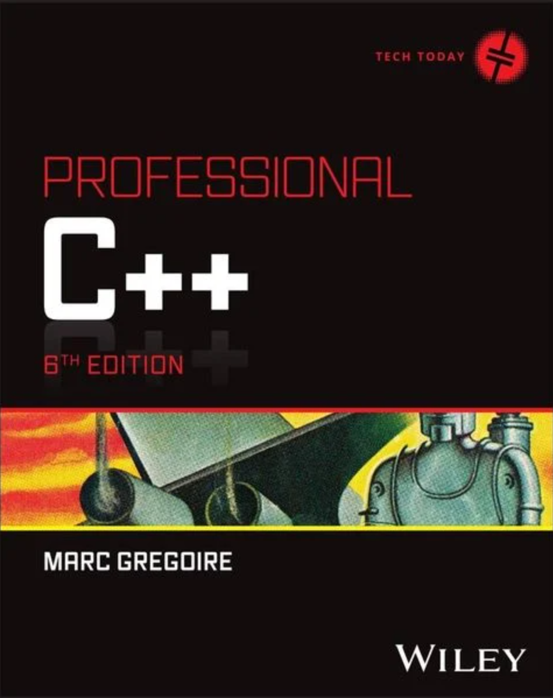

# Literatur

[Zurück](../../Readme.md)

---

## C++

  * Marc Gregoire, &bdquo;*Professional C++ (6. Auflage)*&rdquo;. 
    Wiley John + Sons (13. Februar 2024), 1326 Seiten. Sprache: Englisch. ISBN-13: 978-1394193172, ISBN-10: 1394193173.

    Für mich das derzeit beste C++ -Buch am Markt. Zugegeben, sehr umfangreich, aber dafür versteht es der Autor,
    seine Leser mit einem jederzeit erkennbaren roten Faden durch alle Niederungen der Sprache C++ 
    in verständlichen (englischen) Erklärungen zu führen. Großartig!

    

---

## C++

  * Josuttis, Nicolai M., &bdquo;*C++20 - The Complete Guide*&rdquo;. 
    NicoJosuttis (7. November, 2022), 768 Seiten. Sprache: Englisch. ISBN-13: 978-3967309201, ISBN-10: 3967309207.

    Das Buch hat mehr den Charakter eines Referenzmanuals als eines Lehrbuches.
    Der Autor versteht es allerdings, bei nahezu allen Themen das Wesentliche herauszuarbeiten
    und dies mit prägnanten Beispielen zu untermauern. 

    

---

  * Stephan Roth: &bdquo;Clean C++ 20&rdquo;. 
    Apress (18. Juni 2021), 508 Seiten. Sprache: Englisch. ISBN-10: 1484259483, ISBN-13: 978-1484259481.

    Dieses Buch vermittelt weniger die Merkmale der Programmiersprache C++ (Lexikon, Syntax, ...),
    sondern vielmehr allgemeingültige Prinzipien für eine moderne Softwareentwicklung mit C++.

    Die Beispiele sind vergleichsweise einfach gehalten, besitzen deshalb eine starke Prägnanz
    und bringen das jeweilige zu veranschaulichende Konzept auf den Punkt. Ein absolut empfehlenswertes Buch!

    

---

  * Torsten T. Will, &bdquo;*C++: Das umfassende Handbuch zu Modern C++ - aktuell zu C++23 (3. Auflage)*&rdquo;.  
    Rheinwerk Computing (6. Juni 2024), 1113 Seiten. Sprache: Deutsch. ISBN-10: 3836298538, ISBN-13: 978-3836298537.

    Ein sehr gutes Buch für Leser, die deutschsprachige Bücher bevorzugen. Viele Beispiele, gute Erklärungen.

    

---

  * [*Google C++ Style Guide*](https://google.github.io/styleguide/cppguide.html) 
    (abgerufen am 26.02.2022).

    Ein aus meiner Sicht sehr interessantes und hilfreiches Dokument,
    um die Sprachfeatures von C++ besser einordnen und verstehen zu können.

    Es soll nicht verschwiegen werden,
    dass das Dokument zum Zeitpunkt seiner Einführung auf seine Nützlichkeit hin überprüft wurde.
    So gesehen sollte man das Dokument mit einer gewissen gesunden Skepsis lesen,
    da manche Sprachkonstrukte von C++ heutzutage durchaus als veraltet bezeichnet werden können.
    Also was &bdquo;damals&rdquo; als nützlich galt,
    kann &bdquo;heute&rdquo; möglicherweise eine schlechte Idee sein, entweder weil es
    bessere Alternativen gibt oder weil sich herausgestellt hat, dass das Feature Mängel hat.

---

  * [*C++ Core Guidelines*](https://isocpp.github.io/CppCoreGuidelines/CppCoreGuidelines) 
    (abgerufen am 26.02.2022).

    Die C++ Core Guidelines sind ein portabler Satz von Richtlinien, Regeln und
    Best Practices zum Programmieren in C++, der von C++&ndash;Experten und &ndash;Designern erstellt wurde.

    Einziger Wermutstropfen dieser exzellenten Website:
    Nicht alle Guidelines sind einfach zu Lesen, eine gewisse Erfahrung
    in der C++&ndash;Programmierung ist Vorraussetzung.

---

  * Bancila, Marius, &bdquo;*Modern C++ Programming Cookbook*&rdquo;.  
    Packt Publishing (29. Februar 2020, 3. Auflage), 816 Seiten. Sprache: Englisch. ISBN-10: 1835080545, ISBN-13: 978-1835080542.

    Das Buch beschäftigt sich überwiegend
    mit den so genannten &bdquo;Modern C++&rdquo; Sprachergänzungen.
    Eine absolut empfehlenswerte Lektüre, aber nicht unbedingt für den C++-Einsteiger zu empfehlen.
  
    

---

  * Bancila, Marius, &bdquo;*The Modern C++ Challenge*&rdquo;.  
    Packt Publishing (23. Mai 2018, 1. Auflage), 328 Seiten. Sprache: Englisch. ISBN-10: 1788993861, ISBN-13: 978-1788993869.

    

---

  * Galowicz, Jacek, &bdquo;*C++17 STL Cookbook*&rdquo;.  
    Packt Publishing (28. Juni 2017), 532 Seiten. Sprache: Englisch. ISBN-10: 178712049X, ISBN-13: 978-1787120495.

    Es gilt dasselbe wie für die Bücher von *Marius Bancila*: Vorzugsweise für Leser geeignet,
    die sich schwerpunktmäßig mit den Sprachergänzungen von &bdquo;*Modern C++*&rdquo; beschäftigen möchten.

    

---

  * Josuttis, Nicolai M., &bdquo;*C++ Move Semantics &ndash; The Complete Guide*&rdquo;.  
    NicoJosuttis (30. August 2020), 262 Seiten. Sprache: Englisch. ISBN-10: 3967309002, ISBN-13: 978-3967309003.

    

---

  * Fertig, Andreas, &bdquo;*Tips and Tricks with Templates*&rdquo;.  
    Fertig Publications (5. Februar 2024), 104 Seiten. Sprache: Englisch. ISBN-10: 3949323074, ISBN-13: 978-3949323072.

    Der Autor von [C++ Insights](https://cppinsights.io/), einem Analysetool für &bdquo;Modern C++&rdquo; Spracherweiterungen,
    wartet mit einem kleinen, aber feinen Werk auf: Viele Tipps und Tricks im Umfeld der Templates werden vorgestellt.

    
 
---

  * Peter Pohmann, &bdquo;*C++ 17: Praxiswissen zum neuen Standard. Von C++11 bis 17*&rdquo;.  
    Software + Support (15. Mai 2017), 332 Seiten. Sprache: Deutsch. ISBN-10: 9783868021745, ISBN-13: 978-3868021745.

    Ein kurz gehaltenes Nachschlagewerk, dass vor allem für Entwickler geeignet ist, die sich für die Neuerungen
    der Programmiersprache C++ bzgl. C++ -11, C++ -14 und C++ -17 interessieren. Zu jedem Sprachfeature gibt es ein
    kleines (und vor allem auch leicht verständliches) Beispiel.

    

---

## Templates

  * David Vandevoorde, Nicolai M. Josuttis und Douglas Gregor: &bdquo;*C++ Templates: The Complete Guide (2nd Edition)*&rdquo;. 
    Addison Wesley (1. Dezember 2017), 2. Auflage, 832 Seiten. Sprache: Englisch. ISBN-10: 0321714121, ISBN-13: 978-0321714121.

    Das ultimative Buch zu Templates in C++. 

    
---

## Frameworks, Bibliotheken, Ressources und mehr ...

  * [Awesome C++](https://github.com/fffaraz/awesome-cpp)

    Eine kuratierte Liste von C++ (oder C)-Frameworks, Bibliotheken, Ressourcen und anderen Informationen
    für den interessierten C++-Entwickler.

  * [A cheatsheet of modern C++ language and library features](https://github.com/AnthonyCalandra/modern-cpp-features)

    Cheatsheet zu allen Spracherweiterungen von C++ in Bezug auf die einzelnen Versionen (C++20/17/14/11).

  * [The Daily bit(e) of C++ series](https://github.com/happycerberus)

    Dies ist ein Verzeichnis für die Beiträge der *Daily bit(e) of C++*&ndash;Reihe (ab 2. Januar 2023).
    Die Reihe präsentiert Informationen zu modernem C++ in einem leicht verdaulichen, mundgerechten Format.

---

[Zurück](../../Readme.md)

---
