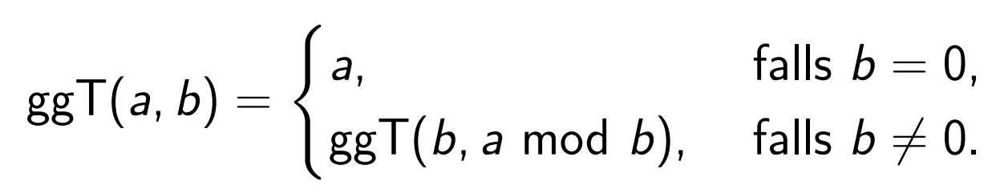

# Einführung in die Metaprogrammierung

[Zurück](../../Readme.md)

---

[Teil II: Metaprogrammierung und Listenverarbeitung](Metaprogramming02.md)

---

## Überblick

C++&ndash;Metaprogrammierung bezeichnet eine rekursive Technik innerhalb der Programmiersprache C++,
um Programmcode zur Übersetzungszeit generieren zu lassen.

Durch rekursive Template-Instanziierungen und Template-Spezialisierungen
können zur Übersetzungszeit Fallunterscheidungen und Schleifen ausgeführt werden

Man macht sich bei der Template-Metaprogrammierung zunutze,
dass Templates während des Kompilierens ausgewertet werden.
So kann man Code schreiben, der zur Übersetzungszeit ausgeführt wird.
Obwohl sich so die Dauer des Kompilierens verlängert, hat das Verfahren den Vorteil, dass es zu einer Verkürzung der Laufzeit kommen kann.

## Das klassische Beispiel

(siehe auch [Quellcode](MetaProgramming01.cpp))

```cpp
template <long N>
struct Factorial {

    static constexpr long result = N * Factorial<N - 1>::result;

};

template <>
struct Factorial<1> {
    static constexpr long result = 1;
};
```

In den Code-Snippets wird zum Thema "*Metaprogrammierung*" das wohl bekannteste Beispiel demontriert, die Berechnung
der Fakultät-Funktion zur Übersetzungszeit. Dabei ist zu beachten, dass es auch sehr wohl zur Übersetzungszeit zu Fehler kommen kann.

Diese werden vom Compiler - in meinem Fall als "*warning*" - gemeldet:

warning C4307: '*': signed integral constant overflow
message : see reference to class template instantiation 'Metaprogramming::Factorial<13>' being compiled

Es tritt also der (hinlänglich bekannte) Überlauf in der Fakultätfunktion bei Verwendung des Datentyps `int` auf.

Die Ausgabe des Programms - mit Fehlern - sieht auf meinem Rechner wie folgt aus:

```cpp
1
2
6
24
120
720
5040
40320
362880
3628800
39916800
479001600
1932053504
1278945280
2004310016
2004189184
-288522240
```

Nach diesem einführenden Beispiel gehen wir im Folgenden auf wesentliche Techniken der Metaprogrammierung
näher ein. In einem zweiten Dokument ([Metaprogrammierung und Listenverarbeitung](Metaprogramming02.md)) vertiefen
wir das Thema.

## Parcours durch gängige Techniken der Metaprogrammierung

### `static constexpr`

Templates werden beim Übersetzen ausgewertet.
Das bedeutet, dass der gesamte Quellcode beim Übersetzen der Quelle tatsächlich ausgeführt wird,
also nicht zur Laufzeit. Da der Übersetzer Klassen - keine Objekte - übersetzt, können Templates
nur auf Klassen angewendet werden, es machen also nur Klassenvariablen (`static constexpr`) Sinn.

### Definition neuer Datentypen mit `using`

Wir betrachten ein weiteres Beispiel: Die klassische *"Bruchrechnung"* aus der Schulmathematik.
Beachten Sie am folgenden Beispiel: In der Metaprogrammierung gibt es *keine* Variablen,
es lassen sich aber sehr wohl *neue* Datentypen aus bestehenden Datentypen bilden.
`Frac` ist ebenfalls ein Typ, wenn er an zwei konkrete Werte gebunden wird.
Binden wir diesen Typ mit `using` an einen Namen, können wir diesen neuen Typen ansprechen,
siehe dazu die Schablone `ScalarMultiplication`:

```cpp
template <size_t N, size_t D>
struct Frac {
    static constexpr long Num = N;
    static constexpr long Den = D;
};

template <size_t N, typename F>
struct ScalarMultiplication {
    using result = Frac<N * F::Num, F::Den>;
};
```

*Test*:

```cpp
using TwoThirds = Frac<2, 3>;
using FourThirds = ScalarMultiplication<2, TwoThirds>::result;
std::cout << FourThirds::Num << "/" << FourThirds::Den << std::endl;
```

*Ausgabe*:

```cpp
4/3
```

Es werden also in Schablonen neue Typen gebildet, auf die über einen Namen von außen zugegriffen werden kann!


### Partielle Spezialisierung von Templates

Die partielle Spezialisierung von Templates ist zentrales Hilfsmittel in der Metaprogrammierung.
Wenn wir dieses Feature noch mit der rekursiven Definition von Templates zusammenführen,
lassen sich mächtige Funktionen definieren!

Wir demonstrieren dies am Beispiel der Berechnung
des größten gemeinsamen Teilers zweier natürlicher Zahlen (ggT),
wir legen dabei den *Algorithmus von Euklid* zu Grunde:



*Abbildung* 1: Algorithmus von *Euklid* zur Berechnung des ggT.


```cpp
template <size_t X, size_t Y>
struct GGT {
    static constexpr long result = GGT<Y, X % Y>::result;
};

template <size_t X>
struct GGT<X, 0> {
    static constexpr long result = X;
};

template <typename F>
struct FracNormalizedVerbose {
    static constexpr long ggt = GGT<F::Num, F::Den>::result;
    static constexpr long newNum = F::Num / ggt;
    static constexpr long newDen = F::Den / ggt;
    using result = Frac<newNum, newDen>;
};

template <typename F>
struct FracNormalized {
    static constexpr long ggt = GGT<F::Num, F::Den>::result;
    using result = Frac<F::Num / ggt, F::Den / ggt>;
};
```

Betrachten Sie die Definition von `GGT<X, 0>` an: Dies ist eine partielle Template Spezialisierung!

*Test*:

```cpp
using Four = Frac<16, 4>;
using FourNormalized = FracNormalizedVerbose<Four>::result;
std::cout << FourNormalized::Num << "/" << FourNormalized::Den << std::endl;
using Eight = Frac<32, 4>;
using EightNormalized = FracNormalized<Eight>::result;
std::cout << EightNormalized::Num << "/" << EightNormalized::Den << std::endl;
```

*Ausgabe*:

```cpp
4/1
8/1
```

### Erste Zusammenfassung: Wiederholungsanweisung, bedingte Anweisungen und Rückgabewerte

In der Metaprogrammierung gelten andere Regeln als in der gewöhnlichen Programmierung. Für die klassischen
programmiersprachlichen Konstrukte Wiederholungsanweisung, bedingte Anweisung und Rückgabewert von Funktionen
lauten die Äquivalente in der Metaprogrammierung:
 
  * **Wiederholungsanweisung**: Rekursive Template-Definition 
  * **bedingte Anweisung**: Partielle Template Spezialisierung
  * **Rückgabewert von Funktionen**: `using`-Anweisung (oder `typedef` Anweisung)

Wir betrachten hierzu ein "komplexeres" Beispiel, in dem alle drei Mechanismen angewendet werden:

```cpp
template <typename X1, typename Y1>
struct SameBase {
    using X = typename ScalarMultiplication<Y1::Den, X1>::result;
    using Y = typename ScalarMultiplication<X1::Den, Y1>::result;
};

template <typename X, typename Y>
struct Sum {
    using Base = SameBase<X, Y>;
    static constexpr long Num = Base::X::Num + Base::Y::Num;
    static constexpr long Den = Base::X::Den * Base::Y::Den;
    using result = typename FracNormalized<Frac<Num, Den>>::result;
};
```

*Hinweis*: Man beachte die Verwendung des Schlüsselworts `typename` in den Schablonen `SameBase` und `Sum`: 
 `typename` wird hier benötigt, um den Compiler wissen zu lassen, dass der nachfolgenden Bezeichner ein Typ und kein statischer Member der Klasse (Struktur) ist.

*Test*:

```cpp
using Frac1 = Frac<1, 3>;
using Frac2 = Frac<4, 7>;
using Result = Sum<Frac1, Frac2>::result;
std::cout << Result::Num << "/" << Result::Den << std::endl;
```

*Ausgabe*:

```cpp
19/21
```

### Ein Beispiel: Die Eulersche Zahl *e*

Die Eulersche Zahl *e* lässt sich mit folgender Formel berechnen:

 

Abbildung: Reihenentwicklung der Eulerschen Zahl *e*.

Da wir bereits wissen, wie Wiederholungsanweisungen, bedingte Anweisungen und Rückgabewerte in der Metaprogrammierung
formuliert werden, fällt uns eine Implementierung nicht schwer:

```cpp
template <int N>
struct E {
    // e = 1/0! + 1/1! + 1/2! + ...
    static constexpr long Den = Factorial<N>::result;
    using Term = Frac<1, Den>;
    using NextTerm = typename E<N - 1>::result;
    using result = typename Sum<Term, NextTerm>::result;
};

template <>
struct E<0> {
    using result = Frac<1, 1>;
};
```

*Test*:

```cpp
using X = E<8>::result;
std::cout << "e = " << (1.0 * X::Num / X::Den) << std::endl;
std::cout << "e = " << X::Num << "/" << X::Den << std::endl;
```

*Ausgabe*:

```cpp
e = 2.71828
e = 109601/40320
```

---

[Teil II: Metaprogrammierung und Listenverarbeitung](Metaprogramming02.md)

---

## Literaturhinweise:

Die Anregungen zu den Beispielen aus diesem Code-Snippet finden sich unter

[Nico Brailovsky's blog](https://monoinfinito.wordpress.com/series/introduction-to-c-template-metaprogramming/)<br>(abgerufen am 20.05.2020).

Eine sehr gute Einführung in diese Thematik findet man bei

[C++ Meta-Programming](http://www.mario-konrad.ch/blog/programming/cpp_metaprogramming.html)<br>(abgerufen am 03.04.2021).

---

[Zurück](../../Readme.md)

---
