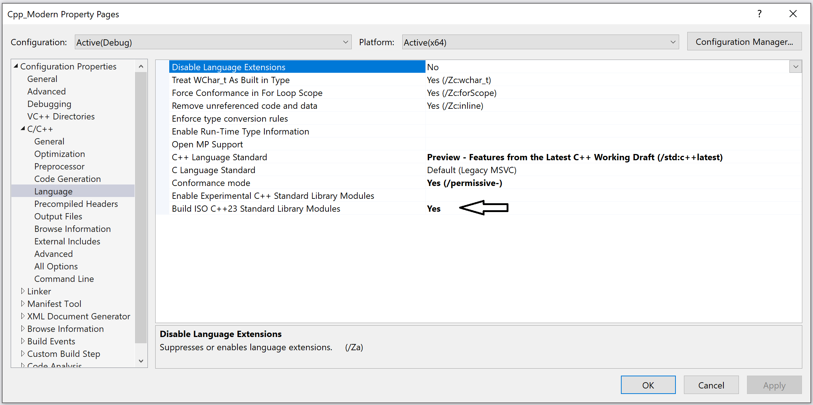

# Modularisierte Standardbibliothek

[Zurück](../../Readme.md)

---

[Quellcode](ModularizedStandardLibrary.cpp)

---

## Allgemeines

Mit Hilfe der so genannten *modularisierten Standardbibliothek* ist es jetzt möglich,
die Standardbibliothek als *Modul* zu importieren, anstatt als ein Gewirr von Headerdateien.

Dies ist viel schneller und stabiler als das Includieren von Headerdateien,
sogar wenn wir es mit vorkompilierten Headern (PCH, *Precompiled Headers*) zu tun haben.

Ab C++23 gibt es zwei benannte Module:

  * `std`
  * `std.compat`

Das Modul `std` importiert die im Namensraum `std::` der C++-Standardbibliothek definierten Deklarationen und Namen
wie beispielsweise `std::vector`. 

Das Modul `std.compat` importiert globale Namensräume der &bdquo;C Runtime Library&rdquo; wie
`::printf`, `::fopen`, `::size_t`, `::strlen` usw.
Das Modul `std.compat` erleichtert die Arbeit mit Codebasen,
die auf viele &bdquo;C Runtime Library&rdquo;-Funktionen/-Typen im globalen Namensraum verweisen.


*Beispiel*:

```cpp
01: import std;
02: 
03: namespace ModularizedStandardLibrary {
04: 
05:     static void test()
06:     {
07:         std::println("Hello World");
08:     }
09: }
```

*Ausgabe*:

```
Hello World
```

*Hinweis*:<br />
Wenn Sie mit Visual Stdio arbeiten,
muss die Verwendung der modularisierten Standardbibliothek
durch einen Compiler-Switch freigeschalten werden:


<p>

</p>

*Abbildung* 1: Compiler-Switch für die modularisierte Standardbibliothek.


Wir betrachten noch ein zweites Beispiel:


```cpp
01: import std;
02: 
03: void test()
04: {
05:     std::println("List of Entries:");
06: 
07:     std::unordered_map<std::string, size_t> phonebook
08:     {
09:         { "Hans Meier" , 12345678 },
10:         { "Franz Schneider", 81726354 },
11:         { "Hubert Mueller", 87654321 }
12:     };
13: 
14:     for (const auto& [name, number] : phonebook) {
15:         std::println("{}: {}", name, number);
16:     }
17: 
18:     std::vector<std::string> names;
19: 
20:     // retrieve names from phonebook
21:     std::transform(
22:         phonebook.begin(),
23:         phonebook.end(),
24:         std::back_inserter(names),
25:         [](const std::pair<std::string, size_t>& entry) {
26:             return std::get<0>(entry);
27:         }
28:     );
29: 
30:     std::println("List of Persons:");
31:     for (const auto& name : names) {
32:         std::println("{}", name);
33:     }
34: }
```

In der herkömmlichen Programmierung müssten hier folgende `#inlucde`-Anweisungen
vorhanden sein:

```cpp
#include <iostream>
#include <vector>
#include <unordered_map>
#include <algorithm>
```

---

[Zurück](../../Readme.md)

---
