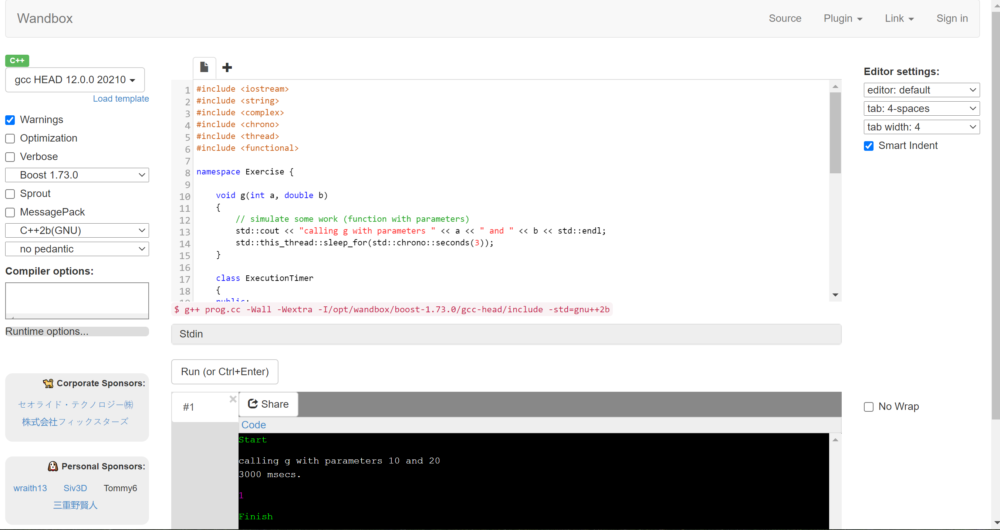
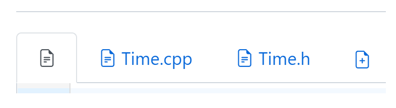
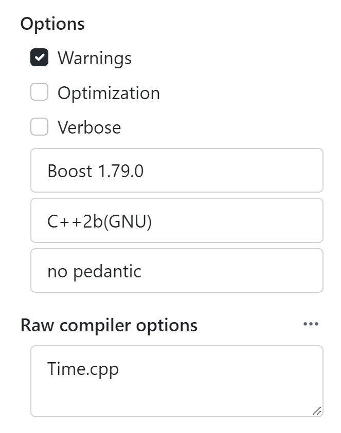
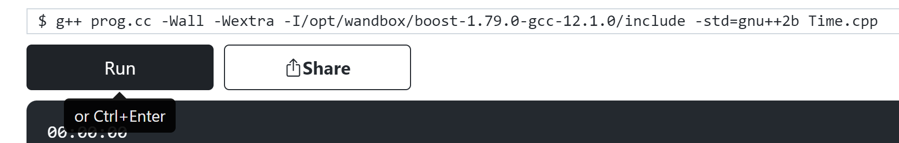
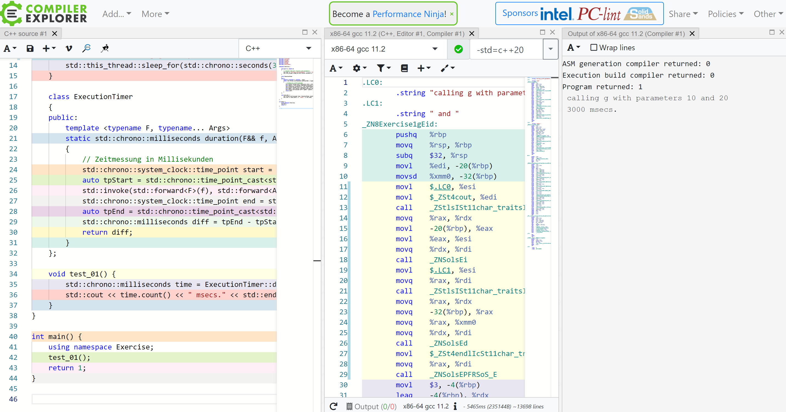
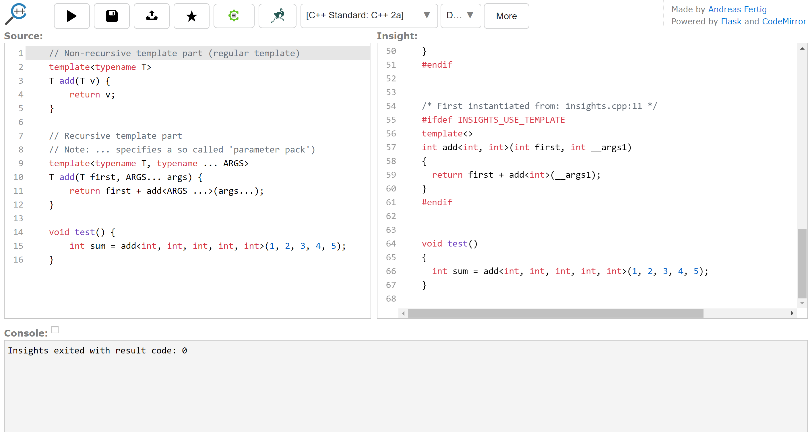

# Online C++ Compiler

[Zurück](../../Readme.md)

---

## Allgemeines

Unter [List of Online C++ Compilers](https://arnemertz.github.io/online-compilers/)
findet man eine Liste mit Informationen zu verfügbaren C++ Online Compilern und ihren wichtigsten Funktionen vor.
Auch unterstützen viele dieser WebSites andere Sprachen als C++,
war für unsere Zwecke jedoch nicht weiter von Bedeutung ist.
Je nach Version des verwendeten Compilers stehen unterschiedliche Versionen des C++&ndash;Standards bzw. &ndash;Sprachumfangs zur Verfügung.

Neben der bloßen Kompilierung führen die meisten Online-Compiler auch das kompilierte Programm aus.
Die Möglichkeiten, die Kompilierung über Compiler-Flags zu parametrisieren,
Kommandozeilen- und/oder Laufzeitparameter an das ausgeführte Programm zu übergeben und Eingaben für den Standard-Input bereitzustellen,
variieren zwischen den verschiedenen WebSites.

Es folgen einige Details zu drei sehr populären Online C++ Compilern.

---

### Wandbox

[Wandbox](https://wandbox.org/) bietet so ziemlich alle Funktionen, die Sie sich von einem typischen Online-Compiler wünschen,
einschließlich der Unterstützung mehrerer Dateien und verschiedener Editor-Tastenkombinationen.
Neben der Standardbibliothek werden einige zusätzliche Bibliotheken unterstützt,
darunter *Boost* (bis zu 1.64), *Sprout* und *MessagePack*.
Die kompilierten Programme laufen in einer Sandbox-Umgebung,
die Datei-I/O ermöglicht. Die mitgelieferten Snapshot-Versionen von *GCC* und *Clang* ermöglichen das Spielen
mit den neuesten C++17/20&ndash;Features.

*Abbildung* 1: Oberfläche des Online Compilers &bdquo;Wandbox&rdquo;.

**Hinweis**:
Ein großartiges Feature des Wandbox Online Compilers ist seine Fähigkeit,
ein Programm auf mehrere Dateien aufteilen zu können:

  * Um mehr als nur eine Quellcodedatei zu erstellen, klickt man auf das große fettgedruckte &bdquo;+&rdquo;-Zeichen
  direkt über Zeile 1 des Quellcodefensters, direkt außerhalb des Textfelds.
  Dadurch wird eine neue Registerkarte mit dem Namen *"noname-1"* erstellt.
  Diese Registerkarte repräsentiert eine neue Quellcodedatei:

*Abbildung* 2: Mehrere Quellcodedateien für ein Programm.

  * Diese Quellcodedatei versieht man mit einem richtigen Namen.
  Man klickt dazu auf *"noname-1"*, um zu dieser Registerkarte zu wechseln,
  und klickt dann erneut auf *"noname-1"*. Der Name wird editierbar,
  nennen wir sie beispielsweise &bdquo;Time.cpp&rdquo;.

  * Wenn wir jetzt auf &bdquo;Run&rdquo; klicken, kompiliert Wandbox nur den Code in der Hauptdatei!
  Die zusätzliche Datei &bdquo;Time.cpp&rdquo; wird nicht berücksichtigt.
  Um Wandbox dazu zu bringen, &bdquo;Time.cpp&rdquo; zusammen mit der Hauptdatei zu kompilieren
  und auszuführen (eigentlich sollten wir von *Linken* sprechen),
  müssen wir &bdquo;Time.cpp&rdquo; zur Compiler-Befehlszeile hinzufügen!

  * Dazu gibt es ein Texteingabefeld für &bdquo;Compiler Options:&rdquo;
  Es befindet sich in der linken Seitenleiste.
  Jede Zeile mit Optionen wird zu einem einzigen Argument für den Compiler.
  Wenn wir nun zusätzliche Codedateien hinzuzufügen, müssen wir nur die Namen dieser Dateien einfach
  reinschreiben:

*Abbildung* 3: Optionen des Compilers.

Und noch ein letzer Hinweis: Zum Ausführen des Programms muss man nicht immer umständlich
in den unteren Abschnitt des Fensters navigieren. Der Short-Cut &bdquo;*Control - Enter*&rdquo;
führt dieselbe Aufgabe aus.

*Abbildung* 4: Tastatur-Shortcut zur Programmausführung.

---

### Compiler Explorer (Godbolt)

[Compiler Explorer](https://godbolt.org/) ist eine &bdquo;*compile-as-you-type*&rdquo; IDE mit einer besonderen Funktion,
da sie den von den Compilern erzeugten Assemblercode darstellt.
Der resultierende Assemblercode kann dem ursprünglichen C++-Code farblich zugeordnet werden.
*Compiler Explorer* unterstützt die gleichzeitige Verwendung verschiedener Quellen und mehrerer Compiler,
sodass wir den Assemblercode, der von verschiedenen Compilern, mit unterschiedlichene Optimierungsflags usw. erzeugt wird,
vergleichen können. Der Compiler-Explorer ist auf GitHub zu finden und kann lokal verwendet werden.

*Abbildung* 5: Oberfläche des Online Compilers &bdquo;Compiler Explorer&rdquo;.

---

### Cppinsights

[Cppinsights](https://cppinsights.io/) ist weniger eine Online-IDE im herkömmlichen Sinne,
denn sie erlaubt es nicht, kompilierte Programme auszuführen.
Stattdessen zeigt die IDE eine andere Version des Quellcodes, die einen Teil der Magie zeigt,
die der Compiler unter der Haube macht. Man könnte auch sagen, dass *Cppinsights* eine Art
&bdquo;C++ nach C++&rdquo;&ndash;Präcompiler mit dem Ziel ist, den ursprünglichen Quellcode besser verständlich umzuwandeln.
*Cppinsights* ist ein Tool geschrieben von [Andreas Fertig](https://andreasfertig.info/).

*Abbildung* 6: Oberfläche des Online Compilers &bdquo;Cppinsights&rdquo;.

---

[Zurück](../../Readme.md)

---
