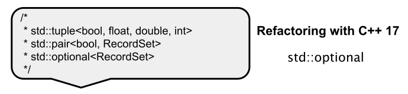

# Klasse `std::optional`

[Zurück](../../Readme.md)

---

[Quellcode](Optional.cpp)

---

## Inhalt

  * [Allgemeines](#link1)
  * [Neue monadische Funktionen](#link2)
    * [`and_then`](#link3)
    * [`or_else`](#link4)
    * [`transform`](#link5)
  * [Literaturhinweise](#link6)

---

## Allgemeines <a name="link1"></a>



Siehe das Beispiel im korrespondierenden Quellcode.

---

# Neue monadische Funktionen <a name="link2"></a>

Ab C++ 23 wurden zur Klasse `std::optional` neue Operationen hinzugefügt: `and_then`, `or_else` und `transform`.

Diese Operationen, die von Konzepten der funktionalen Programmierung inspiriert sind,
bieten eine prägnantere und ausdrucksstärkere Möglichkeit,
mit optionalen Werten (also mit `std::optional`-Objekten) zu arbeiten,

Die monadischen Interfaces (eingeführt mit C++ 23) bringen vor allem Eleganz und Sicherheit in den Code. Hier sind die wichtigsten Vorteile:

  * Vermeidung von &bdquo;if-Pyramiden&bdquo;:<br />Statt verschachtelter `if (opt.has_value())`-Abfragen kann man Operationen einfach
    mit `.and_then()` oder `.transform()` verketten. Das hält den Code flach und lesbar.
  * Deklarativer Stil:<br />Der Fokus liegt auf dem *Was* (der Logik) statt auf dem *Wie* (dem Error-Handling).
    Der Kontrollfluss für Fehlerfälle ist implizit eingebaut.
  * Sicheres Pipelining:<br />Wenn ein Glied in der Kette `std::nullopt` oder einen Fehler zurückgibt, wird der Rest der Kette automatisch übersprungen.
    Man muss nicht bei jedem Zwischenschritt manuell prüfen.
  * Kompaktheit:<br />Komplexe Transformationen, die früher mehrere Zeilen *Boilerplate*-Code erforderten,
    lassen sich oft in einem einzigen Ausdruck (Expression) formulieren.

Kurz gesagt: Es macht Quellcode funktionaler und weniger fehleranfällig gegenüber vergessenen Null-Checks.

## `and_then` <a name="link3"></a>

Die Funktion `and_then` ermöglicht die Verkettung von Funktionen, die einen `std::optional`-Wert zurückgeben.
Enthält das `std::optional`-Objekt, auf dem `and_then` aufgerufen wird, einen Wert,
wird die angegebene Funktion mit diesem Wert aufgerufen.
Das `std::optional`-Objekt wird gewissermaßen ausgepackt.

Bei erfolgreichem Funktionsaufruf wird ein Ergebnis zurückgegeben,
andernfalls wird ein leeres `std::optional`-Objekt zurückgegeben.

*Beispiel*:

```cpp
01: void test()
02: {
03:     std::optional<int> n{ 123 };
04: 
05:     auto result = n.and_then([](auto x) {
06:         if (x == 123) {
07:             return std::optional<std::string>("Got expected value 123");
08:         }  
09:         else {
10:             return std::optional<std::string>("Got unexpected value! ");
11:         }
12:     });
13: 
14:     if (result) {
15:         std::println("{}", result.value());
16:     }
17: 
18:     std::println("Done.");
19: }
```


*Ausgabe*:

```
Got expected value 123
```

Die Funktion `and_then()` erwartet eine Funktion, die einen Wert vom Typ des in `std::optional` enthaltenen Objekts entgegennimmt
und ein anderes `std::optional`-Objekt zurückgibt.
Die Anforderungen an die in `and_then()` übergebene Funktion sind wie folgt:

  * Eingabetyp:<br />Die Funktion muss ein einzelnes Argument akzeptieren. Der Typ dieses Arguments muss mit dem Typ des Werts im `std::optional`-Objekt übereinstimmen, auf dem `and_then()` aufgerufen wird. 
  * Rückgabetyp:<br />Die Funktion muss ein `std::optional<U>`-Objekt zurückgeben, wobei `U` ein beliebiger Typ sein kann.

Wir betrachten ein zweites, realitätsnahes Beispiel. Es geht um `User`-Objekte:

```cpp
01: class User
02: {
03: public:
04:     std::string m_first;
05:     std::string m_last;
06:     std::size_t m_age;
07: };
```

Der Einfachheit halber legen wir fest, dass ein `User`-Objekt einen gültigen Namen besitzt,
wenn die beiden Zeichenketten des Vor- und Nachnamens nicht leer sind.

Mit der Funktion `and_then()` können wir auf einem gültigen `std::optional<User>` eine Nachverarbeitung
der in der Klasse `User` vorhandenen Informationen vornehmen:

*Beispiel*:

```cpp
01: std::optional<std::string> hasValidName(const User& user) {
02:     if (!user.m_first.empty() and !user.m_last.empty()) {
03:         return user.m_first + " " + user.m_last;
04:     }
05:     else {
06:         return std::nullopt;
07:     }
08: }
09: 
10: void test()
11: {
12:     auto user = std::make_optional<User>("Hans", "Mueller", 30);
13: 
14:     auto result = user.and_then([](const auto& user) {
15:         return hasValidName(user);
16:     });
17: 
18:     if (result) {
19:         std::println("Result: {}", result.value());
20:     }
21: }
```

*Ausgabe*:

```
Result: Hans Mueller
```

## `or_else` <a name="link4"></a>

Die `or_else`-Operation ermöglicht es, eine Alternative für den Fall festzulegen,
dass `std::optional` leer ist. Enthält `std::optional` einen Wert, wird dieser unverändert durchgereicht.
Ist er leer, wird die angegebene Funktion aufgerufen und deren Ergebnis (das ebenfalls ein `std::optional` sein sollte) zurückgegeben.

*Beispiel*:

```cpp
01: void test()
02: {
03:     auto user = std::make_optional<User>("Hans", "Mueller", 30);
04: 
05:      auto result = user.and_then([](const auto& user) {
06:          return hasValidName(user);
07:          }).or_else([]() {
08:              return std::optional<std::string>{"Max Mustermann"};
09:          });
10: 
11:     if (result) {
12:         std::println("Result: {}", result.value());
13:     }
14: }
```

*Ausgabe*:

```
Result: Hans Mueller
```

Stimmt an dem Vor- oder Nachnamen etwas nicht, erhält man die Ausgabe

```
Result: Max Mustermann
```

## `transform` <a name="link5"></a>

Die `transform`-Operation ähnelt `and_then`, jedoch mit einem entscheidenden Unterschied:
Die an `transform` übergebene Funktion gibt einen einfachen Wert zurück, kein `std::optional`.
Dieser Wert wird dann in ein neues `std::optional`-Objekt eingeschlossen.

Ist das ursprüngliche `std::optional`-Objekt leer, wird die Funktion nicht aufgerufen und es wird ein leeres `std::optional`-Objekt zurückgegeben.


*Beispiel*:

```cpp
01: void test()
02: {
03:     auto user = std::make_optional<User>("Hans", "Mueller", 30);
04: 
05:     auto result = user.and_then([](const auto& user) {
06:         return hasValidName(user);
07:         }).transform([](auto name) {
08: 
09:             std::transform(
10:                 name.begin(),
11:                 name.end(),
12:                 name.begin(),
13:                 [](unsigned char c) { return std::toupper(c); }
14:             );
15: 
16:             return name;
17:         });
18: 
19:     if (result) {
20:         std::println("Result: {}", result.value());
21:     }
22: }
```


*Ausgabe*:

```
Result: HANS MUELLER
```

---


## Literaturhinweise <a name="link6"></a>

Die Anregungen zu diesem Code-Snippet finden sich unter anderem unter

[std::optional](https://sodocumentation.net/cplusplus/topic/2423/std--optional)<br>(abgerufen am 23.05.2020).

[Modern C++ Features – std::optional](https://arne-mertz.de/2018/06/modern-c-features-stdoptional/)<br>(abgerufen am 23.05.2020).

[Quick tip: How to return std::optional from a function](https://techoverflow.net/2019/06/13/quick-tip-how-to-return-stdoptional-from-a-function/)<br>(abgerufen am 23.05.2020).

Zu den Erweiterungen ab C++ 23 &ndash; neue monadische Funktionen &ndash; gibt es die folgenden beiden interessanten Artikel:

[How to Use Monadic Operations for `std::optional` in C++ 23](https://www.cppstories.com/2023/monadic-optional-ops-cpp23/)<br>(abgerufen am 08.04.2026).

[Daily bit(e) of C++ | Monadic interface for `std::optional`](https://medium.com/@simontoth/daily-bit-e-of-c-monadic-interface-for-std-optional-fd1a9349960c)<br>(abgerufen am 08.04.2026).

---

[Zurück](../../Readme.md)

---
