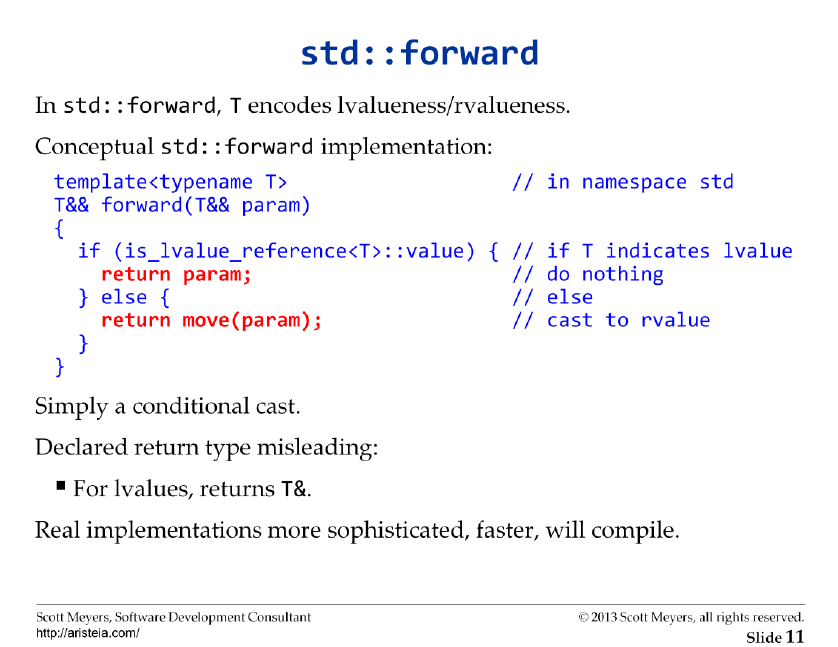

# Perfect Forwarding

[Zurück](../../Readme.md)

---

## Grundlagen

&#x21D2; [Teil II: Ein klassischer Übersetzungsfehler](PerfectForwarding_02.md)

---

[Quellcode 1](PerfectForwarding02.cpp): Motivation

[Quellcode 2](PerfectForwarding03.cpp): Elementarer Datentyp (`int`)

[Quellcode 3](PerfectForwarding04.cpp): Benutzerdefinierter Datentyp (`class`)

## Motivation zu Perfect Forwarding

Zur Motivation des Perfect Forwarding betrachten wir folgendes Szenario
mit einer Template Funktion.

Angenommen, wir wollen eine Funktion schreiben,
die ein oder mehrere Parameter (möglicherweise unterschiedlichen Typs) hat
und diese an einen Konstruktor weiterleitet. In der Praxis könnte es sich
um eine Umsetzung des Factory-Patterns handeln:

```cpp
template<typename TCLASS, typename TARG>
TCLASS Factory(TARG a)
{
    return TCLASS(a);
}
```

Nun können wir diese Fabrik schon einsetzen, sowohl für `int`-Werte als auch für `AnyClass`-Objekte:

```cpp
// first example
auto n = Factory<int>(123);
std::cout << n << std::endl;

// second example
auto obj = Factory<AnyClass>(1.5);
std::cout << obj << std::endl;
```

`AnyClass` ist hier ein Stellvertreter
einer beliebigen benutzerdefinierten C++-Klasse, die einen Konstruktor mit einem Parameter besitzt.

So weit, so gut, nur ist an diesem einfachen Vorgehen unschön, dass der aktuelle Parameter `a`
stets als Kopie an den Konstruktor weitergereicht wird. Eigentlich sollte dieser
Parameter als Referenz-Typ deklariert sein:

```cpp
template<typename TCLASS, typename TARG>
TCLASS Factory(TARG& a)
{
    return TCLASS(a);
}
```

Hmmm, eigentlich gut gedacht, aber auf einmal sind die beiden letzten Beispiele
nicht mehr übersetzungsfähig (unter der Voraussetzung, das die `Factory`-Funktionsschablone
mit *copy-by-value*-Parameterübergabemechanismus nicht mehr zur Verfügung steht).

Eine triviale Lösung besteht darin, dass man die Beispiele - und damit den Aufruf der `Factory`-Funktion - 
geringfügig ändert:

```cpp
// first example
int value = 123;
auto n = Factory<int>(value);
std::cout << n << std::endl;

// second example
AnyClass arg(1.5);
auto obj = Factory<AnyClass>(arg);
std::cout << obj << std::endl;
```

Nichtsdestotrotz ist diese Lösung unschön, da das direkte Versorgen der Konstruktoren mit
Konstanten nicht mehr möglich ist. Dies wiederum könnten wir allerdings mit einer weiteren Überladung
der `Factory`-Funktion lösen:

```cpp
template<typename TCLASS, typename TARG>
TCLASS Factory(const TARG& a)
{
    return TCLASS(a);
}
```

Das `const`-Schlüsselwort (*const reference*) bewirkt nun die Übersetzungsfähigkeit aller bislang
gezeigten Beispiele!

Jetzt könnten wir eigentlich unseren Konstruktor mit einem zweiten Parameter ... oder gar gleich
mit einem dritten Parameter ausstatten. Aha, Problem möglicherweise erkannt:
Es genügt nicht eine Überladung hinzuzufügen, sondern wir müssen auch `const&` und `&` überladen!
Bei 2 Parametern sind dies dann 4 Überladungen, bei 3 Parametern 8 Überladungen etc.
In der Tat ergibt das für *n* Argumente 2<sup>*n*</sup> Überladungen!

Damit kommen wir auf C++ 11 zu sprechen, und einem neuen Referenz-Typ, der passt: Der *RValue*-Referenz.
Als Argument in einer Template-Funktion passt sich der Typ dem tatsächlichen Argument an!
Das Ergebnis verwendet die &&-Notation und die Standard-Funktion `std::forward`:

```cpp
template<typename TCLASS, typename TARG>
TCLASS FactoryEx(TARG&& a)
{
    return TCLASS(std::forward<TARG>(a));
}
```

Um das *Perfect Forwarding* umfassend zu verstehen, müssen wir uns vergegenwärtigen, was passiert,
wenn mehrere Referenzen `&` und `&&` sich aneinanderreihen.
Damit sind wir beim so genannten *Reference Collapsing* angekommen:

## Reference Collapsing Rules

Da es ab C++ 11 neben der "einfachen" Referenz `&` noch die Referenz `&&` gibt,
wurde ein Regelwerk definiert, wenn mehrere Referenzen aufeinander treffen.

Es gilt die sogenannte Tabelle der *Reference Collapsing Rules* 
(zu Deutsch etwa: *Zusammenfassungsregeln*):

| Formaler Typ | Beschreibung | Resultattyp | Beschreibung|
|:------ |:----------|:----------|:----------|
| T& &   | LValue-Referenz auf eine LValue-Referenz | T&  | LValue-Referenz |
| T&& &  | LValue-Referenz auf eine RValue-Referenz | T&  | LValue-Referenz |
| T& &&  | RValue-Referenz auf eine LValue-Referenz | T&  | LValue-Referenz |
| T&& && | RValue-Referenz auf eine RValue-Referenz | T&& | RValue-Referenz |

Tabelle 1. *Zusammenfassungsregeln*/*Collapsing Rules* für das *Perfect Forwarding*.

Von *Scott Meyers* in Worte gefasst lauten diese Regeln, wenn gleich auch nicht einfach verständlich formuliert:

"[given] a type TR that is a reference to a type T, an attempt to create the type “lvalue reference to cv TR”
creates the type “lvalue reference to T”,
while an attempt to create the type “rvalue reference to cv TR” creates the type TR."

Ein zweiter Versuch von *Scott Meyers* bietet eine möglicherweise leichter verständlichere Darstellung
des Sachverhalts an:



Abbildung 1. `std::forward`.


## Zum Abschuss: *What’s the difference between `std::move` and `std::forward`*?

Ein einfaches Beispiel findet sich unter

https://isocpp.org/blog/2018/02/quick-q-whats-the-difference-between-stdmove-and-stdforward

Eine Antwort in SO (*Stackoverflow*) lautet:

`std::move` takes an object and allows you to treat it as a temporary (an *rvalue*). Although it isn’t a semantic requirement,
typically a function accepting a reference to an *rvalue* will invalidate it.
When you see `std::move`, it indicates that the value of the object should not be used afterwards.

`std::forward` has a single use case: to cast a templated function parameter (inside the function)
to the value category (*lvalue* or *rvalue*) the caller used to pass it.
This allows *rvalue* arguments to be passed on as *rvalues*, and *lvalues* to be passed on as *lvalues*,
a scheme called “perfect forwarding.”

Zu deutsch etwa:

`std :: move` nimmt ein Objekt und ermöglicht es, diese als Temporärobjekt (als *rvalue*) zu behandeln.
Obwohl dies keine semantische Anforderung ist, macht in der Regel eine Funktion,
die einen Verweis auf einen *rvalue* akzeptiert, diesen ungültig.
Wenn Sie `std::move` sehen, bedeutet dies, dass der Wert des Objekts danach nicht mehr verwendet werden sollte.

`std :: forward` hat einen einzigen Anwendungsfall: 
einen Parameter einer Templatefunktion (innerhalb der Funktion) in die *Value* Kategorie
(*lvalue* oder *rvalue*) umzuwandeln, mit der der Aufrufer sie übergeben hat.
Auf diese Weise können *rvalue*-Argumente als *rvalues* und *lvalue*-Argumente als *lvalues* weitergegeben werden,
ein Schema, das als “perfekte Weiterleitung” (“perfect forwarding”) bezeichnet wird.


## Literaturhinweise:

Eine sehr gute Beschreibung zu diesem Thema befindet sich unter

[Arne Mertz Blog](https://arne-mertz.de/2015/10/new-c-features-templated-rvalue-references-and-stdforward//)<br>(abgerufen am 31.05.2020).

oder

[Eli Bendersky's website: Perfect forwarding and universal references in C++](https://eli.thegreenplace.net/2014/perfect-forwarding-and-universal-references-in-c//)<br>(abgerufen am 15.01.2021).

oder auch

[C++11: Perfect forwarding](https://oopscenities.net/2014/02/01/c11-perfect-forwarding//)<br>(abgerufen am 14.03.2021).

---

[Zurück](../../Readme.md)

---
