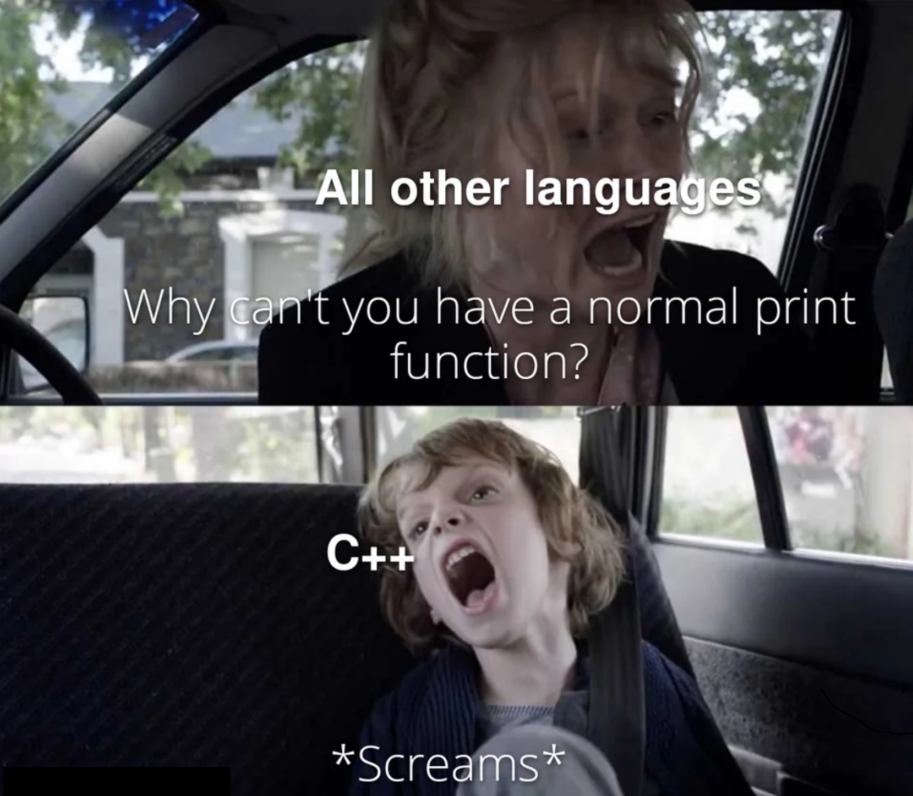

# The Return of &bdquo;`printf`&rdquo;: `std::print(ln)` in C++ 23

[Zurück](../../Readme.md)


---

[Quellcode](Println.cpp)

---

## Inhalt

  * [Einleitung](#link1)
  * [Dokumentation](#link2)
  * [Beispiele zur Ausgabe elementarer Datentypen](#link3)
  * [Beispiele zur Ausgabe benutzerdefinierter Datentypen](#link4)
  * [Literaturhinweise](#link5)

---

## Einleitung <a name="link1"></a>

&bdquo;`printf`&rdquo;: Wer hat sie nicht vermisst? Die C-Bibliotheksfunktion war uns doch &ndash; trotz all ihrer Schwächen &ndash; 
sehr ans Herz gewachsen.



<sup>(Credits: Found in [std::print in C++23](https://vitaut.net/posts/2023/print-in-cpp23/) from *Victor Zverovic*)</sup>

*Abbildung* 1: The Return of &bdquo;`printf`&rdquo;: `std::print` ab C++ 23.

In C++ 23 ist sie zurückgekehrt, und wenn wir so wollen: Stärker denn je zuvor!
Typsicherheit, Erweiterbarkeit, Unterstützung von Unicode und Performanz sind 
einige der Stärken der neuen Funktionen `std::print` und  `std::println`.
Darüber hinaus weisen sie große Ähnlichkeiten zu `printf` auf!

---

## Dokumentation <a name="link2"></a>

Eine genaue Beschreibung der Formatzeichenkette findet man in der
&bdquo;[Standard Format Specification](https://en.cppreference.com/w/cpp/utility/format/spec)&rdquo; wieder.
Aus diesem Grund macht es wenig Sinn, hier die Spezifikation zu wiederholen.

Ich versuche, mit einer Reihe möglichst ausdrucksstarker Beispiele die wesentlichen Features der `std::print(ln)`
Funktion vorzustellen:

  * Teil 1: Standardformatspezifikation<br />
  Für elementare Datentypen und Stringtypen basiert die Formatspezifikation auf der Formatspezifikation von Python.

  * Teil 2: `std::print` mit benutzerdefinierten Typen verwenden<br />
  Neben den elementaren Datentypen kann man `std::print` auch für benutzerdefinierte Typen einsetzen.


Um `std::print` für einen benutzerdefinierten Datentyp benötigt man
das Klassentemplate `std::formatter<T, char>`:

Die einzelnen Schritte sehen nun so aus:

  * Definieren Sie eine Spezialisierung der Klasse `std::formatter<T, char>` im Namensraum `std`.
  * Implementieren Sie die Methode `parse()`, um den Teil der Formatzeichenfolge zu analysieren, der dem aktuellen Argument entspricht. Wenn die Spezialisierung der Klasse `std::formatter<T, char>` von einem anderen Formatierer erbt, kann diese Methode weggelassen werden.
  * Implementieren Sie die Methode `format()`, um das Argument zu formatieren und die Ausgabe über `std::format_context` zu schreiben.

Sie finden auch hierzu im Beispielcode eine Reihe von Beispielen vor.

---

## Beispiele zur Ausgabe elementarer Datentypen <a name="link3"></a>


*Beispiel*:

```cpp
01: test()
02: {
03:     std::println("Hello, world!");
04: }
```

*Ausgabe*:

```
Hello, world!
```

---

*Beispiel*:

```cpp
01: test()
02: {
03:     int value{ 123 };
04:     std::println("Value: {}", value);
05: }
```

*Ausgabe*:

```
Value: 123
```

---

*Beispiel*:

```cpp
01: void test()
02: {
03:     int firstValue{ 123 };
04:     int secondValue{ 456 };
05: 
06:     std::println("First Value: {}, Second Value: {}", firstValue, secondValue);
07:     std::println("First Value: {0}, Second Value: {1}", firstValue, secondValue);
08: }
```

*Ausgabe*:

```
First Value: 123, Second Value: 456
First Value: 123, Second Value: 456
```

---

*Beispiel*: *Fill and Align*

```cpp
01: void test()
02: {
03:     int value{ 123 };
04: 
05:     std::println("{}", value);             // "123"
06:     std::println("{0}", value);            // "123"
07:     std::println("{:10}", value);          // "       123"
08:     std::println("!{:_<10}!", value);      // "!123_______!"
09:     std::println("!{:_>10}!", value);      // "!_______123!"
10: }
```

*Ausgabe*:

```
123
123
       123
!123_______!
!_______123!
```

---

*Beispiel*: *Fill, Align and Precision*

```cpp
01: void test()
02: {
03:     int value{ 123 };
04: 
05:     std::println("{}", value);             // "123"
06:     std::println("{:d}", value);           // "123"
07:     std::println("{:010}", value);         // "0000000123"
08:     std::println("{:010d}", value);        // "0000000123"
09:     std::println("{:0}", value);           // "123"
10:     std::println("{:+}", value);           // "+123"
11:     std::println("{:+}", -value);          // "-123"
12:     std::println("{:+10}", value);         // "      +123"
13:     std::println("{:+10}", -value);        // "      -123"
14:     std::println("{:+010}", value);        // "+000000123"
15:     std::println("{:+010}", -value);       // "-000000123"
16: }
```

*Ausgabe*:

```
123
123
0000000123
0000000123
123
+123
-123
      +123
      -123
+000000123
-000000123
```

---


*Beispiel*: *Fill, Align and Precision*

```cpp
01: void test()
02: {
03:     float pi{ 3.1415926535f };
04: 
05:     std::println("{}", pi);                // "3.1415927"
06:     std::println("{0}", pi);               // "3.1415927"
07:     std::println("{:15f}", pi);            // "       3.141593"    (width = 15)
08:     std::println("{:{}f}", pi, 15);        // "       3.141593"    (width = 15)
09:     std::println("{:.12f}", pi);           // "3.141592741013"     (precision = 12)
10:     std::println("{:.{}f}", pi, 3);        // "3.142"              (precision = 3)
11:     std::println("{:15.12f}", pi);         // " 3.141592741013"    (width = 15, precision = 12)
12:     std::println("{:{}.{}f}", pi, 15, 12); // " 3.141592741013"    (width = 15, precision = 12)
13: }
```

*Ausgabe*:

```
3.1415927
3.1415927
       3.141593
       3.141593
3.141592741013
3.142
 3.141592741013
 3.141592741013
```

---


*Beispiel*: *Fill, Align and Precision*

```cpp
01: static void test_07()
02: {
03:     double pi{ 3.1415926535f };
04: 
05:     std::println("{}", pi);                // "3.1415927"
06:     std::println("{0}", pi);               // "3.1415927"
07:     std::println("{:15g}", pi);            // "       3.141593"    (width = 15)
08:     std::println("{:{}g}", pi, 15);        // "       3.141593"    (width = 15)
09:     std::println("{:.12g}", pi);           // "3.141592741013"     (precision = 12)
10:     std::println("{:.{}g}", pi, 3);        // "3.142"              (precision = 3)
11:     std::println("{:15.12g}", pi);         // " 3.141592741013"    (width = 15, precision = 12)
12:     std::println("{:{}.{}g}", pi, 15, 12); // " 3.141592741013"    (width = 15, precision = 12)
13: }

```

*Ausgabe*:

```
3.1415927410125732
3.1415927410125732
        3.14159
        3.14159
3.14159274101
3.14
  3.14159274101
  3.14159274101
```

---


*Beispiel*: *Sign, #, and different Formats*

```cpp
01: static void test_08()
02: {
03:     std::println("Hexadecimal:  {:x}", 6);      // "Hexadecimal:  6"
04:     std::println("Hexadecimal:  {:x}", 30);     // "Hexadecimal: 1e"
05:     std::println("Hexadecimal:  {:X}", 30);     // "Hexadecimal: 1E"
06:     std::println("Hexadecimal:  {:#x}", 30);    // "Hexadecimal: 0x1e"
07:     std::println("Hexadecimal:  {:#X}", 30);    // "Hexadecimal: 0X1E"
08:     std::println("Hexadecimal:  {:15x}", 6);    // "Hexadecimal:               6"   (width = 15)
09:     std::println("Hexadecimal:  {:#15X}", 30);  // "Hexadecimal:            0X1E"   (width = 15)
10: 
11:     std::println("Octal:        {:o} ", 12);    // "Octal:       14"
12:     std::println("Octal:        {:#o} ", 12);   // "Octal:       014"
13:     std::println("Octal:        {:#o}", 4);     // "Octal:       04"
14: 
15:     std::println("Binary:       {:b} ", 31);    // "Binary:      11111"
16:     std::println("Binary:       {:#b} ", 31);   // "Binary:      0b11111"
17:     std::println("Binary:       {:#B}", 7);     // "Binary:      0B111"
18:     std::println("Binary:       {:#15b} ", 31); // "Binary:              0b11111"   (width = 15)
19:     std::println("Binary:       {:#15B}", 7);   // "Binary:                0B111"   (width = 15)
20: }
```

*Ausgabe*:

```
Hexadecimal:  6
Hexadecimal:  1e
Hexadecimal:  1E
Hexadecimal:  0x1e
Hexadecimal:  0X1E
Hexadecimal:                6
Hexadecimal:             0X1E
Octal:        14
Octal:        014
Octal:        04
Binary:       11111
Binary:       0b11111
Binary:       0B111
Binary:               0b11111
Binary:                 0B111
```


## Beispiele zur Ausgabe benutzerdefinierter Datentypen <a name="link4"></a>


*Beispiel*: *Basic Formatter API*

```cpp
01: namespace std
02: {
03:     template<>
04:     struct formatter<SimpleClass>
05:     {
06:         // parse the format string for this type
07:         constexpr auto parse(std::format_parse_context& ctx) {
08:             return ctx.begin(); // should return position of '}' (hopefully)
09:         }
10: 
11:         // format by always writing its value:
12:         auto format(const SimpleClass& obj, std::format_context& ctx) const {
13:             return std::format_to(ctx.out(), "{}", obj.getValue());
14:         }
15:     };
16: }
17: 
18: void test()
19: {
20:     SimpleClass obj{ 123 };
21:     std::println("Value: {}", obj);
22:     std::println("Two Values: {0} - {0}", obj);
23: }
24: 
```

*Ausgabe*:

```
Value: 123
Two Values: 123 - 123
```

---

*Beispiel*: *Implementing parse-Function of Class Template Specialization*

```cpp
01: namespace std
02: {
03:     template<>
04:     class formatter<SimpleClass>
05:     {
06:     private:
07:         int m_width; // specified width of the field
08: 
09:     public:
10:         constexpr formatter() : m_width{ 0 } {}
11: 
12:         // parse the format string for this type
13:         constexpr auto parse(std::format_parse_context& ctx)
14:         {
15:             auto pos{ ctx.begin() };
16:             while (pos != ctx.end() && *pos != '}') {
17:                 if (*pos < '0' || *pos > '9') {
18:                     throw std::format_error{ std::format("invalid format '{}'", *pos) };
19:                 }
20: 
21:                 m_width = m_width * 10 + (*pos - '0'); // new digit for the width
22:                 ++pos;
23:             }
24:             return pos; // should return position of '}'
25:         }
26: 
27:         // format by always writing its value
28:         auto format(const SimpleClass& obj, std::format_context& ctx) const {
29:             return std::format_to(ctx.out(), "{:{}}", obj.getValue(), m_width);
30:         }
31:     };
32: }
33: 
34: void test()
35: {
36:     SimpleClass obj{ 123 };
37:     std::println("{}", obj.getValue());
38:     std::println("Value: {}", obj);
39:     std::println("Twice: {0} {0}", obj);
40:     std::println("With width:       '{:6}'", obj);
41:     std::println("Twice with width: '{0:6}' = '{1:6}'", obj, obj);
42: }
43: 
```

*Ausgabe*:

```
123
Value: 123
Twice: 123 123
With width:       '   123'
Twice with width: '   123' = '   123'
```

---

*Beispiel*: *Delegating formatting to Standard Formatter Implementation*

```cpp
01: namespace std
02: {
03:     // delegating formatting to standard formatters
04:     template<>
05:     class formatter<SimpleClass>
06:     {
07:     private:
08:         // use a standard int formatter that does the work:
09:         std::formatter<int> m_formatter;
10: 
11:     public:
12:         // delegate parsing to the standard formatter:
13:         constexpr auto parse(std::format_parse_context& ctx) {
14:             return m_formatter.parse(ctx);
15:         }
16: 
17:         // delegate formatting of the value to the standard formatter:
18:         auto format(const SimpleClass& obj, std::format_context& ctx) const {
19:             return m_formatter.format(obj.getValue(), ctx);
20:         }
21:     };
22: }
23: 
24: void test()
25: {
26:     SimpleClass obj{ 123 };
27:     std::println("{}", obj.getValue());
28:     std::println("Value: {}", obj);
29:     std::println("Twice: {0} {0}", obj);
30:     std::println("With width: '{:>20}'", obj);
31:     std::println("With all:   '{:.^20}'", obj);
32: }
33: 
```

*Ausgabe*:

```
123
Value: 123
Twice: 123 123
With width: '                 123'
With all:   '........123.........'
```

---


*Beispiel*: *Inheriting From Standard Formatters*

```cpp
01: namespace std
02: {
03: 
04:     template<>
05:     struct std::formatter<SimpleClass> : std::formatter<int>
06:     {
07:         auto format(const SimpleClass& obj, std::format_context& ctx) const {
08:             // delegate formatting of the value to the standard formatter
09:             return std::formatter<int>::format(obj.getValue(), ctx);
10:         }
11:     };
12: }
13: 
14: void test()
15: {
16:     SimpleClass obj{ 123 };
17:     std::println("{}", obj.getValue());
18:     std::println("Value: {}", obj);
19:     std::println("Twice: {0} {0}", obj);
20:     std::println("With width: '{:>20}'", obj);
21:     std::println("With all:   '{:.^20}'", obj);
22: }
23: 
```

*Ausgabe*:

```
123
Value: 123
Twice: 123 123
With width: '                 123'
With all:   '........123.........'
```

---


*Beispiel*: *Example Formatter for User defined Enum Type Color*

```cpp
01: namespace std
02: {
03:     // formatter for user defined enum type Color
04:     template<>
05:     struct std::formatter<Color> : public std::formatter<std::string>
06:     {
07:         auto format(Color col, format_context& ctx) const {
08: 
09:             std::string value{};
10: 
11:             switch (col)
12:             {
13:             case Color::red:
14:                 value = "red";
15:                 break;
16:             case Color::green:
17:                 value = "green";
18:                 break;
19:             case Color::blue:
20:                 value = "blue";
21:                 break;
22:             default:
23:                 value = std::format("Color{}", static_cast<int>(col));
24:                 break;
25:             }
26: 
27:             // delegate the rest of formatting to the string formatter
28:             return std::formatter<std::string>::format(value, ctx);
29:         }
30:     };
31: }
32: 
33: void test()
34: {
35:     // using user-provided formatter for enum Color
36:     for (auto val : { Color::red, Color::green, Color::blue, Color{ 123 } })
37:     {
38:         std::println("Color {:_>8} has value 0X{:02X}", val, static_cast<int>(val));
39:     }
40: }
41: 
```

*Ausgabe*:

```
Color _____red has value 0X00
Color ___green has value 0X01
Color ____blue has value 0X02
Color Color123 has value 0X7B
```

---


*Beispiel*: *Using Standard Formatters for STL class std::vector*

```cpp
01: namespace std
02: {
03:     using namespace Formatting_Examples_Revised;
04: 
05:     // formatter for std::vector
06:     template <typename T>
07:     struct std::formatter<std::vector<T>> : std::formatter<std::string_view>
08:     {
09:         constexpr auto parse(format_parse_context& ctx) {
10:             return ctx.begin();
11:         }
12: 
13:         auto format(const std::vector<T>& vec, std::format_context& ctx) const {
14: 
15:             std::string tmp{};
16: 
17:             const auto fmt_str = [&]() {
18:                 if constexpr (std::is_integral<T>::value) {
19:                     return "{:+5}";
20:                 }
21:                 else if constexpr (std::is_floating_point<T>::value) {
22:                     return "{:+5.2}";
23:                 }
24:                 else {
25:                     return "{}";
26:                 }
27:                 }();
28: 
29:             const auto header = [&]() {
30: 
31:                 if (std::is_same<T, int>::value) {
32:                     return "std::vector<int>";
33:                 }
34:                 else if (std::is_same<T, long>::value) {
35:                     return "std::vector<long>";
36:                 }
37:                 else if (std::is_same<T, short>::value) {
38:                     return "std::vector<short>";
39:                 }
40:                 else if (std::is_same<T, float>::value) {
41:                     return "std::vector<float>";
42:                 }
43:                 else if (std::is_same<T, double>::value) {
44:                     return "std::vector<double>";
45:                 }
46:                 else {
47:                     return "std::vector<>";
48:                 }
49:                 }();
50: 
51:             std::format_to(std::back_inserter(tmp), "{} - ", header);
52: 
53:             T lastElem = vec.back();
54: 
55:             std::for_each(
56:                 vec.begin(),
57:                 std::prev(vec.end()),
58:                 [&](const auto& elem) {
59:                     std::format_to(std::back_inserter(tmp), "{}, ", elem);
60:                 }
61:             );
62: 
63:             std::format_to(std::back_inserter(tmp), "{}", lastElem);
64: 
65:             return std::formatter<string_view>::format(tmp, ctx);
66:         }
67:     };
68: }
69: 
70: void test()
71: {
72:     std::vector<int> intVec = { 1, 2, 3, 4, 5 };
73:     std::println("{}", intVec);
74: 
75:     std::vector<double> doublesVec = { 1.5, 2.5, 3.5, 4.5, 5.5 };
76:     std::println("{}", doublesVec);
77: }
78: 
```

*Ausgabe*:

```
std::vector<int> - 1, 2, 3, 4, 5
std::vector<double> - 1.5, 2.5, 3.5, 4.5, 5.5
```

---


*Beispiel*:  *Implementation of a Formatter for a User defined Class Color*

```cpp
01: class Color
02: {
03: private:
04:     std::uint8_t m_red;
05:     std::uint8_t m_green;
06:     std::uint8_t m_blue;
07: 
08: public:
09:     Color() : Color{ 0, 0, 0 } {}
10: 
11:     Color(std::uint8_t red, std::uint8_t green, std::uint8_t blue)
12:         : m_red{ red }, m_green{ green }, m_blue{ blue }
13:     {}
14: 
15:     std::uint8_t getRed() const { return m_red; }
16:     std::uint8_t getGreen() const { return m_green; }
17:     std::uint8_t getBlue() const { return m_blue; }
18: };
19: 
20: namespace std
21: {
22:     // formatter for class Color
23:     template<>
24:     struct std::formatter<Color> {
25:         constexpr auto parse(std::format_parse_context& ctx) {
26:             return ctx.begin();
27:         }
28: 
29:         auto format(const Color& col, std::format_context& ctx) const {
30: 
31:             return
32:                 std::format_to(ctx.out(), "[{}, {}, {}]", col.getRed(), col.getGreen(), col.getBlue());
33:         }
34:     };
35: }
36: 
37: void test()
38: {
39:     std::println("Color {}", Color{ 100, 200, 255 });
40: }
41: 
```

*Ausgabe*:

```
Color [100, 200, 255]
```

---

*Beispiel*:

```cpp
01: namespace std
02: {
03:     template<>
04:     struct std::formatter<Color> : std::formatter<string_view>
05:     {
06:         auto format(const Color& col, std::format_context& ctx) const {
07: 
08:             std::string tmp{};
09: 
10:             std::format_to(std::back_inserter(tmp), "({}, {}, {})",
11:                 col.getRed(), col.getGreen(), col.getBlue());
12: 
13:             return std::formatter<string_view>::format(tmp, ctx);
14:         }
15:     };
16: }
17: 
18: void test()
19: {
20:     std::println("Color {}", Color{ 100, 200, 255 });
21: }
22: 
```

*Ausgabe*:

```
Color (100, 200, 255)
```

---

*Beispiel*:

```cpp
01: namespace std
02: {
03:     template <>
04:     class std::formatter<Color>
05:     {
06:     private:
07:         bool m_isHex;
08: 
09:     public:
10:         constexpr formatter() : m_isHex{ false } {}
11: 
12:         constexpr auto parse(std::format_parse_context& ctx)
13:         {
14:             auto pos{ ctx.begin() };
15:             while (pos != ctx.end() && *pos != '}') {
16:                 if (*pos == 'h' || *pos == 'H')
17:                     m_isHex = true;
18:                 ++pos;
19:             }
20: 
21:             return pos; // should return position of '}'
22:         }
23: 
24:         auto format(const Color& col, std::format_context& ctx) const {
25: 
26:             if (m_isHex) {
27:                 uint32_t val{ static_cast<uint32_t>(col.getRed() << 16 | col.getGreen() << 8 | col.getBlue()) };
28:                 return std::format_to(ctx.out(), "#{:X}", val);
29:             }
30:             else {
31:                 return std::format_to(ctx.out(), "[{}, {}, {}]", col.getRed(), col.getGreen(), col.getBlue());
32:             }
33:         };
34:     };
35: }
36: 
37: void test()
38: {
39:     Color color{ 100, 200, 255 };
40:     std::println("Color {}", color);
41:     std::println("Color {:h}", color);
42: }
43: 
```

*Ausgabe*:

```
Color [100, 200, 255]
Color #64C8FF
```

---

## Literaturhinweise <a name="link5"></a>

Die Anregungen zu den Beispielen stammen teilweise bzw. in modifizierter Form aus

[Formatting Custom types with std::format from C++20](https://www.cppstories.com/2022/custom-stdformat-cpp20)

bzw.

[An Extraterrestrial Guide to C++20 Text Formatting](https://www.cppstories.com/2020/02/extra-format-cpp20.html)

von Bartomiej Filipek als auch Victor Zverovich.

Weitere Informationen kann man in

[Formatting User-Defined Types in C++20](https://www.modernescpp.com/index.php/formatting-user-defined-types-in-c20/)

nachlesen.

---

[Zurück](../../Readme.md)

---
