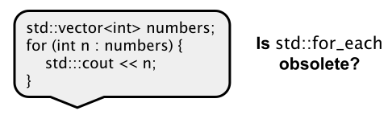

# Range-based `for` Loop

[Zurück](../../Readme.md)

---

[Quellcode](RangeBasedForLoop.cpp)

---

## Inhalt

  * [Allgemeines](#link1)
  * [Laufzeitmessungen](#link2)

---

## Allgemeines <a name="link1"></a>



---

Die *bereichsbasierte* `for`-Schleife ist ein besser lesbares Äquivalent
zur regulären `for`-Schleife. Sie kann verwendet werden,
um ein Array oder ein anderes Objekt (typischerweise: STL-Container) zu traversieren.

---

## Laufzeitmessungen <a name="link2"></a>

Wir vergleichen die unterschiedlichen Möglichkeiten zum Iterieren eines Containers
an Hand von Laufzeitmessungen. 

Als Container legen wir ein `std::vector<double>`-Objekt zu Grunde,
die Werte des Containers sind jeweils auszusummieren.

Folgende Varianten werden betrachtet:

  * Die *klassische* `for`-Wiederholungsschleife
  * Iteration mit STL-Iteratoren
  * *Bereichsbasierte* `for`-Schleife (*Range-based Loop*)
  * Standard-STL-Algorithmus (`std::for_each`)
  * Standard-STL-Algorithmus (`std::accumulate`)


*Hinweis*:<br />
Es lassen sich große Unterschiede zwischen Debug- und Release-Modus beobachten.
Vor allem fällt im Debug-Modus der Gebrauch von STL-Iteratoren aus dem Rahmen.

Es folgen einige Beispiele:

#### `std::vector<double>`-Objekt mit 10.000.000 Elementen &ndash; Debug-Modus

```
Classic Loop:
Elapsed time: 81 milliseconds.
sum:  50000005000000
Iterator Loop:
Elapsed time: 1307 milliseconds.
sum:  50000005000000
Range-based Loop:
Elapsed time: 23 milliseconds.
sum:  50000005000000
Standard Algorithm - std::for_each:
Elapsed time: 35 milliseconds.
sum:  50000005000000
Standard Algorithm - std::accumulate:
Elapsed time: 38 milliseconds.
sum:  50000005000000
```

#### `std::vector<double>`-Objekt mit 100.000.000 Elementen &ndash; Release-Modus

```
Classic Loop:
Elapsed time: 102 milliseconds.
sum: 5000000050000000
Iterator Loop:
Elapsed time: 103 milliseconds.
sum: 5000000050000000
Range-based Loop:
Elapsed time: 115 milliseconds.
sum: 5000000050000000
Standard Algorithm - std::for_each:
Elapsed time: 105 milliseconds.
sum: 5000000050000000
Standard Algorithm - std::accumulate:
Elapsed time: 103 milliseconds.
sum: 5000000050000000
```

#### `std::vector<double>`-Objekt mit 100.000.000 Elementen &ndash; Debug-Modus mit GCC

```
Classic Loop: 
Elapsed time: 486 milliseconds.
sum: 5000000050000000
Iterator Loop: 
Elapsed time: 1474 milliseconds.
sum: 5000000050000000
Range-based Loop: 
Elapsed time: 991 milliseconds.
sum: 5000000050000000
Standard Algorithm - std::for_each:
Elapsed time: 1325 milliseconds.
sum: 5000000050000000
Standard Algorithm - std::accumulate:
Elapsed time: 1350 milliseconds.
sum: 5000000050000000
```

---

[Zurück](../../Readme.md)

---
