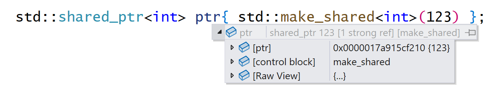
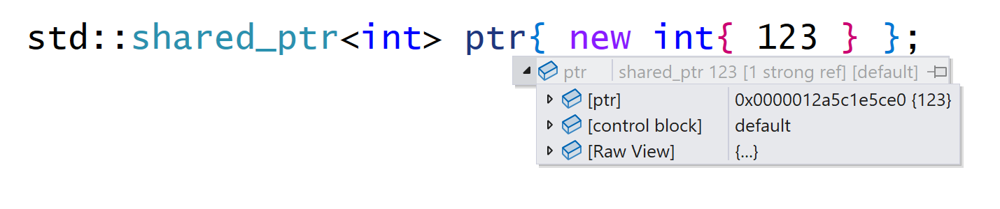

# Shared Pointer: Klasse `std::shared_ptr`

[Zurück](../../Readme.md)

---

[Quellcode](SharedPtr.cpp)

---

## Inhalt

  * [&bdquo;It's about ownership&rdquo;](#link1)
  * [`std::make_shared`](#link2)
  * [*Control Block*](#link3)
  * [Die Klasse `std::shared_ptr` unterstützt Arrays](#link4)
  * [Literaturhinweise](#link5)

---

## &bdquo;It's about ownership&rdquo; <a name="link1"></a>

###### Exklusiver Besitz: `std::unique_ptr<T>`

#### Geteilter Besitz: `std::shared_ptr<T>`

###### Temporärer Besitz: `std::weak_ptr<T>`

---

## `std::make_shared` <a name="link2"></a>

Die beiden Varianten, ein `std::shared_ptr`-Objekt anzulegen, sind nicht
ganz identisch:

  * `std::shared_ptr` und expliziter `new` Aufruf
  * `std::make_shared` Aufruf

Ein `std::shared_ptr`-Objekt verwaltet zwei Speicherbereiche:

  * einen so genannten `Control-Block` (speichert Metadaten wie Referenz-Zähler, den *Deleter* für das Objekt usw.)
  * das zu allokierende Objekt selbst

Ein Aufruf von `std::make_shared` löst eine einzige Heap-Speicherplatzanforderung aus,
die den `Controlblock` und den für die Daten erforderlichen Speicherplatz umfasst.

Im anderen Fall bewirkt `new Obj ("foo")` eine Heap-Speicherplatzanforderung für die zu verwaltenden Daten,
und der Konstruktor von `std::shared_ptr` führt die zweite Anforderung
für den Kontrollblock aus.

Man kann damit zusammenfassen, dass die Verwendung der `std::make_shared`-Funktion
effizienter ist, siehe dazu auch die folgenden beiden Abbildungen:



*Abbildung* 1: Der Control-Block enthält beide Speicherbereiche.



*Abbildung* 2: Der Control-Block enthält nicht das eigentlich dynamisch angelegte Objekt. 

---

## *Control Block* <a name="link3"></a>

Wesentlich für die Arbeitsweise eines `std::shared_ptr`-Objekts ist der so genannte *Control Block*:
Siehe hierzu *Abbildung* 3: 


*Abbildung* 3: `std::shared_ptr`-Objekt und Control-Block.

---

## Die Klasse `std::shared_ptr` unterstützt Arrays <a name="link4"></a>

Beispiel:

```cpp
01: // shared pointer - prior to C++17
02: A* ip{ new A[3] };
03: std::shared_ptr<A> sp{ ip, std::default_delete<A[]>() };
04: std::println();
05: sp.reset();
06: std::println();
07: 
08: // shared pointer - C++ 17 
09: std::shared_ptr<A[]> sp2 = std::make_shared<A[]>(3);
10: std::println();
11: sp2.reset();
12: std::println();
```

---

## Literaturhinweise <a name="link5"></a>

Auch in das C++&ndash;Umfeld dringen bisweilen *Fake*-*News* ein:

[No New New: Das Ende von Zeigern in C++](https://www.heise.de/blog/No-New-New-4009347.html) (abgerufen am 13.06.2022).

&bdquo;*Vor zwei Wochen fand das ISO-C++-Standardisierungsmeeting in Jacksonville statt.*
*Das Standardisierungskomitee entschied, dass Zeiger mit C++ 20 deprecated und mit C++23 mit hoher Wahrscheinlichkeit entfernt werden.*&rdquo;
Alles weitere hierzu können Sie dem zitierten Artikel entnehmen :)

---

[Zurück](../../Readme.md)

---
