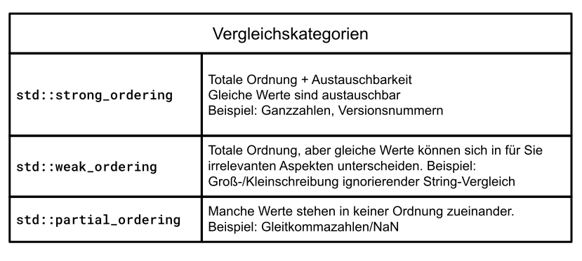
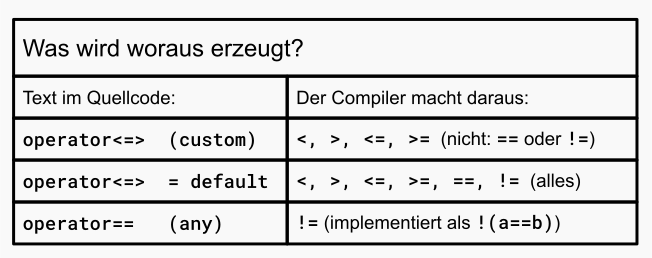

# Spaceship Operator `<=>`

[Zurück](../../Readme.md)

---

[Quellcode](SpaceshipOperator.cpp)

---

## Inhalt

  * [Allgemeines](#link1)
  * [Vergleichskategorien (*Comparison Categories*)](#link2)
  * [Der C++ 20 Spaceship Operator `<=>`](#link3)
  * [Ein Beispiel zum Spaceship Operator](#link4)
  * [Literaturhinweise](#link5)

---

## Allgemeines <a name="link1"></a>

Es gibt in C++ ein gewisses Boilerplate-Codeproblem für Vergleiche von Objekten.
Angenommen, wir haben eine einfache `Version`-Klasse, die eine Software-Versionsnummer repräsentiert:

```cpp
struct Version
{
    int major; 
    int minor; 
    int patch;
};
```

Wir wollen nun zwei `Version`-Objekte miteinander vergleichen. Also definieren wir den `operator <`:

```cpp
bool operator<(const Version& a, const Version& b) {
    if (a.major != b.major) return a.major < b.major;
    if (a.minor != b.minor) return a.minor < b.minor;
    return a.patch < b.patch;
}
```

Wie sieht es nun mit folgendem einfachen Beispiel aus:

```cpp
01: void test_01()
02: {
03:     struct Version firstVersion { 1, 1, 1 };
04:     struct Version anotherVersion { 1, 1, 1 };
05: 
06:     if (firstVersion < anotherVersion) {
07:         std::println("firstVersion is older");  // compiles, works
08:     }
09: 
10:     if (firstVersion > anotherVersion) {
11:         std::println("firstVersion is newer");  // error: no operator>
12:     } 
13: 
14:     if (firstVersion == anotherVersion) {
15:         std::println("same version");           // error: no operator==
16:     }
17: }
```

Der Compiler generiert die anderen Operatoren nicht automatisch!
Man muss diese alle selbst schreiben:

```cpp
01: bool operator>(const Version& a, const Version& b) { 
02:     return b < a;
03: }
04: 
05: bool operator<=(const Version& a, const Version& b) {
06:     return !(b < a); 
07: }
08: 
09: bool operator>=(const Version& a, const Version& b) {
10:     return !(a < b); 
11: }
12: 
13: bool operator==(const Version& a, const Version& b) {
14:     return a.major == b.major && a.minor == b.minor && a.patch == b.patch;
15: }
16: 
17: bool operator!=(const Version& a, const Version& b) {
18:     return !(a == b);
19: }
```

Das sind fünf weitere Funktionen, um ein einziges Konzept auszudrücken: &bdquo;Wie lassen sich zwei `Version`-Objekte vergleichen?&rdquo;
Vor diesem Hintergrund wurde ein neues Konzept entwickelt und ab C++ 20 in die Sprache aufgenommen:
Der so genannte Spaceship Operator `<=>`.

Bevor wir auf diesen Operator näher eingehen, benötigen wir noch einige Definitionen.

---

## Vergleichskategorien (*Comparison Categories*)  <a name="link2"></a>

Nicht alle Arten des Vergleichs zweier Werte oder Objekte sind gleich.
Es gibt verschiedene Möglichkeiten des Vergleichens:


#### `std::strong_ordering`

Hier gilt: Gleiche Objekte können nicht voneinander unterschieden werden.

  * Ein typisches Beispiel sind `int`-Variablen. Zwei Variablen `a` und `b` mit demselben Wert lassen sich nicht voneinander unterscheiden.

  * Ein zweites Beispiel: Betrachten wir eine Klasse `Rectangle` mit zwei Instanzvariablen `m_width` und `m_height`.
    Gilt für zwei `Rectangle`-Objekte, dass deren `m_width`- und `m_height`-Instanzvariablen gleich sind,
    dann lassen sich auch die beiden `Rectangle`-Objekte nicht voneinander unterscheiden.

#### `std::weak_ordering`

Objekte, die an Hand der Beziehungsstärke `std::weak_ordering` gleich sind, müssen nicht als solche gleich sein.
Man spricht in diesem Fall auch weniger von *Gleichheit* als vielmehr von *Äquivalenz*.

  * Beispiel: Für Zeichenketten &ndash; egal, ob hier die Klasse `std::string` oder eine andere, benutzerdefinierte Klasse betrachtet wird &ndash;
    kann man einen Vergleich definieren, der Groß- und Kleinschreibung außer Acht lässt.
    Zwei Zeichenketten `"ABC"` und `"abc"` wären an Hand dieser Betrachtung dann gleich bzw. *äquivalent*,
    die dazugehörigen Objekte sind es nicht (im Sinne der Vergleichskategorie `std::strong_ordering`).

  * Ein zweites Beispiel: Für eine benutzerdefinierte Klasse `Rectangle` &ndash; möglicherweise wieder mit den Instanzvariablen `m_width` und `m_height` &ndash;
    legt man fest, dass zwei `Rectangle`-Objekte mit derselben Fläche gleich sind. Damit wären im Sinne dieser Definition
    ein `Rectangle`-Objekt mit `m_width` gleich 1 und `m_height` gleich 14 und 
    ein zweites `Rectangle`-Objekt mit `m_width` gleich 7 und `m_height` gleich 7 gleich.
    Die korrespondierenden  `Rectangle`-Objekte wiederum sind nicht gleich.

#### `std::partial_ordering`

Die Beziehungsstärke `std::partial_ordering` ist ähnlich zu `std::weak_ordering` nur mit dem Unterschied,
dass es manche Werte gibt, die sich überhaupt nicht miteinander vergleichen lassen.

  * Beispiel: Zum Datentyp `float` oder `double` gibt es den Wert `NaN`,
    der mit einem regulären Gleitpunktwert nicht verglichen werden kann:<br />
    ```
	// WARNUNG: Der Vergleich mit == funktioniert bei NaN NIEMALS
	double nanWert = std::numeric_limits<double>::quiet_NaN();
	...
    if (nanWert == std::numeric_limits<double>::quiet_NaN()) {
        // Dieser Block wird NIEMALS ausgeführt!
    }
	```


Der Rückgabetyp von `<=>`, dem noch zu betrachtenden C++ 20 Spaceship Operator,
ist einer dieser drei Typen `std::strong_ordering`, `std::weak_ordering` und `std::partial_ordering`.
Diese Typen bilden unterschiedliche mathematische Ordnungseigenschaften ab:



*Abbildung* 1: Vergleichskategorien.


| Vergleichskategorie | Werte | | | | 
|:-|:-|:-|:-|:-|
| `std::strong_ordering`:  | *less* | *equal*      | *greater* | |
| `std::weak_ordering`:    | *less* | *equivalent* | *greater* | | 
| `std::partial_ordering`: | *less* | *equivalent* | *greater* | *unordered* |

*Tabelle* 1: Werte der einzelnen Vergleichskategorien.

Der Hauptunterschied zwischen *equal* und *equivalent*:<br />
`std::strong_ordering::equal` impliziert, dass die beiden Werte tatsächlich gegeneinander austauschbar sind.<br />
`std::weak_ordering::equivalent` bedeutet &bdquo;Ich betrachte sie für die Zwecke dieses Vergleichs als gleich&rdquo;, sie können sich jedoch in anderer Hinsicht unterscheiden.

---

## Der C++ 20 Spaceship Operator `<=>`  <a name="link3"></a>

Mit C++ 20 wurde der Operator `<=>` eingeführt, auch Drei-Wege-Vergleichsoperator genannt
(und aufgrund seiner Ähnlichkeit mit einem Raumschiff umgangssprachlich &bdquo;Spaceship Operator&rdquo; genannt).

Die Idee ist einfach: Anstatt einen booleschen Wert zurückzugeben, liefert er ein Vergleichskategorieobjekt zurück,
das die vollständige Beziehung in einem einzigen Aufruf kodiert.

```cpp
a <=> b
```

Dieser eine Ausdruck verrät dir:

  * Ist `a` kleiner als `b`?
  * Ist `a` größer als `b`?
  * Sind sie gleich?
  * Oder sind sie nicht vergleichbar?

Man kann das Ergebnis mit dem Literal 0 vergleichen:

```cpp
auto result = a <=> b;

if (result < 0)  { /* a < b */ }
if (result > 0)  { /* a > b */ }
if (result == 0) { /* a == b */ }
```

Wir betrachten für die drei Vergleichskategorien jeweils ein Beispiel:

Alle Standarddatentypen in C++ fallen bei Verwendung des Raumschiffoperators natürlich
entweder in die `std::strong_ordering` oder in die `std::partial_ordering` Vergleichskategorie:
Ganzzahlen, Zeiger, Boolesche Werte und Zeichen geben `std::strong_ordering` zurück.
Dies liegt daran, dass äquivalente Werte perfekt ersetzbar sind (z. B. wenn `a == b`, dann `5 + a == 5 + b`).

Gleitkommatypen (`float`, `double`) geben `std::partial_ordering` zurück. Dies liegt an der Existenz von `NaN` (*Not-a-Number*),
das mit nichts verglichen werden kann &ndash; nicht einmal mit sich selbst.

Standardcontainertypen (`std::vector`, `std::string` usw.) synthetisieren ihre Vergleichskategorien automatisch basierend
auf den zugrunde liegenden Elementtypen. Da sie Typen enthalten, die zu `std::strong_ordering` oder `std::partial_ordering` ausgewertet werden,
werden sie natürlich nie zu einem reinen `std::weak_ordering` ausgewertet.


### Beispiel zu `std::strong_ordering`

```cpp
01: int a = 1;
02: int b = 2;
03: 
04: auto result = a <=> b;    // std::strong_ordering
05: 
06: if (result < 0) {
07:     std::println("a < b");
08: }
09: if (result <= 0) {
10:     std::println("a < b");
11: }
12: if (result > 0) {
13:     std::println("a < b");
14: }
15: if (result >= 0) {
16:     std::println("a > b");
17: }
18: if (result == 0) {
19:     std::println("a < b");
20: }
21: if (result != 0) {
22:     std::println("a == b");
23: };
```

### Beispiel zu `std::partial_ordering`

```cpp
01: double a = 1.5;
02: double b = 2.5;
03: 
04: auto result = a <=> b;    // std::partial_ordering
05: 
06: if (result < 0) {
07:     std::println("a < b");
08: }
09: if (result <= 0) {
10:     std::println("a < b");
11: }
12: if (result > 0) {
13:     std::println("a < b");
14: }
15: if (result >= 0) {
16:     std::println("a > b");
17: }
18: if (result == 0) {
19:     std::println("a < b");
20: }
21: if (result != 0) {
22:     std::println("a == b");
23: }
```

### Beispiel zu `std::weak_ordering`

Es gibt in C++ keinen fundamentalen Datentyp und keinen Datentyp der Standardbibliothek (STL),
dessen nativer Spaceship Operator (`<=>`) `std::weak_ordering` zurückgibt.

Wie man `std::weak_ordering` erzwingt: `std::weak_ordering` ist als bewusste, vom Benutzer gewählte Vergleichskategorie gedacht.
Sie kommt zum Einsatz, wenn zwei Objekte mathematisch als &bdquo;äquivalent&rdquo; betrachtet werden können,
ohne völlig identisch oder in jeder Funktion gegeneinander austauschbar zu sein.
Soll ein Typ `std::weak_ordering` verwenden, muss dies manuell definiert werden.
Das klassische Beispiel hierfür ist ein Wrapper für Zeichenketten, der Groß- und Kleinschreibung ignoriert.

```cpp
01: class CaseInsensitiveString
02: {
03: private:
04:     std::string m_str;
05: 
06: public:
07:     CaseInsensitiveString() = default;
08:     CaseInsensitiveString(std::string str) : m_str{ str } {}
09: 
10:     // explicitly enforce weak_ordering
11:     std::weak_ordering operator <=> (const CaseInsensitiveString& other) const {
12: 
13:         // compare lengths or transform characters to lowercase
14:         std::string a = m_str;
15:         std::string b = other.m_str;
16: 
17:         std::transform(a.begin(), a.end(), a.begin(), ::tolower);
18:         std::transform(b.begin(), b.end(), b.begin(), ::tolower);
19: 
20:         return a <=> b;  // std::string's <=> returns strong_ordering,
21:                          // but we return std::weak_ordering to signal "equivalent, not equal"
22:     }
23: 
24:     bool operator== (const CaseInsensitiveString& other) const {
25:         return (*this <=> other) == 0;
26:     }
27: };
28: 
29: void spaceship_03()
30: {
31:     // std::strong_ordering order;
32:     CaseInsensitiveString s1{ "Hello" };
33:     CaseInsensitiveString s2{ "hello" };
34: 
35:     // evaluation returns std::weak_ordering::equivalent
36:     // they are equivalent, but NOT identical/substitutable (e.g., s1.str != s2.str)
37:     if ((s1 <=> s2) == std::weak_ordering::equivalent) {
38:         std::println("They are equivalent!");
39:     }
40: }
```

---

## Was versteht man unter der `= default` Realisierung des Spaceship Operators

Technisch gesehen eine Zeile der Art

```cpp
struct Point
{
    auto operator<=> (const Point&) const = default;
};
```

Aber wie sieht die Realisierung, die der Compiler automatisch erzeugt, aus?

Hierzu ein Beispiel:


```cpp
struct Point
{
    int    m_x;   // strong_ordering
    int    m_y;   // strong_ordering
    double m_z;   // partial_ordering <== weakens the whole thing

    auto operator<=>(const Point&) const = default; // deduces return type: std::partial_ordering
};
```

Eine standardmäßige Realisierung des Spaceship Operators `<=>` führt einen Vergleich
in der lexikografischen Reihenfolge der Instanzvariablen durch.

Es vergleicht die erste Instanzvariable und wechselt, wenn diese &bdquo;equal&rdquo; sind,
zur zweiten usw. &ndash; in der Reihenfolge der Deklarationen.

Der Rückgabetyp ergibt sich durch die &bdquo;schwächste&rdquo; Vergleichskategorie aus der Liste aller Mitglieder:

```
[ x <=> other.x ]
       |
    not 0? ---------------------------------------> return that result
       |
    == 0
       |
[ y <=> other.y ]
       |
    not 0? ---------------------------------------> return that result
       |
    == 0
       |
[ z <=> other.z ]
       |
       -------------------------------------------> return that result
```

---

## Eine Zusammenfassung

  * In der Realisierung des Spaceship Operators (`<=>`) orientiert man sich an den mathematischen Eigenschaften des Typs (standardmäßigen Vergleichskategorien aus dem Header `<compare>`),
   nicht beispielsweise an dem Operator `<`.
  * Der Compiler schreibt `<`, `<=`, `>`, `>=` über `(a <=> b) == 0` um.
  * `==` und `!=` werden separat über `operator==` gelöst (aus Performancegründen).


Die Implementierung muss einen dieser drei Typen zurückgeben:

  * `std::strong_ordering`: Für absolut eindeutige Werte (z. B. Ganzzahlen). Wenn `a == b`, dann sind `a` und `b` in allen Aspekten absolut identisch (austauschbar).
  * `std::weak_ordering`: Für Werte, die gleichwertig, aber nicht identisch sind (z. B. Groß-/Kleinschreibung ignorieren: `"Text"` und `"text"`).
  * `std::partial_ordering`: Für Werte, die nicht zwingend vergleichbar sind (z. B. NaN bei Fließkommazahlen).


Deshalb wurde im Standard bewusst entschieden: Der Operator `==` wird nicht aus `<=>` generiert
(wenn man einen benutzerdefinierten `<=>`-Operator schreibt). Die Gleichheit bietet oft Optimierungsmöglichkeiten, die die Reihenfolge nicht bietet, und das Komitee wollte == nicht stillschweigend benachteiligen.

Die Regeln lauten:



*Abbildung* 2: Automatische Generierung von Operatoren bei Verwendung des Spaceship Operators `<=>`.

Die praktische Regel lautet also:<br />
  * Wenn man ein benutzerdefiniertes `<=>` schreibt, schreibt man auch ein benutzerdefiniertes `==`.
  * Wenn man `<=>` durch `= default` festlegt, erhält man `==` kostenlos.


---

## Ein Beispiel zum Spaceship Operator  <a name="link4"></a>


---

## Der Operator `==`

Wenn der Spaceship Operator `<=>` den Wert 0 zurückgibt, könnte man meinen, dass dies &bdquo;gleich&rdquo; bedeutet.
Warum reicht das dann nicht aus?

Die Antwort liegt in der Performance und der Semantik. Betrachten wir folgendes Beispiel:

```cpp
struct BigData
{
    std::vector<int> items;
    std::string label;

    auto operator<=>(const BigData&) const = default;
};
```

Wenn Sie `a == b` schreiben, könnte der Compiler dies als `(a <=> b) == 0` umschreiben.
Aber `<=>` durchläuft einen `std::vector` vollständig lexikografisch &ndash; es durchläuft jedes Element
Bei Gleichheit könnte man die Prüfung sofort abbrechen, wenn sich die Größen unterscheiden:

```cpp
bool operator==(const BigData& other) const {
    return items.size() == other.items.size()
        && items == other.items
        && label == other.label;
}
```

Deshalb wurde im Standard bewusst entschieden: Der Operator `==` wird nicht aus `<=>` generiert
(wenn man einen benutzerdefinierten `<=>`-Operator schreibt).
Die Gleichheit bietet oft Optimierungsmöglichkeiten, deshalb wollte man `==` nicht stillschweigend benachteiligen.

Die Regeln lauten:

---

## Literaturhinweise  <a name="link5"></a>

Interessante Informationen und Beschreibungen des *Spaceship*-Operators findet sich hier:

[&ldquo;The C++20 Spaceship Operator: Three-Way Comparison&rdquo;](https://towardsdev.com/cpp20-spaceship-operator-three-way-comparison-b1213302bf93)

---

[Zurück](../../Readme.md)

---
