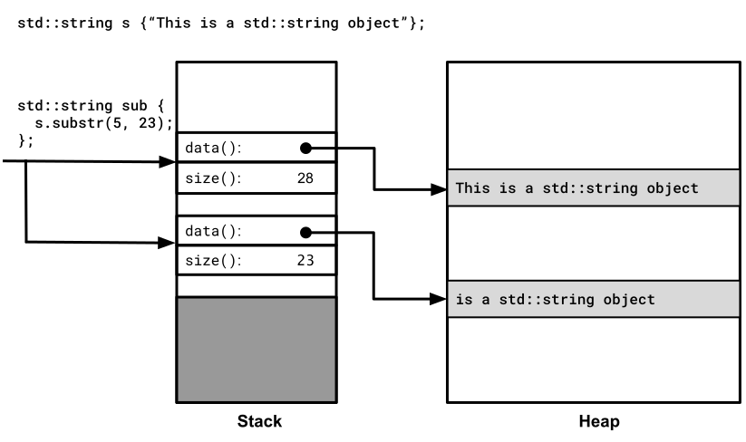
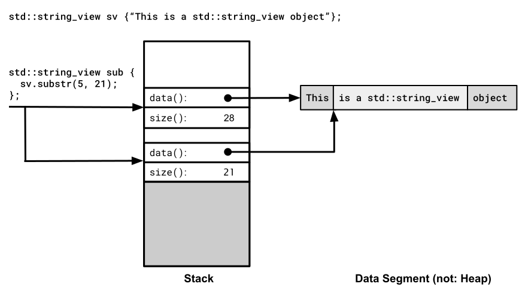

# Klasse `std::string_view`

[Zurück](../../Readme.md)

---

[Quellcode](StringView.cpp)

---

## Inhalt

  * [Allgemeines](#link1)
  * [Ist ein Parametertyp `std::string_view` besser als `const std::string&`?](#link2)
  * [Einige Beispiele](#link3)


---

## Allgemeines <a name="link1"></a>

Eine Instanz von `std::string_view` ist eine *Sicht* auf eine Zeichenkette,
die nicht verändert werden kann.
Man kann die Klasse `std::string_view` als eine Schnittstelle für die Kasse `std::string` ansehen,
die nur alle lesenden Methoden enthält.
Als Parameter verhält sich damit der `std::string_view`-Datentyp weitestgehend
wie eine konstante String-Referenz (`const std::string&`).

Der Zweck der beiden Alternativen (`std::string_view` versus `const std::string&`) besteht
darin, in einer Methode auf eine Zeichenkette lesend zuzugreifen,
ohne diese zu kopieren. Es geht also um das Optimieren von Speicherplatz und Rechenleistung.
Und darin ist `std::string_view` noch besser als `const std::string&`.
 
Zum Beispiel, weil eine `std::string_view`-Instanz auch ohne Overhead aus einem
klassischen C-String (`const char*`) konstruiert werden kann.
Das geht mit `const std::string&` nicht.
Zum anderen ist es auch möglich, einen Teilstring *ohne zusätzliche Speicherplatzanforderung*
als `std::string_view` an eine Funktion zu übergeben.

---

## Ist ein Parametertyp `std::string_view` besser als `const std::string&`? <a name="link2"></a>

Diese Frage kann man durchaus mit &bdquo;Ja&rdquo; beantworten:

  * Der Typ `const std::string&` setzt voraus,
    dass die Daten in einem `std::string` vorliegen und eben nicht in einem einfachen C-Array (also `const char*`).
    Mit der Klasse `std::string` müssen die Daten auf dem Heap (Halde) vorhanden sein,
    bei konstanten C-Zeichenketten muss dies nicht der Fall sein.

  * Einige der typischen Zeichenkettenoperationen, zum Beispiel `substr`, lassen sich mit 
    der Klasse `std::string_view` erheblich performanter als mit der `std::string`-Klasse umsetzen:
    * Die Methode `substr` der `std::string`-Klasse liefert ein Teilzeichenkettenobjekt zurück, das aus dem Originalobjekt extrahiert wird
    und folglich in einer Kopie auf dem Heap anzulegen ist.
    * Die beiden Methoden `remove_prefix` und `remove_suffix` modifizieren ein vorhandenes `std::string_view`-Objekt
    (Modifikation der Anfangsadresse der Zeichenkette um einen bestimmten Offset). Dies ist eine sehr schnelle Operation,
    und es wird weder eine Kopie für das Ergebnis noch wird die Freispeicherverwaltung des Programms aktiviert,
    um ein Objekt auf der Halde zu erzeugen.


In den folgenden beiden Abbildungen betrachten wir die Arbeitsweise der `substr`-Methode
in Bezug auf die beiden Klassen `std::string` und `std::string_view`:




*Abbildung* 1: Arbeitsweise der `substr`-Methode von Klasse `std::string`.




*Abbildung* 2: Arbeitsweise der `substr`-Methode von Klasse `std::string_view`.


---

## Einige Beispiele <a name="link3"></a>

Wir betrachten dazu einige Code-Snippets:

*Beispiel*:

```cpp
01: void test()
02: {
03:     std::string_view sv{ "AAAAAAAAAAAAAAAAAAAAAAAAAAAA" };  // Konstante Zeichenkette
04: 
05:     std::string s{ "AAAAAAAAAAAAAAAAAAAAAAAAAAAA" };        //  Heap
06: 
07:     // sv[0] = '?';   // error
08:     char ch{ sv[0] };
09: }
```

*Beispiel*:

```cpp
01: void test()
02: {
03:     std::string s{ "AAAAAAAAAAAAAAAAAAAAAAAAAAAA" };
04: 
05:     std::string_view sv{ s };
06: 
07:     std::println("{}", sv);
08: 
09:     s += "BBBBBBBBBBBBBBBBBBBBBBBBBBBB";        // Caution: the content of s is reallocated !
10: 
11:     std::println("{}", sv);
12: }
```

*Hinweis*:
Wenn Sie von nun an eine Funktion schreiben, die eine Zeichenfolge benötigt,
denken Sie an `std::string_view` als Parametertyp.
Es ist nicht erforderlich, eine `std::string_view`-Referenz zu verwenden!
Ein `std::string_view`-Objekt ist sehr &bdquo;billig&rdquo; zu kopieren,
daher ist es vollkommen in Ordnung, es als Wert zu übergeben.
Grundsätzlich enthält eine `std::string_view`-Instanz nur einen Zeiger auf eine Zeichenfolge
und deren Länge.

```cpp
template <class _Elem, class _Traits>
class basic_string_view { // wrapper for any kind of contiguous character buffer
public:
    constexpr basic_string_view() noexcept : _Mydata(), _Mysize(0) {}
    ...

    const_pointer _Mydata;
    size_type _Mysize;
};
```

Ein `std::string_view`-Parameter akzeptiert jede Art von Zeichenfolge,
z.B. ein klassisches C++-`std::string`-Objekt, eine `const char*` Zeichenfolge im C-Stil
oder ein Zeichenkettenliteral, alles ohne Kopieren!

---

[Zurück](../../Readme.md)

---

