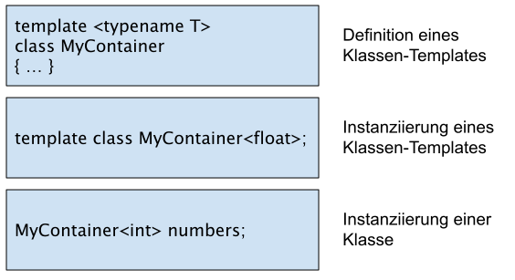
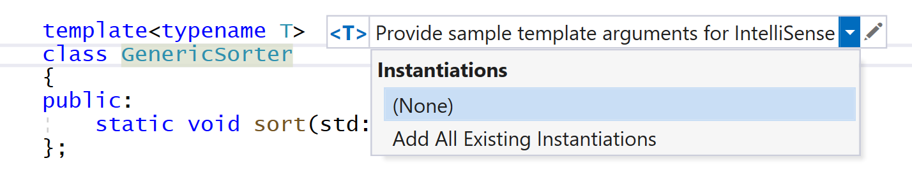
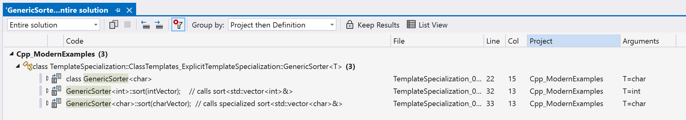

# Klassen-Templates: Grundlagen

[Zurück](../../Readme.md)

---

[Quellcode](TemplatesClassBasics01.cpp)

---

## Übersicht

Es werden grundlegende Aspekte von Klassentemplates aufgezeigt:


  * #### [Klassen-Templates definieren](#Definition-eines-Klassen-Templates)
  * #### [Erzeugung von Objekten eines Klassen-Templates](#Objekte-aus-Klassen-Templates-erzeugen)
  * #### [Klassen-Templates mit mehreren Parametern](#Klassen-Templates-mit-mehreren-formalen-Datentypen)
  * #### [Definition von Methoden eines Klassen-Templates](#Definition-von-Methoden-von-Klassen-Templates)
  * #### [Eine Methode eines Klassen-Templates überschreiben](#Methoden-eines-Klassen-Templates-spezialisieren)
  * #### [Member Function Templates (kurz: Member Templates)](#Member-Function-Templates)
  * #### [Klassen-Templates und Non-Type Parameter](#Klassen-Templates-mit-Non-Type-Parametern)
  * #### [Ein Template mit Template-Parametern](#Template-Template-Parameter)
  * #### [Default-Werte für Template-Parameter](#Default-Template-Parameter)
  * #### [Alias Template](#Alias-Templates)

Danach folgen noch Informationen zu den **Übersetzungsmodellen** für Templates.

---

## Definition eines Klassen-Templates


```cpp
01: template <typename T>
02: class MyContainer 
03: {
04: private:
05:     T m_data;
06: 
07: public:
08:     MyContainer() : m_data{} {}
09:     void setData(const T& data) { m_data = data; }
10:     T getData() const { return m_data; }
11: };
```

*Beispiel*:

```cpp
01: void main()
02: {
03:     MyContainer<double> container;
04:     container.setData(123.456);
05:     double value = container.getData();
06:     std::cout << value << std::endl;
07: }
```

*Bemerkung*:
Die Methode `setData` (*setter*) wurde bewusst mit der Schnittstelle

```cpp
const T& data
```

unter Verwendung einer Referenz (oder als Zeiger) realisiert.


#### Hinweis:
Klassen-Templates eignen sich vor allem gut zur Erstellung von Container-Klassen,
siehe deshalb auch den Entwurf und die Konzeption der *Standard Template Library* (STL).

---

## Objekte aus Klassen-Templates erzeugen

Bei der ersten Festlegung eines konkreten Typs für den Platzhalter `T` wird ein
Klassen-Template *instanziiert*:

```cpp
MyContainer<double> container;  // instantiate class template
container.setData(123.456);
...
```

Im Prinzip haben wir es hier &ndash; oder
allgemeiner formuliert: in der generischen Programmierung  &ndash; mit 3 Ebenen zu tun
(siehe Abbildung 1):



*Abbildung* 1: 3-Ebenenmodell der Template-Instanzierung.

Die Instanziierung eines Templates kann dabei *explitit* oder *implizit* erfolgen:

*Explitite* Instanziierung:

```cpp
// explicit class template instantiation
template class MyContainer<float>;
```

*Implizite* Instanziierung:

```cpp
void main()
{
    // implicit instantiation of MyContainer<double>
    MyContainer<double> container;
}
```

*Hinweis*:
Mit der Visual C++ Entwicklungsumgebung lassen sich in einem Programm alle vorhandenen
Template Instanziierungen anzeigen.
Einstiegspunkt hierzu ist das Menü &ldquo;*Provide sample template arguments for IntelliSense*&rdquo;
im Editor:



*Abbildung* 1: Auswahl Untermenü &ldquo;*Add all Existing Instantiations*&rdquo;.

Danach öffnet sich ein weiteres Fenster mit allen vorhandenen Template Instanziierungen:



*Abbildung* 2: Vorhandene Template Instanziierungen in einem C++&ndash;Programm.


---

## Klassen-Templates mit mehreren formalen Datentypen


Offensichtlich ist die Definition eines Klassen-Templates nicht
auf einen formalen Datentyp beschränkt:

*Beispiel*:

```cpp
01: template <typename T, typename U>
02: class MyPair
03: {
04: public:
05:     T m_data_01;
06:     U m_data_02;
07: 
08: public:
09:     MyPair(const T& data_01, const U& data_02) 
10:         : m_data_01{ data_01 }, m_data_02{ data_02 } { }
11: 
12:     void print(std::ostream& os) {
13:         os << m_data_01 << " : " << m_data_02 << std::endl;
14:     }
15: };
16: 
17: void main() {
18:     MyPair<std::string, double> averageTemperature{ "March", 5.5 };
19:     averageTemperature.print(std::cout);
20: }
```

*Ausgabe*:

```
March : 5.5
```

---

## Definition von Methoden von Klassen-Templates

Wenn Methoden von Klassen-Templates nicht im
Klassenrumpf definiert werden, müssen sie ähnlich wie ein
Funktions-Template formuliert werden:

```cpp
01: template <typename T>
02: class MyContainer
03: {
04: private:
05:     T m_data;
06: 
07: public:
08:     MyContainer();
09:     T getData() const;
10:     void setData(const T& data);
11: };
12: 
13: ...
14: 
15: template <typename T>
16: MyContainer<T>::MyContainer() : m_data{} {}
17: 
18: template <typename T>
19: T MyContainer<T>::getData() const {
20:     return m_data;
21: }
22: 
23: template <typename T>
24: void MyContainer<T>::setData(const T& data) {
25:     m_data = data;
26: }
```

*Hinweis*:

Man beachte, dass die Definition von Methoden eines Klassen-Templates
nur eine &ldquo;*vorläufige Definition*&rdquo; darstellt, weil der Klassentyp immer noch
unvollständig ist, da hier ja nur ein formaler Datentyp enthalten ist.

Die eigentlichen Methoden werden erst dann erzeugt, wenn zu einem Klassentyp ein bestimmtes
Objekt instanziiert wird. Also wenn für den Template Parameter `T`
ein konkreter Typ benannt wird.

---

## Methoden eines Klassen-Templates spezialisieren

Von einem Klassentemplate lassen sich einzelne Methoden *überschreiben* bzw. *spezialisieren*.
Wir betrachten dies an einem Beispiel der Methode  `setData`:

```cpp
01: template <typename T>
02: class MyContainer
03: {
04: private:
05:     T m_data;
06: 
07: public:
08:     MyContainer() : m_data{} {}
09:     T getData() const { return m_data; }
10:     void setData(const T& data) { m_data = data; }
11: };
12: 
13: template <>
14: void MyContainer<std::string>::setData(const std::string& data) {
15:     m_data = "[" + data + "]";
16: }
```

Im vorliegenden Beispiel finden wir eine Spezialisierung der Methode `setData` für die
Klasse `MyContainer<std::string>` vor. Dies beeinträchtigt in keiner Weise
den allgemeinen Fall, der für alle Methoden und Datentypen in Kraft tritt, für die
keine Spezialisierung vorhanden ist:

*Beispiel*:

```cpp
01: void main()
02: {
03:     MyContainer<std::string> container;
04:     container.setData("I love C++ Templates :)");
05:     std::string data = container.getData();
06:     std::cout << data << std::endl;
07: 
08:     MyContainer<int> anotherContainer;
09:     anotherContainer.setData(123);
10:     int value = anotherContainer.getData();
11:     std::cout << value << std::endl;
12: }
```

*Ausgabe*:

```
[I love C++ Templates :)]
123
```

---

## Member Function Templates

*Member Function Templates* sind Funktions-Templates, die Mitglieder einer (regulären) Klasse oder
eines Klassen_Template sind.


*Beispiel*:

```cpp
class Printer {
private:
    std::ostream& m_target;

public:
    explicit Printer(std::ostream& target) : m_target{ target } {}

    template<typename T>
    Printer& print(const T& arg) {
        m_target << arg;
        return *this;
    }
};
```

*Anwendung*:

```cpp
01: void test_06() {
02: 
03:     Printer normalPrinter{ std::cout };
04:     normalPrinter.print(100).print(" --> ").print(123.456).print("\n");
05: 
06:     Printer errorPrinter{ std::cerr };
07:     errorPrinter.print(654.321).print(" <== ").print(100).print("\n");
08: }
```

*Ausgabe*:

```cpp
100 --> 123.456
654.321 <== 100
```

---

## Klassen-Templates mit Non-Type Parametern

Neben Datentypen können auch konstante Ausdrücke als Template-Parameter benutzt werden:

```cpp
01: template <typename T, int DIM>
02: class FixedVector
03: {
04: private:
05:     T m_data[DIM];
06: 
07: public:
08:     FixedVector () : m_data{} {}
09: 
10:     size_t size() { return DIM; }
11: 
12:     void set(size_t idx, const T& elem) { m_data[idx] = elem; }
13: 
14:     T get(size_t idx) const { return m_data[idx]; }
15: 
16:     void print(std::ostream& os) {
17:         for (const auto& elem : m_data) {
18:             os << elem << ' ';
19:         }
20:         os << '\n';
21:     }
22: };
```

#### Hinweis:
Betrachten Sie das folgende Beispiel:

```cpp
01: void main()
02: {
03:     MyContainer<int> cont_1;
04:     MyContainer<int> cont_2; 
05:     FixedVector<int, 10> vector_1;
06:     FixedVector<int, 20> vector_2;
07: }
```

Die beiden Objekte `cont_1` und `cont_2` sind vom selben Typ, was naheliegend, aber
nicht ganz selbstverständlich ist &ndash; siehe dazu auch *Abbildung* 1.
In beiden Fällen wird ein Template (hier: `MyContainer<T>` mit `T` gleich `int`)
instanziiert (Zeilen 3 und 4).

Offensichtlich muss der Übersetzer sich hier der Aufgabe stellen, bei einer 
Template-Instanziierung (in Zeile 4) den Überblick zu verschaffen,
ob er das Klassen-Template (`MyContainer<T>`) schon einmal mit demselben
Template-Parameter `int` für `T` instanziiert hat. In diesem Fall
werden die beiden resultierenden Typen als &ldquo;identisch&rdquo; erachtet.

Die zuvor beschriebene Situation liegt in den Zeilen 5 und 6 nicht vor.
Die beiden Objekte `vector_1` und `vector_2` sind verschiedenen Typs!
So ist es beispielsweise nicht möglich, eine Wertzuweisung von `vector_1` an `vector_2`
oder umgekehrt durchzuführen.

---

## Template Template-Parameter

Templates, die Templates benutzen sollen, können auch
Templates als Parameter bekommen:

```cpp
01: template <template <typename> class Container>
02: class DoubleDataCollector
03: {
04: private:
05:     Container<double> m_collectedData;  // an arbitrary container is used
06: public:
07:     // ...
08: };
09: 
10: template <typename T, template <typename> class Container>
11: class GenericDataCollector
12: {
13: private:
14:     Container<T> m_collectedData;  // an arbitrary container is used
15: public:
16:     // ...
17: };
```

*Beispiel*:

```cpp
void main()
{
    DoubleDataCollector<MyContainer>         dc{};
    GenericDataCollector<float, MyContainer> gdc{};
}
```

---

## *Default* Template-Parameter

Ähnlich wie bei Default-Argumenten von Funktionen (Methoden)
können auch Template-Parameter einen Default-Wert haben.

*Hinweis*: Hat ein Template-Parameter einen Default-Wert, so müssen
auch die nachfolgende Parameter einen Default-Wert haben:

```cpp
01: template <typename T = int, int DIM = 10>
02: class FixedVector
03: {
04: private:
05:     T m_data[DIM];
06:     ...
07: };
```

*Beispiel*:

```cpp
01: void main() {
02:     FixedVector vec1;
03:     FixedVector<> vec2;
04:     FixedVector<double> vec3;
05:     FixedVector<bool, 20> vec4;
06: }
```

Einige Anmerkungen zu dem letzten Beispiel:
  * Auf `<>` kann man verzichten, oder man schreibt es hin, so dass ein Leser des Quellcode sieht,
  dass es sich bei dem Objekt `vec2` um die Instanziierung eines Klassen-Template handelt.
  * Objekt `vec3` besitzt intern die Feldlänge 10 - per Voreinstellung.
  * Objekt `vec4` benützt die Feldlänge 20.

---

## Alias Templates

Mit einem so genannten *Alias Template* lässt sich einer Familie
von Typen ein eingängiger Name geben.

Template-Parameter können Datentypen, Non-Types und sogar Templates selbst sein.

*Beispiel*:

Eine Instanziierung der Template-Klasse in der Art

```cpp
FixedVector<100> vec;   // Error: too few template arguments	
```

ist nicht möglich, denn wenn bei einer Instanziierung ein Argument weggelassen wird,
dann müssen alle nachfolgenden Argumente auch weggelassen werden.

Mit Hilfe eines Alias Templates können wir die Fehlermeldung beseitigen:

```cpp
template <size_t MAX>
using FixedIntVector = FixedVector<int, MAX>;
```

Nun ist die Deklaration

```cpp
FixedVector<100> vec;
```

fehlerfrei übersetzungsfähig.

---

## Übersetzungsmodelle für Templates

Normalerweise trennen C++ Programmierer die
Schnittstellendefinition (Deklarationen, <i>\*.h</i> Datei) von der
Implementierung (<i>\*.cpp</i> Datei):


Datei *Maximum.h*:

```cpp
template <typename T>
const T& max (const T &a, const T &b);
```

Datei *Maximum.cpp*:

```cpp
#include "Maximum.h"

template <typename T>
const T& max (const T &a, const T &b) {
    return a < b ? b : a;
}
```

Bei Templates führt das zu Problemen:

  * In der Datei *Maximum.cpp* sind die noch benötigten Instanzen (`a`, `b`) noch unbekannt
  * Andere Übersetzungseinheiten haben nicht den Quelltext des Templates zur Verfügung

#### Das *Inclusion* Modell:

Der einfachste und gebräuchlichste Weg, um Template-Definitionen
in einer Übersetzungseinheit sichtbar zu machen, besteht darin,
die Definitionen in die Header-Datei selbst einzufügen.

Jede <i>\*.cpp</i>-Datei, die das Template verwendet,
muss nur die Header-Datei inkludieren (`#include`):

*Beispiel*: Header-Datei

```cpp
01: template<typename T, size_t DIM>
02: class MyArray
03: {
04: private:
05:     T m_data[DIM];
06: 
07: public:
08:     // full definitions
09:     MyArray() : m_data{} {}
10: 
11:     size_t size() { return DIM; }
12: 
13:     void print()
14:     {
15:         for (const auto& v : m_data) {
16:             std::cout << v << " , ";
17:         }
18:     }
19: 
20:     T& operator[](size_t i)
21:     {
22:         return m_data[i];
23:     }
24: };
```

Das *Inclusion* Modell kann in Bezug auf die Übersetzungszeiten Nachteile haben.
In großen Programmen können diese erheblich sein,
besonders wenn der Template-Header wiederum andere Header-Dateien inkludiert.

Jede <i>\*.cpp</i>-Datei, die derartige Header-Dateien verwendet,
erhält eine eigene Kopie der Templates und der dazugehörigen Definitionen.

Template-Funktionen und Member-Funktionen von Template
Klassen werden in diesem Fall speziell gebunden. Der Binder vermeidet Duplikate,
er muss in der Lage sein, die möglicherweise dabei auftretenden
*ODR (One Definition Rule)*&ndash;Verletzungen zu erkennen und auszusortieren.


#### Das *Explicit Instantiation* Modell:

Das *Explicit Instantiation* Modell setzt voraus, das der Template Code
in einer <i>\*.h</i>- und einer <i>\*.cpp</i>-Datei realisiert wird,
gewissermaßen in der *klassischen* Vorgehensweise.

Zusätzlich müssen dann allerdings in der <i>\*.cpp</i>-Datei die gewünschten Template-Klassen
explizit instanziiert werden. Auf diese Weise wird für diese Klassen Maschinencode generiert,
auf den der Compiler (Linker) zurückgreift, wenn er auf Template Instanziierungen trifft.


*Beispiel*: Header-Datei

```cpp
01: template<typename T, size_t DIM>
02: class AnotherArray
03: {
04: private:
05:     T m_data[DIM];
06: 
07: public:
08:     AnotherArray();
09:     size_t size();
10:     void print();
11:     T& operator[](size_t i);
12: };
```

*Beispiel*: Cpp-Datei

```cpp
01: template<typename T, size_t DIM>
02: AnotherArray<T, DIM>::AnotherArray() : m_data{} {}
03: 
04: template<typename T, size_t DIM>
05: size_t AnotherArray<T, DIM>::size() { return DIM; }
06: 
07: template<typename T, size_t DIM>
08: void AnotherArray<T, DIM>::print() { 
09:     for (const auto& v : m_data) {
10:         std::cout << v << ", ";
11:     }
12:     std::cout << '\n';
13: }
14: 
15: template<typename T, size_t DIM>
16: T& AnotherArray<T, DIM>::operator[](size_t i) { return m_data[i]; }
17: 
18: template AnotherArray<int, 5>;
19: template AnotherArray<double, 5>;
20: template AnotherArray<std::string, 5>;
```

Wir erkennen im letzten Beispiel die expliziten Instanziierungen am Ende der <i>\*.cpp</i>-Datei.
Eine Klasse `AnotherArray` darf folglich nur für die Datentypen `int`, `double` oder `std::string` &ndash;
und dieses wiederum nur mit der Länge 5 &ndash; verwendet werden!

*Anwendung*:

```cpp
01: void main()
02: {
03:     AnotherArray<double, 5> array;
04: 
05:     for (size_t i = 0; i != 5; ++i) {
06:         array[i] = 2.0 * i + 0.5;
07:     }
08:     array.print();
09: 
10:     AnotherArray<double, 5> array2;  // works
11:     // AnotherArray<double, 10> array3;  // does NOT compile !!! see explicit instantiated classes !!!
12: }
```

---

## Literaturhinweise:

Einige Informationen zu den Übersetzungsmodellen für Templates wurden aus

[Source code organization (C++ Templates)](https://learn.microsoft.com/en-us/cpp/cpp/source-code-organization-cpp-templates?view=msvc-170)

entnommen (abgerufen am 27.11.2022).

---

[Zurück](../../Readme.md)

---
