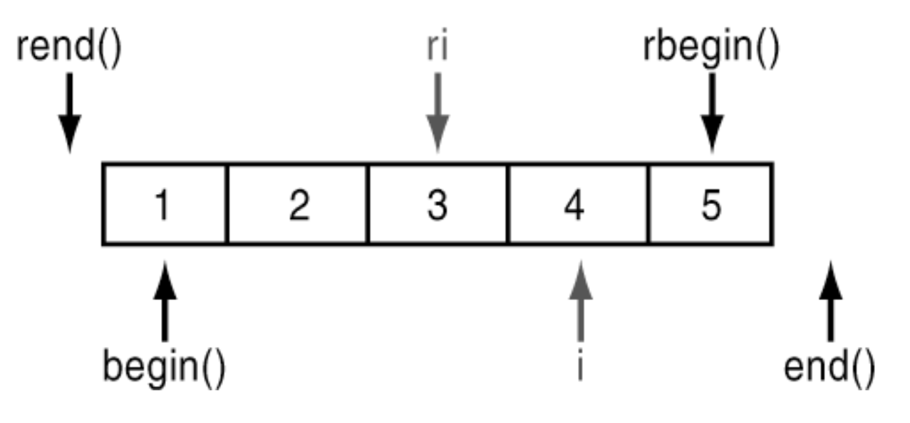

# `std::find_if`, `erase` und `base` (Beispiel `trim`)

[Zurück](../../Readme.md)

---

[Quellcode](Trim.cpp)

---

Im Quellcode wird gezeigt, wie sich der STL-Algorithmus einsetzen lässt, um eine `trim`-Funktion für Zeichenketten umzusetzen.
`std::find_if` wird mit einem Vorwärts- oder Rückwärts-Iterator angewendet, um das erste &ldquo;non-space&rdquo;-Zeichen
zu finden. Der so gefundene Iterator kann nun an die erase-Methode der Klasse std::string übergeben werden.

*Hinweis*: Bei Rückwärts-Iteratoren gilt es eine Eigenheit zu betrachten:

*Abbildung* 1: Ein `Complex`-Objekt, erzeugt vom Übersetzer.

WEITER: HIer noch Text ergänzten ... und das Beispiel samt Ausführung reinkopieren.

WEITER: Dann das .md File testen, ob es korrekt über Readme.md erreichbar ist

WEITER: Dann das .cpp File testen, ob es korrekt über Program.cpp erreichbar und ausführbar ist ...

---

## Literaturhinweise:

Die Anregungen zu den Beispielen dieses Code-Snippets finden sich unter

[Trim a string in C++ – Remove leading and trailing spaces](https://www.techiedelight.com/trim-string-cpp-remove-leading-trailing-spaces/) (abgerufen am 21.09.2021).

Die Besonderheit der `base`-Methode ist beschrieben unter

[How to call erase with a reverse iterator](https://stackoverflow.com/questions/1830158/how-to-call-erase-with-a-reverse-iterator/) (abgerufen am 21.09.2021).

oder

[C++ STL what does base() do](https://stackoverflow.com/questions/16609041/c-stl-what-does-base-do/) (abgerufen am 21.09.2021).

---

[Zurück](../../Readme.md)

---
