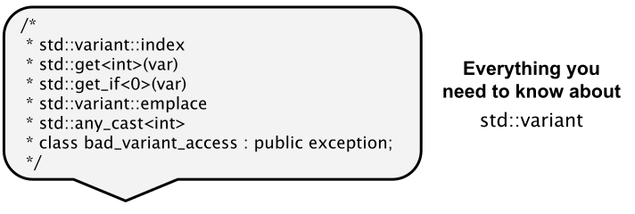

# Klasse `std::variant`

[Zurück](../../Readme.md)

---

[Quellcode](Variant.cpp)

---

## Inhalt

  * [Allgemeines](#link1)
  * [*Overload*-Pattern](#link2)
  * [Internas einer möglichen Realisierung einer Kasse `std::variant`](#link3)
  * [Literaturhinweise](#link4)

---

## Allgemeines <a name="link1"></a>



Neben der Klasse `std::variant` wird im Beispiel 
auch auf das *Visitor*-Konzept eingegangen.

Klasse `std::variant`:

  * `index()`
  * `std::get<>()`
  * `emplace<>()`
  * `std::get_if<>()`
  * `std::bad_variant_access`

*Visitor*-Konzept:

  * `std::visit()`
  * `std::common_type`

---

## *Overload*-Pattern <a name="link2"></a>

Dieses Pattern verwendet werden, um den Wert eines `std::variant`-Objekts zielgerichtet zu besuchen.

```cpp
template<class... Ts>
struct Overload : Ts... { using Ts::operator()...; };
    
template<class... Ts> Overload(Ts...) -> Overload<Ts...>;
```

Dieses Pattern ist sehr trickreich &ndash; ich will es deshalb nur kurz beschreiben:

  * Die Strukturdefinition `struct Overload` ist das Overload Pattern selbst.
  * Die nachfolgende Anweisung ist der so genannte *Deduction Guide* dafür.
  * Die `Overload`-Klasse kann beliebig viele Basisklassen (`Ts ...`) haben.
    Sie leitet sich von jeder Klasse `public` ab und
    bringt den Aufrufoperator (`Ts::operator...`) jeder Basisklasse
    in ihren Geltungsbereich.
  * Die Basisklassen benötigen einen überladenen Aufrufoperator (`Ts::operator()`).
    Lambdas stellen diesen Aufrufoperator zur Verfügung.

Kompakt formuliert kann man unter dem *Deduction Guide* ein Muster verstehen,
das einer Templateklasse zugeordnet ist und dem Compiler mitteilt,
wie ein Satz von Konstruktorargumenten (und deren Typen)
in Template-Parameter für die Klasse übersetzt werden sollen.

Im Quellcode finden Sie ein Beispiel vor,
das so einfach wie möglich gehalten ist.

---

## Internas einer möglichen Realisierung einer Kasse `std::variant` <a name="link3"></a>

Im Netz finden sich einige Ansätze vor, wie man eine Klasse `std::variant` selber realisieren könnte,
siehe zum Beispiel diesen *GitHub Gist*: [variant.cc](https://gist.github.com/tibordp/6909880).

---


## Literaturhinweise <a name="link4"></a>

Ein interessanter Vergleich der beiden Klassen `std::variant` und `std::any` findet sich in *stackoverflow*:

["C++ `std::variant` versus `std::any`"](https://stackoverflow.com/questions/56303939/c-stdvariant-vs-stdany/)

---

[Zurück](../../Readme.md)

---
