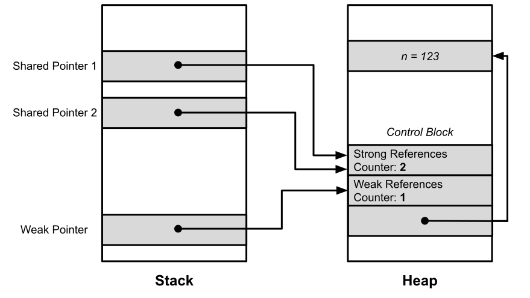
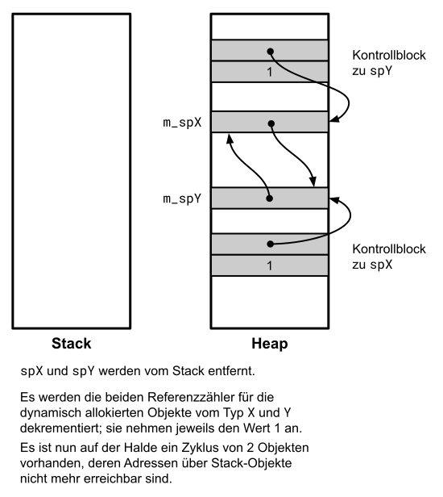

# Weak Pointer: Klasse `std::weak_ptr`

[Zurück](../../Readme.md)

---

[Quellcode](WeakPtr.cpp)

---

## Inhalt

  * [&bdquo;It's about ownership&rdquo;](#link1)
  * [Funktionsweise Klasse `std::weak_ptr`](#link2)
  * [*Control Block*](#link3)
  * [Zyklische Referenzen](#link4)
  * [Betrachtung der Referenzzähler im Detail](#link5)

---

## &bdquo;It's about ownership&rdquo; <a name="link1"></a>

###### Exklusiver Besitz: `std::unique_ptr<T>`

###### Geteilter Besitz: `std::shared_ptr<T>`

#### Temporärer Besitz: `std::weak_ptr<T>`

---

## Funktionsweise Klasse `std::weak_ptr` <a name="link2"></a>

Die Funktionsweise der Klasse `std::weak_ptr` wird an zwei Beispielen aufgezeigt.

Das erste Beispiel erläutert vor allem den Zusammenhang zwischen den beiden Klassen
`std::weak_ptr` und `std::shared_ptr`.

Ein zweites Beispiel demonstriert die Probleme mehrere Objekte,
die sich durch `std::shared_ptr`-Objekte gegenseitig referenzieren.

---

## *Control Block*  <a name="link3"></a>

Der bei `std::shared_ptr`-Objekten vorhandene *Control Block* bezieht auch 
`std::weak_ptr`-Objekte mit ein:



*Abbildung* 1: `std::weak_ptr`-Objekt und Control-Block.

---

## Zyklische Referenzen <a name="link4"></a>

Interessant ist der Weak-Pointer bei zyklischen Referenzen:


*Abbildung* 2: Zyklische Referenzen.

Beachten Sie die Ausgabe des zweiten Code-Snippets: Hier haben wir es mit
einer zyklischen Referenz von Shared-Pointern zu tun. Im einen Fall werden
alle beteiligten Zeiger freigegeben, im anderen auf Grund der zyklischen Referenzen nicht.

```cpp
c'tor ParentNode
c'tor RightNode
c'tor LeftNode

d'tor LeftNode
```

oder

```cpp
c'tor ParentNode
c'tor RightNode
c'tor LeftNode

d'tor LeftNode
d'tor RightNode
d'tor ParentNode
```

## Betrachtung der Referenzzähler im Detail <a name="link5"></a>

Wir sind dem Problem von `std::shared_ptr`-Objekten und zyklischen Referenzen auf die Spur gekommen.
Möglicherweise ist es aber immer noch nicht ganz genau verständlich geworden,
warum es mit der Freigabe allokierten Speichers in diesem Fall nicht funktioniert.

Zu diesem Zweck haben wir das letzte Beispiel auf die wesentlichen Bestandteile komprimiert:

```cpp
01: struct X;
02: struct Y;
03: 
04: struct X
05: {
06:     std::shared_ptr<Y> m_spY{};
07: };
08: 
09: struct Y
10: {
11:     std::shared_ptr<X> m_spX{};
12: };
13: 
14: void test() {
15: 
16:     std::shared_ptr<X> sp1{ std::make_shared<X>() };
17:     std::shared_ptr<Y> sp2{ std::make_shared<Y>() };
18: 
19:     sp1->m_spY = sp2;
20:     sp2->m_spX = sp1;
21: }
```


Eine Studie von mehreren Bildern verdeutlicht nun, warum es bei einem Zyklus mit der Freigabe des 
allokierten Speichers nicht klappen kann &ndash; und beim Beseitigen des Zyklusses doch:


*Abbildung* 3: Ein erstes, dynamisch allokiertes Objekt wird angelegt.


*Abbildung* 4: Ein zweites, dynamisch allokiertes Objekt wird angelegt.


*Abbildung* 5: Wertzuweisung `std::shared_ptr`-Variable.


*Abbildung* 6: Zweite Wertzuweisung `std::shared_ptr`-Variable.

Wir erkennen nun in *Abbildung* 5, dass ein Zyklus vorhanden ist!



*Abbildung* 7: Die auf dem Stack vorhandenen `std::shared_ptr`-Variablen werden entfernt:
Es verbleibt ein Zyklus auf dem Heap!

Ein genaues Studium dieser Abbildungen sollte verdeutlichen, warum Zyklen bei dynamisch verzeigerten
Objekten mit einem Referenzzähler-Mechanismus nicht korrekt verwaltet werden können.

---

[Zurück](../../Readme.md)

---
