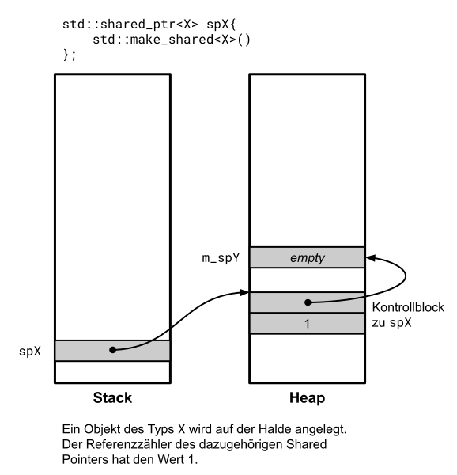
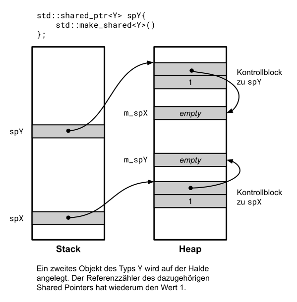
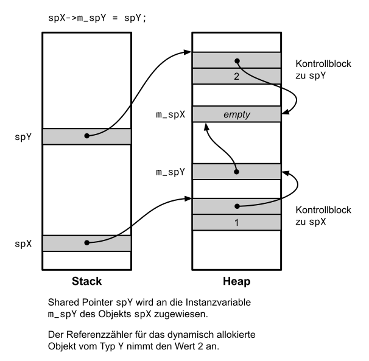
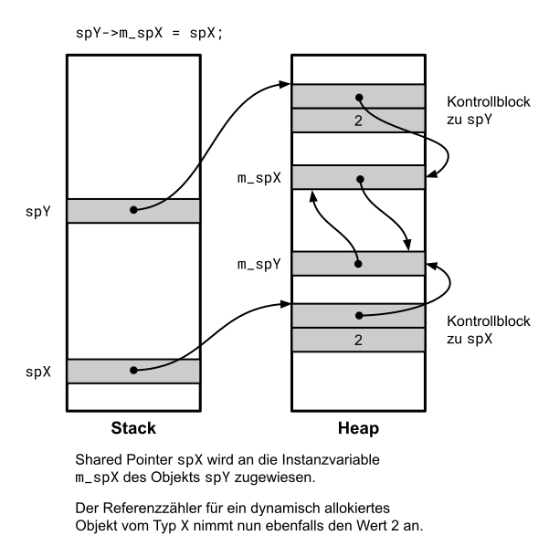

# Weak Pointer: Klasse `std::weak_ptr`

[Zurück](../../Readme.md)

---

[Quellcode](WeakPtr.cpp)

---

## &ldquo;It's about ownership&rdquo;

###### Exklusiver Besitz: `std::unique_ptr<T>`

###### Geteilter Besitz: `std::shared_ptr<T>`

#### Temporärer Besitz: `std::weak_ptr<T>`

---

Die Funktionsweise der Wrapper-Klasse wird an zwei Beispielen aufgezeigt.

Das erste Beispiel erläutert vor allem den Zusammenhang zwischen den beiden Klassen
`std::weak_ptr` und `std::shared_ptr`.

*Hinweis*:

Man beachte den Unterschied in der Anwendung der beiden Anweisungen

```cpp
std::shared_ptr<int> ptr1 = std::make_shared<int>(123);
```

oder

```cpp
std::shared_ptr<int> ptr1 = std::shared_ptr<int>(new int{ 123 });
```

Im ersten Fall wird für den dynamischen Speicherbereich *und* den Control-Block
*ein* gemeinsamer Speicherbereich angelegt &ndash; im zweiten Fall sind dies zwei getrennte Speicherbereiche.

Dies kann man im Debugger beobachten, die Freigabezeitpunkte der Speicherbereiche sind unterschiedlich:


*Abbildung* 1: Der Control-Block enthält beide Speicherbereiche.


*Abbildung* 2: Der Control-Block enthält nicht das eigentlich dynamisch angelegte Objekt. 

In *Abbildung* 2 erkennt man, dass trotz eigentlich erfolgter Freigabe des dynamisch angelegten Objekts
dieses noch vom Debugger angezeigt wird. Die tatsächliche Freigabe erfolgt zu einem späteren Zeitpunkt.

## Zyklische Referenzen

Interessant ist der Weak-Pointer bei zyklischen Referenzen:


Beachten Sie die Ausgabe des zweiten Code-Snippets: Hier haben wir es mit
einer zyklischen Referenz von Shared-Pointern zu tun. Im einen Fall werden
alle beteiligten Zeiger freigegeben, im anderen auf Grund der zyklischen Referenzen nicht.

```cpp
c'tor ParentNode
c'tor RightNode
c'tor LeftNode

d'tor LeftNode
```

oder

```cpp
c'tor ParentNode
c'tor RightNode
c'tor LeftNode

d'tor LeftNode
d'tor RightNode
d'tor ParentNode
```


## Betrachtung der Referenzzähler im Detail

Wir sind dem Problem von `std::shared_ptr`-Objekten und zyklischen Referenzen auf die Spur gekommen.
Möglicherweise ist es aber immer noch nicht ganz genau verständlich geworden,
warum es mit der Freigabe allokierten Speichers in diesem Fall nicht funktioniert.

Zu diesem Zweck haben wir das letzte Beispiel auf die wesentlichen Bestandteile komprimiert:

```cpp
01: struct X;
02: struct Y;
03: 
04: struct X
05: {
06:     std::shared_ptr<Y> m_spY{};
07: };
08: 
09: struct Y
10: {
11:     std::shared_ptr<X> m_spX{};
12: };
13: 
14: void test() {
15: 
16:     std::shared_ptr<X> sp1{ std::make_shared<X>() };
17:     std::shared_ptr<Y> sp2{ std::make_shared<Y>() };
18: 
19:     sp1->m_spY = sp2;
20:     sp2->m_spX = sp1;
21: }
```


Eine Studie von mehreren Bildern verdeutlicht nun, warum es bei einem Zyklus mit der Freigabe des 
allokierten Speichers nicht klappen kann &ndash; und beim Beseitigen des Zyklusses doch:



*Abbildung* 3: Ein erstes, dynamisch allokiertes Objekt wird angelegt.



*Abbildung* 4: Ein zweites, dynamisch allokiertes Objekt wird angelegt.



*Abbildung* 5: Wertzuweisung `std::shared_ptr`-Variable.


*Abbildung* 6: Zweite Wertzuweisung `std::shared_ptr`-Variable.

Wir erkennen nun in *Abbildung* 6, dass ein Zyklus vorhanden ist!


*Abbildung* 7: Die auf dem Stack vorhandenen `std::shared_ptr`-Variablen werden entfernt: Es verbleibt ein Zyklus auf dem Heap!

 Wir schlagen noch einen alternativen Weg ein &ndash; siehe dazu folgende Modifikation des Beispiels:

```cpp
01: void test()
02: {
03: 
04:     std::shared_ptr<X> sp1{ std::make_shared<X>() };
05:     std::shared_ptr<Y> sp2{ std::make_shared<Y>() };
06: 
07:     sp1->m_spY = sp2;
08: }
```

Es wird nun kein Zyklus mehr aufgebaut. Welche Konsequenzen hat dies auf die
Ausführung des Programms? Die Betrachtungen schließen sich an *Abbildung* 5 an:



*Abbildung* 8: Die `std::shared_ptr`-Variable `sp2` wird vom Stack entfernt (Beachte: Umgekehrte Reihenfolge!).


*Abbildung* 9: Die noch verbleibende `std::shared_ptr`-Variable `sp1` wird vom Stack entfernt.

Ein genaues Studium dieser Abbildungen sollte verdeutlichen, warum Zyklen bei dynamisch verzeigerten
Objekten mit einem Referenzzähler-Mechanismus nicht korrekt verwaltet werden können.

---

[Zurück](../../Readme.md)

---
