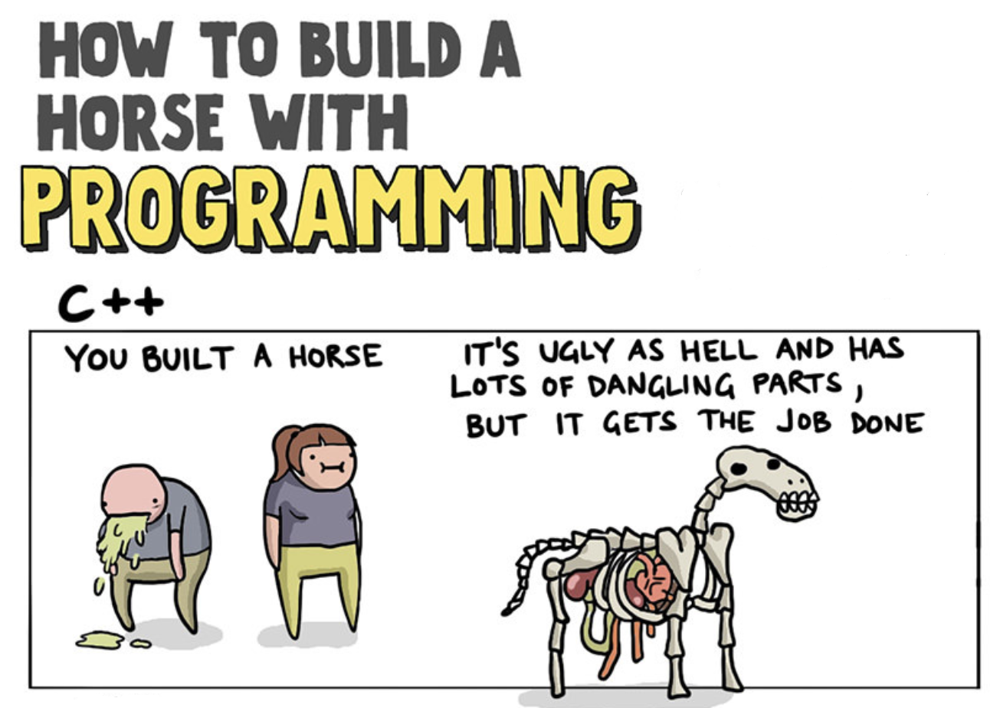
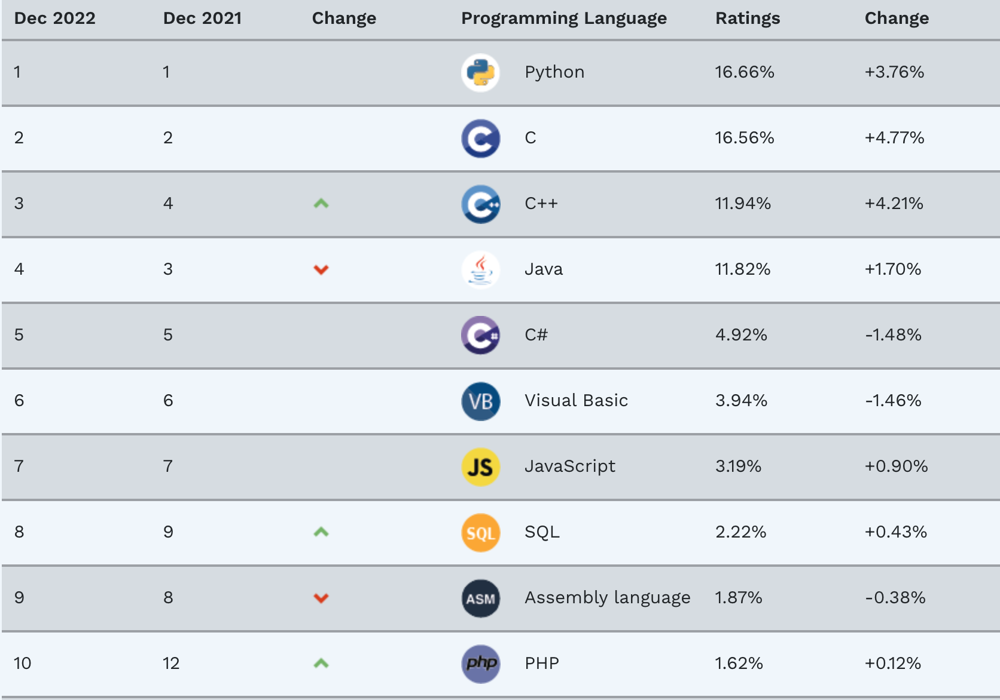

# Modern C++

###### Preamble

 *Herb Sutter*: *"The world is built on C++ (and its C subset)"*

 

---

## Bevor es losgeht ...

*Modern C++* mag möglicherweise für den einen oder anderen Entwickler durch seine Komplexität etwas abschreckend wirken.
Nichtsdestotrotz ist diese Programmiersprache aus der systemnahen Software-Entwicklung und vielen anderen
Einsatzbereichen nicht mehr wegzudenken.
C++ zählt zu den Programmiersprachen, die ein etwas tieferes Verständnis erfordern.
Ziel dieses Seminars/Repositories ist es, auf die größten Hürden beim Erlernen von *Modern C++* einzugehen!

*Abbildung* 1: Modern C++ &ndash; *Relax*!

([How To Build A Horse With Programming](https://toggl.com/blog/build-horse-programming))

---

## Überblick

**C++** ist eine high-level, general-purpose Programmiersprache, 
die von Bjarne Stroustrup als Erweiterung der Programmiersprache C erfunden wurde.
*Cfront* war der ursprüngliche Compiler für C ++ &ndash; damals bekannt als &ldquo;*C with Classes*&rdquo; &ndash; aus der Zeit um 1983,
der C ++ in C konvertierte. Entwickelt wurde der Übersetzer von Bjarne Stroustrup bei AT&T Bell Labs.

Die Sprache hat sich im Laufe der Zeit erheblich erweitert, und modernes C++ verfügt jetzt
über objektorientierte, generische und funktionale Möglichkeiten sowie über Funktionen zur Low-Level Speichermanipulation.
Es wird fast immer als kompilierte Sprache implementiert, und viele Anbieter bieten für C++ Compiler an,
darunter die Free Software Foundation, LLVM, Microsoft, Intel, Oracle und IBM.
C++ ist daher auf sehr vielen Plattformen verfügbar.

Einen genauen Abriss zur geschichtlichen Entwicklung von C++ kann man
[hier](https://en.cppreference.com/w/cpp/language/history)
nachlesen.

*Bemerkung*:

Die Betreiber des monatlich erscheinenden *TIOBE Programming Community Index* haben im Januar 2023
die Programmiersprache des Jahres 2022 bekannt gegeben.
Den Titel erhält jeweils die Sprache, die im Verlauf des Jahres den höchsten Zuwachs im Ranking zu verzeichnen hat.
Nach Python im Jahr 2021 steht nun C++ auf dem Thron für 2022:

*Abbildung* 2: Die Rangfolge der ersten zehn Programmiersprachen auf Basis des *TIOBE Programming Community Index* im Januar 2023.

Der Grund für die Beliebtheit von C++ liegt laut TIOBE
&ldquo;in seiner hervorragenden Leistung und der Tatsache, dass es sich um eine objektorientierte Hochsprache handelt.
Daher ist es möglich, schnelle und umfangreiche Softwaresysteme (über Millionen von Codezeilen) in C++ zu entwickeln,
ohne zwangsläufig in einem Wartungsalptraum zu enden.&rdquo;

---

## Agenda

Es ist nicht einfach, bei der Menge an sprachlichen Ergänzungen, Erweiterungen und Neuerungen von C++ den Überblick
zu behalten. Das von mir zusammengestellte Inhaltsverzeichnis unternimmt den Versuch,
den größten Teil dieser Weiterentwicklung zumindest nach gewissen systematischen und methodischen Gesichtspunkten
so zu gliedern und zusammenzufassen, dass bei deren Betrachtung der &ldquo;rote Faden&rdquo; nicht verloren geht. 

[Zur Agenda](GeneralSnippets/Agenda/Agenda.md).

---

## Aufgaben

Einige kleinere Aufgaben (samt Musterlösungen) sind diesem Repository ebenfalls beigefügt.
Sie können bei weitem nicht den gesamten Stoffumfang des *Modern C++* Sprachumfangs abdecken,
dienen aber dem Zweck, die &ldquo;graue Materie&rdquo; an der einen oder anderen Stelle etwas aufzuhellen:

[Zu den Aufgaben](GeneralSnippets/Exercises/Exercises.md).

---

## Online C++ Compiler 

Online C++ Compiler können nützliche Werkzeuge sein, um ein Code-Snippet schnell kompilieren und/oder ausführen zu können,
ohne hierfür extra einen C++ Compiler installieren zu müssen.
Besonders nützlich können Online Compiler sein, um mit den neuesten Sprachfeatures zu spielen
oder auch um verschiedene Compiler vergleichen zu können.

[Weitere Details](GeneralSnippets/OnlineCppCompilers/OnlineCppCompilers.md).

---

## Literaturverzeichnis

Jedes Jahr gibt es immer noch zahlreiche Neuerscheinungen zum Thema C++, die auf den Markt kommen. 
Sich aus der Fülle an alter und neuer C++-Literatur für einen Titel zu entscheiden,
fällt oftmals gar nicht so leicht.
Aus diesem Grund habe ich im Folgenden eine Liste mit Büchern zusammengestellt,
die bei mir derzeit hoch im Kurs stehen und meiner Meinung nach absolut lesenswert sind. 

[Zum Literaturverzeichnis](GeneralSnippets/Literatur/Literature.md).

---

## Katalog aller Modern-C++-Code-Snippets

In diesem Projekt sind zahlreiche kleinere Code-Snippets abgelegt, um die diversen Features
von C++&ndash;11/14/17 demonstrieren zu können.
Es folgt eine tabellarische Auflistung dieser Unterverzeichnisse.

| Unterverzeichnis | Thematik |
|:-------------- |-----------------------------------------|
| [Accumulate](GeneralSnippets/Accumulate/Accumulate.md) | STL-Algorithmus `std::accumulate` und Lambda-Funktionen in der Anwendung |
| [Allocator](GeneralSnippets/Allocator/Allocator.md) | Container und Speicher-Allokatoren |
| [Any](GeneralSnippets/Any/Any.md) | Neue STL-Utility Klasse `std::any` |
| [Apply](GeneralSnippets/Apply/Apply.md) | `std::apply`, `std::integer_sequence` und `std::make_integer_sequence` |
| [ArgumentDependentNameLookup](GeneralSnippets/ArgumentDependentNameLookup/ArgumentDependentNameLookup.md) | Argument-Dependent Name Lookup (ADL) / *Koenig*-Lookup |
| [Array](GeneralSnippets/Array/Array.md) | Neue STL-Utility Klasse `std::array`, Hilfsfunktion `std::to_array` und Hilfsklasse `std::span` |
| [ArrayDecay](GeneralSnippets/ArrayDecay/ArrayDecay.md) | Arrays und Pointer |
| [Attributes](GeneralSnippets/Attributes/Attributes.md) | C++ Standard Attribute |
| [Auto](GeneralSnippets/Auto/Auto.md) | Keyword `auto` |
| [BackInserter](GeneralSnippets/BackInserter/BackInserter.md) | `std::back_inserter` Iterator |
| [Bind](GeneralSnippets/Bind/Bind.md) | `std::bind` |
| [Casts](GeneralSnippets/Casts/Casts.md) | Typumwandlungen `static_cast`, `dynamic_cast`, `const_cast` und `reinterpret_cast` |
| [CommonType](GeneralSnippets/CommonType/CommonType.md) | Utility `std::common_type` |
| [Concepts/Requires/Classes](GeneralSnippets/ConceptsRequiresClasses/ConceptsRequiresClasses.md) | Moderne Stilistik für die Schreibweise von Klassen |
| [Concepts/Requires/Functions](GeneralSnippets/ConceptsRequiresFunctions/ConceptsRequiresFunctions.md) | Moderne Stilistik für die Schreibweise von Funktionen |
| [ConstExpr](GeneralSnippets/ConstExpr/Constexpr.md) | Programmierung zur Übersetzungszeit mit `constexpr` |
| [ConstructursOrder](GeneralSnippets/ConstructursOrder/CtorDtorOrder.md)  | Reihenfolge der Aufrufe von Konstruktoren und Destruktoren |
| [*Copy/Move Elision*](GeneralSnippets/CopyMoveElision/CopyMoveElision.md) | Auslassen von Kopier- oder Verschiebe-Operationen |
| [CRTP](GeneralSnippets/CRTP/CRTP.md) | Curiously Recurring Template Pattern (CRTP) |
| [DeclType](GeneralSnippets/DeclType/decltype.md) | `decltype` und `std::declval` |
| [DefaultInitialization](GeneralSnippets/DefaultInitialization/DefaultInitialization.md)| Default-Initialisierung für Member-Variablen |
| [*Erase-Remove* Idiom](GeneralSnippets/EraseRemoveIdiom/EraseRemoveIdiom.md) | Das *Erase-Remove*-Idiom |
| [Explicit](GeneralSnippets/Explicit/Explicit.md) | Schlüsselwort `explicit` |
| [ExpressionTemplates](GeneralSnippets/ExpressionTemplates/ExpressionTemplates.md) | Expression Templates |
| [Folding](GeneralSnippets/Folding/Folding.md) | *Folding Expressions* |
| [FunctionalProgramming](GeneralSnippets/FunctionalProgramming/FunctionalProgramming.md) | Funktionale Programmierung |
| [Generate](GeneralSnippets/Generate/Generate.md) | STL-Algorithmus `std::generate` |
| [GenericLambdas](GeneralSnippets/GenericLambdas/GenericLambdas.md) | Generische Lambda Ausdrücke |
| [InitializerList](GeneralSnippets/InitializerList/InitializerList.md) | Klasse `std::initializer_list<T>` |
| [InputOutputStreams](GeneralSnippets/InputOutputStreams/InputOutputStreams.md) | Streams manipulieren und formatieren |
| [Invoke](GeneralSnippets/Invoke/Invoke.md) | `std::invoke`: "*Uniformly invoking anything callable*" |
| [Lambda](GeneralSnippets/Lambda/Lambda.md) | Lambda-Funktionen |
| [Literals](GeneralSnippets/Literals/Literals.md) | Benutzerdefinierte Literale |
| [MemoryLeaks](GeneralSnippets/MemoryLeaks/MemoryLeaksDetection.md) | CRT (C-Runtime-Library) Memory Leak Detection |
| [MetaProgramming](GeneralSnippets/MetaProgramming/Metaprogramming01.md) | Programmierung zur Übersetzungszeit |
| [Modules](GeneralSnippets/Modules_Import/Modules_Import.md) | Module |
| [MoveSemantics](GeneralSnippets/MoveSemantics/MoveSemantics.md) | *Move Semantics* / Verschiebesemantik |
| [Optional](GeneralSnippets/Optional/Optional.md) | Neue STL-Utility Klasse `std::optional` |
| [ParametersWithConstAndRef](GeneralSnippets/ParametersWithConstAndRef/ConstDeclarations.md)  | Die Deklarationen `int& const`, `int const&`, `const& int` und `const int&` im Vergleich |
| [PerfectForwarding](GeneralSnippets/PerfectForwarding/PerfectForwarding.md) | Perfect Forwarding (`std::forward`) |
| [RAII](GeneralSnippets/RAII/RAII.md) | RAII-Idiom (*Resource acquisition is Initialization*) |
| [Random](GeneralSnippets/Random/Random.md) | Generierung von Zufallszahlen |
| [RangeBasedForLoop](GeneralSnippets/RangeBasedForLoop/RangeBasedForLoop.md) | Range-based `for` Loop |
| [ReferenceWrapper](GeneralSnippets/ReferenceWrapper/ReferenceWrapper.md)  | Klasse `std::reference_wrapper` und Funktion `std::ref` |
| [RegExpr](GeneralSnippets/RegExpr/RegExpr.md) | Reguläre Ausdrücke |
| [RValueLValue](GeneralSnippets/RValueLValue/RValueLValue.md) | LValue- und RValue Referenzen |
| [SFINAE_EnableIf](GeneralSnippets/SFINAE_EnableIf/Sfinae.md) | SFINAE und `std::enable_if` |
| [SharedPointer](GeneralSnippets/SharedPtr/SharedPtr.md) | Klasse `std::shared_ptr<T>` |
| [SSO](GeneralSnippets/SSO/SSO.md) | *Small String Optimization* |
| [StaticAssert](GeneralSnippets/StaticAssert/StaticAssert.md) | Compile-Time Makro `static_assert` |
| [StringView](GeneralSnippets/StringView/StringView.md) | Klasse `std::string_view` |
| [StructuredBinding](GeneralSnippets/StructuredBinding/StructuredBinding.md) | Verknüpfung einer Liste von Bezeichnern mit einem Satz von Objekten (Variablen) |
| [TemplatesFunctionBasics](GeneralSnippets/TemplateFunctionBasics/TemplatesFunctionBasics.md) | Grundlagen zu Funktions-Templates |
| [TemplatesClassBasics](GeneralSnippets/TemplateClassBasics/TemplatesClassBasics.md) | Grundlagen zu Klassen-Templates |
| [TemplateSpecialization](GeneralSnippets/TemplateSpecialization/TemplateSpecialization.md) | Template Spezialisierung |
| [TemplateConstexprIf](GeneralSnippets/TemplateConstexprIf/TemplatesConstExpr_If.md) | Templates und bedingte Compilierung (`if constexpr`) |
| [TemplateStaticPolymorphism](GeneralSnippets/TemplateStaticPolymorphism/TemplateStaticPolymorphism.md) | Templates und statischer Polymorphismus |
| [TemplateTemplateParameter](GeneralSnippets/TemplateTemplateParameter/TemplateTemplateParameter.md) | Template Template Parameter |
| [TemplateTwoPhaseLookup](GeneralSnippets/TemplateTwoPhaseLookup/TemplateTwoPhaseLookup.md) | Two-Phase Name Lookup |
| [Transform](GeneralSnippets/Transform/Transform.md) | STL-Algorithmus `std::transform` und Lambda-Funktionen in der Anwendung |
| [TrimmingStrings](GeneralSnippets/Trim/Trim.md) | Leerzeichen am Anfang und Ende einer Zeichenkette entfernen |
| [Tuples](GeneralSnippets/Tuple/Tuple.md) | Neue STL-Utility Klasse `std::tuple` |
| [TypeTraits](GeneralSnippets/TypeTraits/TypeTraits.md) | Typmerkmale |
| [UniformInitialization](GeneralSnippets/UniformInitialization/UniformInitialization.md) | Einheitliches Initialisierungs-Konzept |
| [UniquePointer](GeneralSnippets/UniquePtr/UniquePtr.md) | Klasse `std::unique_ptr<T>` |
| [UsingNamespaceStd](GeneralSnippets/UsingNamespaceStd/UsingNamespaceStd.md) | Warum ist `using namespace std;` als schlechte Praxis angesehen? |
| [VariadicTemplates](GeneralSnippets/VariadicTemplates/VariadicTemplates_01_Introduction.md) | Templates mit variabler Argumentanzahl (Variadische Templates) |
| [Variant](GeneralSnippets/Variant/Variant.md)  | Neue STL-Utility Klasse `std::variant` |
| [VirtualBaseClassDestructor](GeneralSnippets/VirtualBaseClassDestructor/VirtualBaseClassDestructor.md) | Virtuelle Destruktoren (einer Basisklasse) |
| [VirtualOverrideFinal](GeneralSnippets/VirtualOverrideFinal/VirtualOverrideFinal.md) | Neue Schlüsselwörter `override` und `final` |
| [WeakPointer](GeneralSnippets/WeakPtr/WeakPtr.md) | Klasse `std::weak_ptr<T>` |

Tabelle 1. Tabelle aller Beispiele zu Modern C++ dieses Repositories. 

---
